# AI Post Scheduler - Feature Flowcharts

**Version:** 1.7.0  
**Last Updated:** 2026-01-23

This document provides visual flowcharts for each major feature in the AI Post Scheduler plugin using Mermaid syntax.

---

## Table of Contents

1. [Template System](#1-template-system)
2. [Scheduling System](#2-scheduling-system)
3. [Authors Feature](#3-authors-feature)
4. [Voices Feature](#4-voices-feature)
5. [Article Structures](#5-article-structures)
6. [Trending Topics Research](#6-trending-topics-research)
7. [Planner](#7-planner-bulk-topic-scheduling)
8. [AI Content Generation](#8-ai-content-generation-pipeline)
9. [History & Activity](#9-history--activity-tracking)
10. [Data Management](#10-data-management)

---

## 1. Template System

### Template Creation & Management Flow

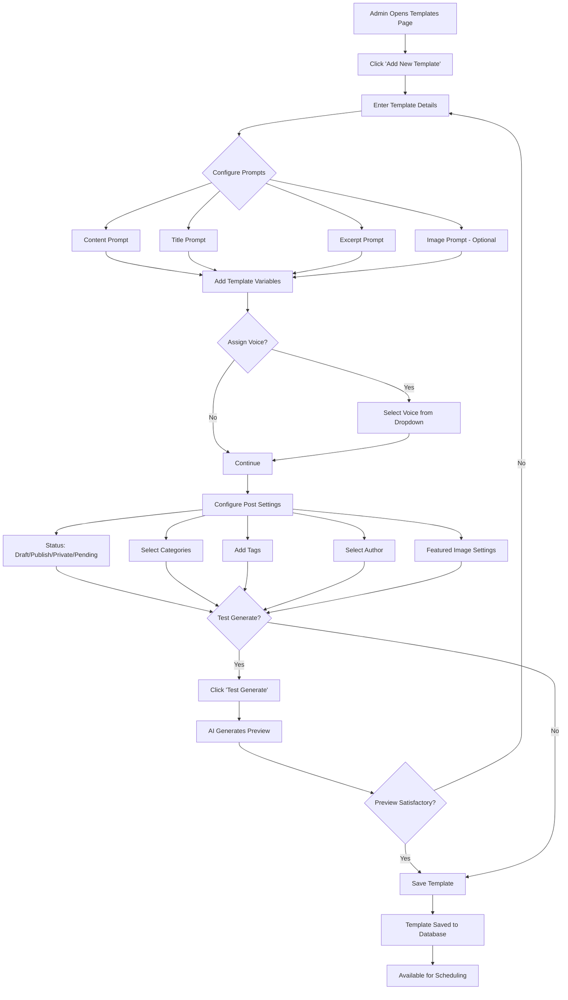

### Template Variables Processing

```mermaid
flowchart LR
    A[Template with Variables] --> B{Process Variables}
    B --> C[{{date}}] --> C1[Replace with Current Date]
    B --> D[{{year}}] --> D1[Replace with Current Year]
    B --> E[{{month}}] --> E1[Replace with Current Month]
    B --> F[{{day}}] --> F1[Replace with Day of Week]
    B --> G[{{time}}] --> G1[Replace with Current Time]
    B --> H[{{site_name}}] --> H1[Replace with Site Name]
    B --> I[{{topic}}] --> I1[Replace with Schedule Topic]
    B --> J[{{random_number}}] --> J1[Replace with Random 1-1000]
    C1 --> K[Final Processed Prompt]
    D1 --> K
    E1 --> K
    F1 --> K
    G1 --> K
    H1 --> K
    I1 --> K
    J1 --> K
    K --> L[Send to AI Engine]
```

---

## 2. Scheduling System

### Schedule Creation & Execution Flow

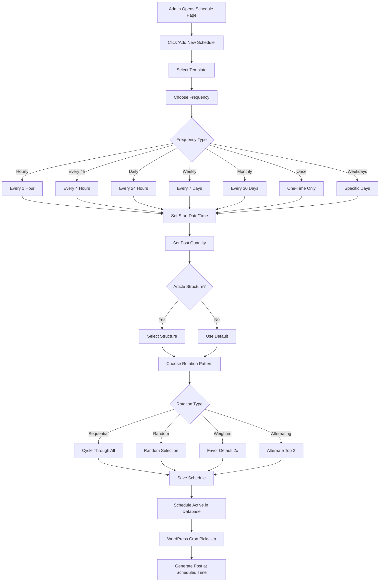

### Cron Execution Flow

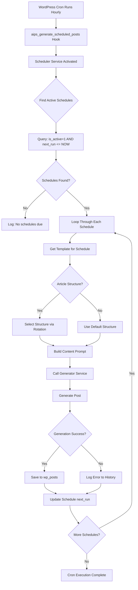

---

## 3. Authors Feature

### Authors Workflow - Complete System

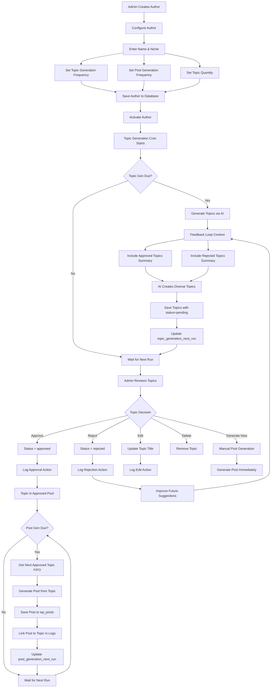

### Topic Approval Flow - Detailed

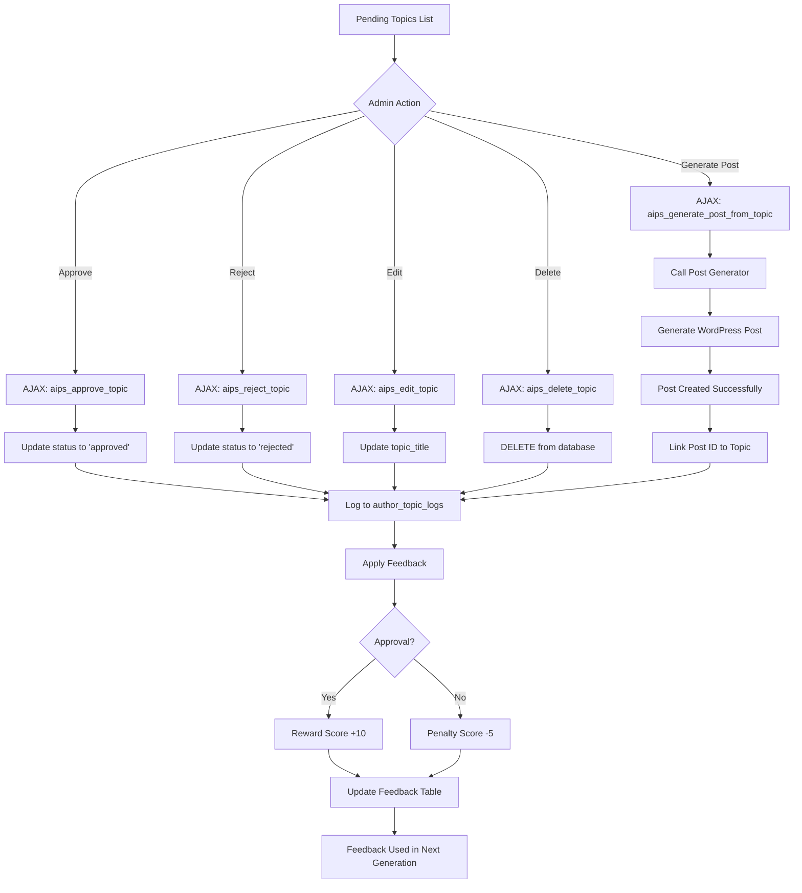

---

## 4. Voices Feature

### Voice Creation & Usage Flow

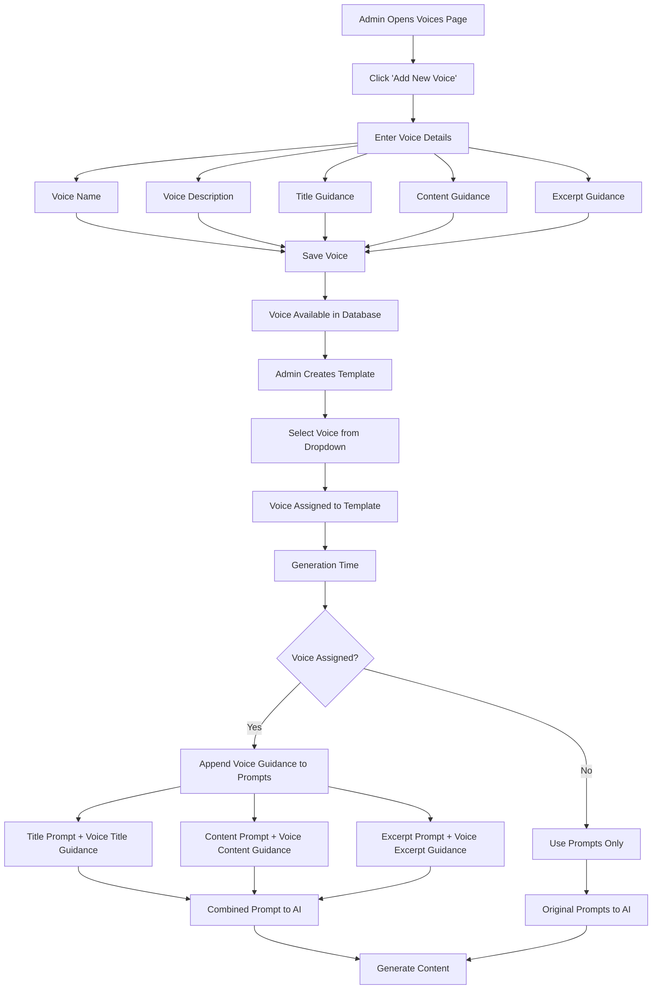

---

## 5. Article Structures

### Structure Selection & Rotation Flow

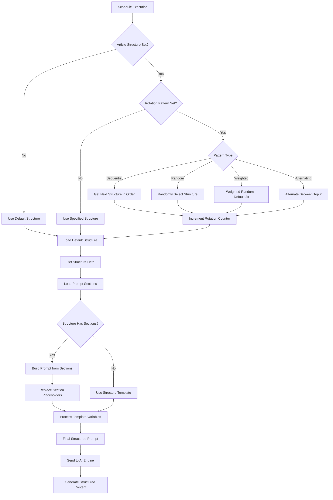

### Structure Builder Flow

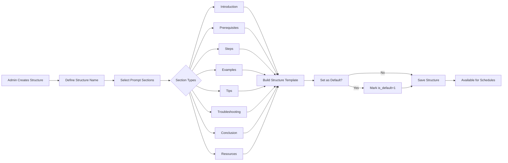

---

## 6. Trending Topics Research

### Research & Discovery Flow

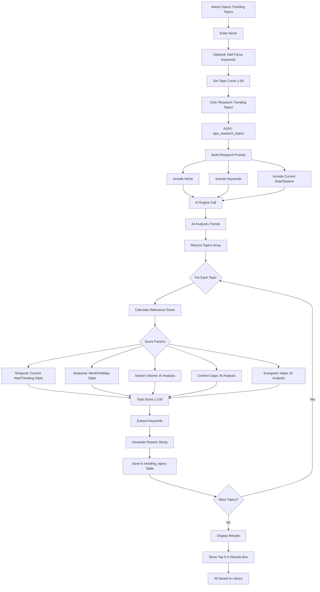

### Topics Library & Scheduling Flow

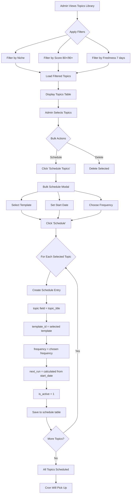

### Automated Research Flow

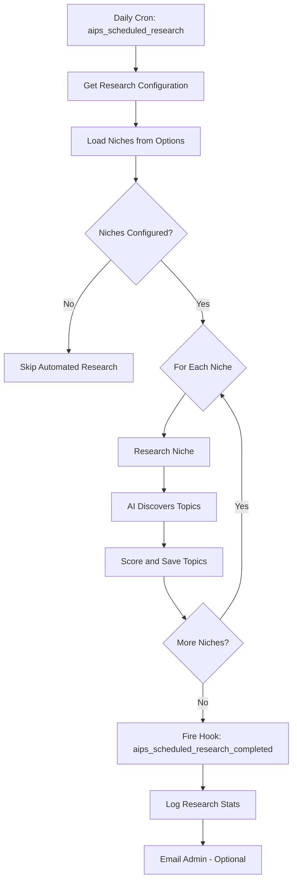

---

## 7. Planner (Bulk Topic Scheduling)

### Planner Workflow

```mermaid
flowchart TD
    A[Admin Opens Planner] --> B{Topic Source}
    B -->|AI Generate| C[Enter Niche]
    B -->|Manual Entry| D[Paste Topics List]
    
    C --> E[Set Topic Count 1-50]
    E --> F[Click 'Generate Topics']
    F --> G[AJAX: aips_generate_planner_topics]
    G --> H[AI Brainstorms Topics]
    H --> I[Display Topics in Grid]
    
    D --> J[Click 'Add to List']
    J --> K[Parse Line-by-Line]
    K --> I
    
    I --> L[Topics Displayed]
    L --> M{Admin Actions}
    M -->|Edit| N[Inline Edit Topic Text]
    M -->|Select| O[Check Topic Boxes]
    M -->|Select All| P[Check All Boxes]
    M -->|Clear| Q[Remove All Topics]
    M -->|Copy| R[Copy Selected to Clipboard]
    
    N --> S[Topics Ready]
    O --> S
    P --> S
    
    S --> T[Configure Bulk Schedule]
    T --> U[Select Template]
    T --> V[Set Start Date]
    T --> W[Choose Frequency]
    
    U --> X[Click 'Schedule Selected Topics']
    V --> X
    W --> X
    
    X --> Y[AJAX: aips_bulk_schedule_planner]
    Y --> Z{For Each Selected}
    Z --> AA[Create Schedule]
    AA --> AB[topic = topic text]
    AB --> AC[Use {{topic}} variable in template]
    AC --> AD[Calculate staggered next_run]
    AD --> AE[Save Schedule]
    AE --> AF{More Topics?}
    AF -->|Yes| Z
    AF -->|No| AG[Success Message]
    AG --> AH[Schedules Created]
```

---

## 8. AI Content Generation Pipeline

### Complete Generation Process

```mermaid
flowchart TD
    A[Generation Triggered] --> B{Trigger Source}
    B -->|Schedule| C[From Schedule Table]
    B -->|Authors| D[From Approved Topic]
    B -->|Planner| E[From Planner Topic]
    B -->|Manual| F[Test Generate / Run Now]
    
    C --> G[Load Template]
    D --> G
    E --> G
    F --> G
    
    G --> H[Load Template Config]
    H --> I{Voice Assigned?}
    I -->|Yes| J[Load Voice Guidance]
    I -->|No| K[Voice = null]
    J --> L[Process Template Variables]
    K --> L
    
    L --> M{Article Structure?}
    M -->|Yes| N[Load Structure & Sections]
    M -->|No| O[Use Template Prompts Only]
    N --> P[Build Structured Prompt]
    O --> P
    
    P --> Q[Start Generation Session]
    Q --> R[Log to History Table]
    R --> S[Generate Title]
    S --> T[AI Service Call - Title]
    T --> U{Title Success?}
    U -->|No| V[Retry with Backoff]
    V --> W{Max Retries?}
    W -->|Yes| X[Circuit Breaker Open]
    W -->|No| T
    U -->|Yes| Y[Title Generated]
    X --> Z[Log Error & Fail]
    Y --> AA[Generate Content]
    AA --> AB[AI Service Call - Content]
    AB --> AC{Content Success?}
    AC -->|No| V
    AC -->|Yes| AD[Content Generated]
    AD --> AE[Generate Excerpt]
    AE --> AF[AI Service Call - Excerpt]
    AF --> AG{Excerpt Success?}
    AG -->|No| AH[Use Content Substring]
    AG -->|Yes| AI[Excerpt Generated]
    AH --> AI
    AI --> AJ{Featured Image?}
    AJ -->|Enabled| AK[Generate Image]
    AJ -->|Disabled| AL[Skip Image]
    AK --> AM{Image Source}
    AM -->|AI-Generated| AN[AI Service Call - Image]
    AM -->|Unsplash| AO[Unsplash API Call]
    AM -->|Media Library| AP[Use Existing Image]
    AN --> AQ{Image Success?}
    AO --> AQ
    AP --> AQ
    AQ -->|Yes| AR[Image URL Obtained]
    AQ -->|No| AL
    AR --> AS[Create WordPress Post]
    AL --> AS
    AS --> AT[Set Post Title]
    AT --> AU[Set Post Content]
    AU --> AV[Set Post Excerpt]
    AV --> AW[Set Post Status]
    AW --> AX[Set Post Author]
    AX --> AY[Set Categories]
    AY --> AZ[Set Tags]
    AZ --> BA{Image Available?}
    BA -->|Yes| BB[Set Featured Image]
    BA -->|No| BC[Skip Featured Image]
    BB --> BD[wp_insert_post]
    BC --> BD
    BD --> BE{Post Created?}
    BE -->|Yes| BF[Update History: Success]
    BE -->|No| BG[Update History: Failed]
    BF --> BH[Fire Hook: aips_post_generated]
    BG --> BI[Fire Hook: aips_post_generation_failed]
    BH --> BJ[Log Success Details]
    BI --> BK[Log Error Details]
    BJ --> BL[Return Post ID]
    BK --> BL
```

### Resilience & Error Handling

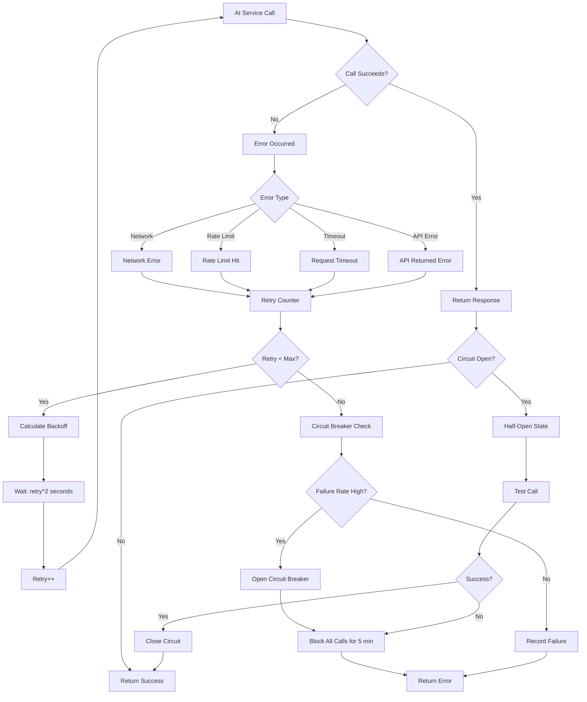

---

## 9. History & Activity Tracking

### History Logging Flow

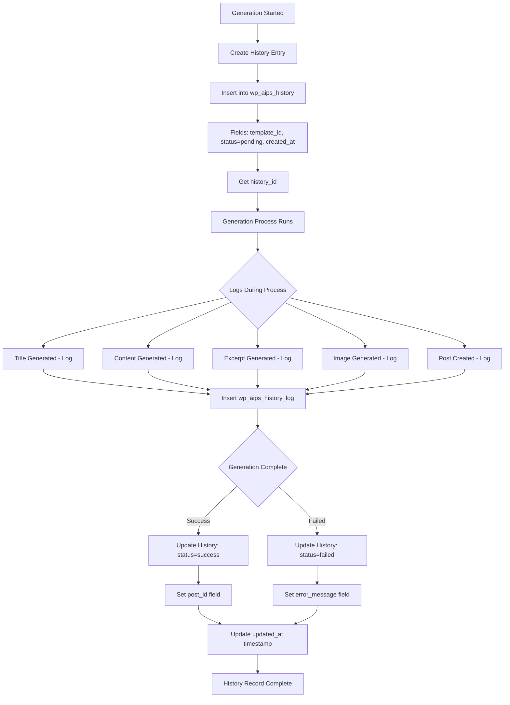

### Activity Tracking Flow

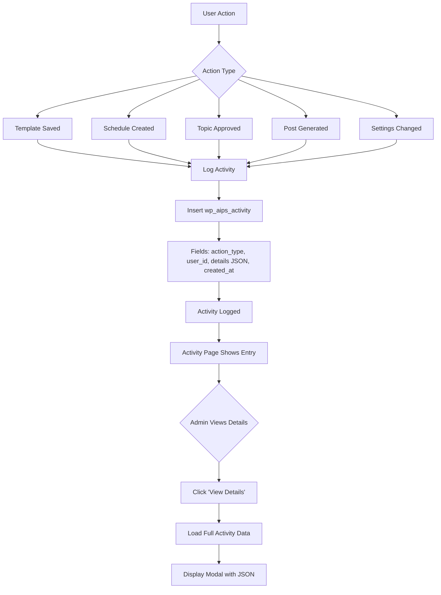

---

## 10. Data Management

### Export Flow

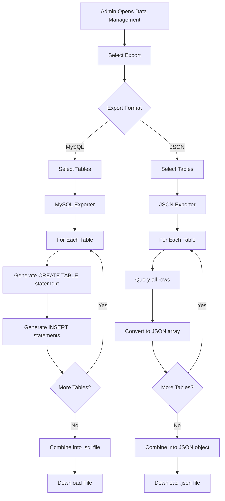

### Import Flow

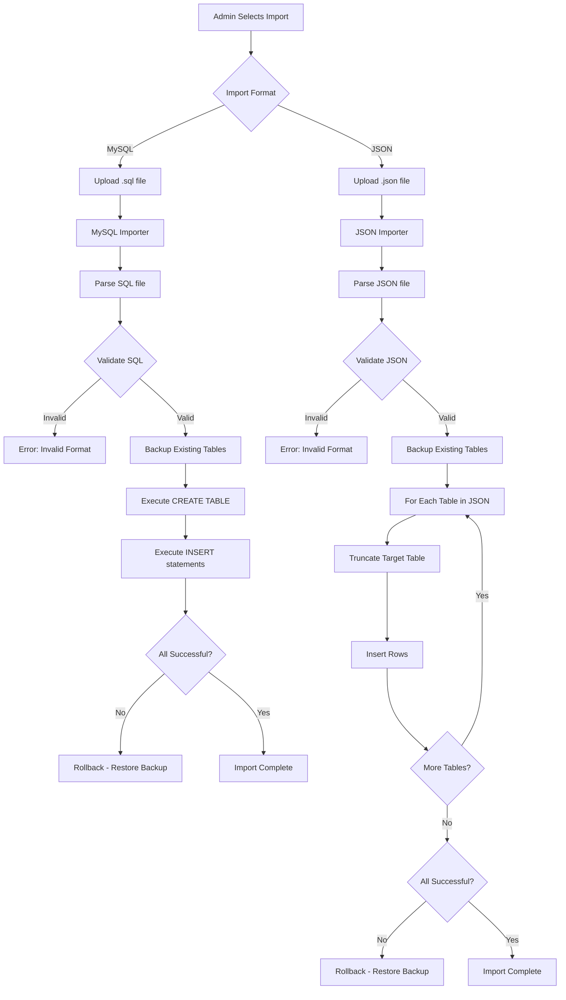

### Database Repair Flow

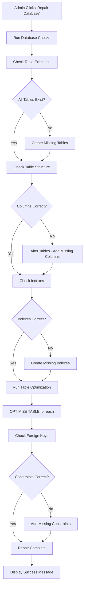

---

## System Architecture Overview

### High-Level Plugin Architecture

```mermaid
flowchart TD
    A[WordPress Core] --> B[AI Post Scheduler Plugin]
    B --> C[Admin Menu Pages]
    B --> D[AJAX Controllers]
    B --> E[Service Layer]
    B --> F[Repository Layer]
    B --> G[Database Tables]
    B --> H[WordPress Cron]
    B --> I[Meow Apps AI Engine]
    
    C --> J[Dashboard]
    C --> K[Templates]
    C --> L[Schedules]
    C --> M[Authors]
    C --> N[Voices]
    C --> O[Research]
    C --> P[Planner]
    C --> Q[History]
    C --> R[Activity]
    C --> S[Settings]
    C --> T[System Status]
    
    D --> U[Template Controller]
    D --> V[Schedule Controller]
    D --> W[Authors Controller]
    D --> X[Research Controller]
    D --> Y[Activity Controller]
    
    E --> Z[Generator Service]
    E --> AA[AI Service]
    E --> AB[Research Service]
    E --> AC[Resilience Service]
    E --> AD[Image Service]
    
    F --> AE[Template Repository]
    F --> AF[Schedule Repository]
    F --> AG[Authors Repository]
    F --> AH[History Repository]
    F --> AI[Trending Topics Repository]
    
    G --> AJ[13 Custom Tables]
    
    H --> AK[4 Cron Jobs]
    AK --> AL[Generate Posts]
    AK --> AM[Generate Topics]
    AK --> AN[Generate Author Posts]
    AK --> AO[Automated Research]
    
    I --> AP[AI Engine API]
    AP --> AQ[OpenAI]
    AP --> AR[Other AI Providers]
```

---

## Conclusion

These flowcharts provide visual representations of how each feature works in the AI Post Scheduler plugin. They show:

- User interactions and decision points
- Data flow through the system
- Integration between features
- Error handling and resilience
- Cron automation processes
- Database operations

Use these diagrams to:
- Understand feature workflows
- Debug issues
- Plan new features
- Onboard new developers
- Document integrations

All diagrams use Mermaid syntax and can be rendered in GitHub, GitLab, VS Code, and many documentation platforms.
