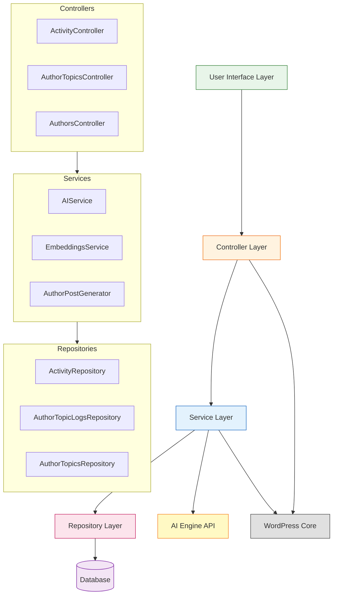
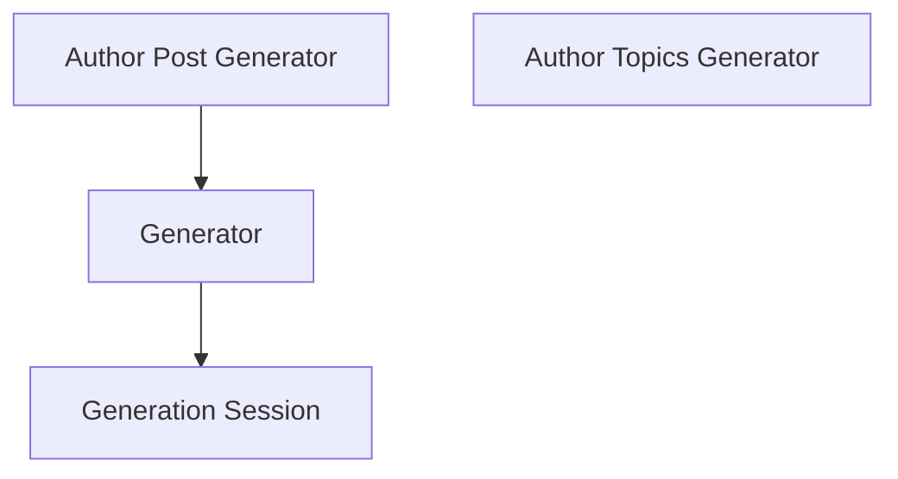
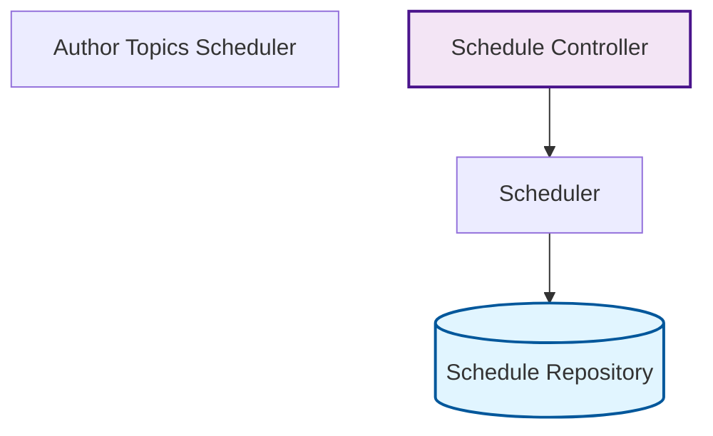
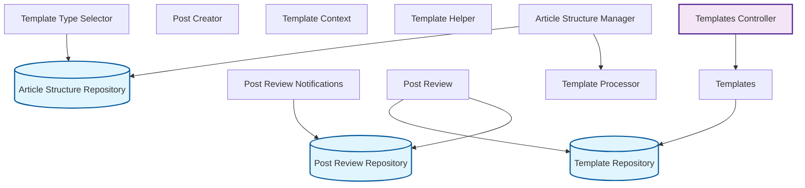
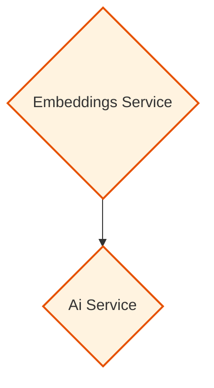
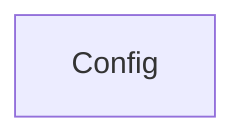

# AI Post Scheduler - Feature Documentation

*Generated by the feature scanner script.*

---

## Table of Contents

1. [Overview](#overview)
2. [Architecture Diagram](#architecture-diagram)
3. [Feature Categories](#feature-categories)
   - [Core Generation](#core-generation)
   - [Scheduling & Automation](#scheduling-and-automation)
   - [Content Management](#content-management)
   - [Data Management](#data-management)
   - [User Interface](#user-interface)
   - [AI Integration](#ai-integration)
   - [Database](#database)
   - [Configuration](#configuration)
   - [Utilities](#utilities)
4. [Feature Profiles](#feature-profiles)
5. [Summary Statistics](#summary-statistics)

## Overview

This document provides comprehensive documentation for the AI Post Scheduler WordPress plugin. The plugin consists of **64 core classes** organized into **9 functional categories**.

- **Total Lines of Code**: 18,366
- **Total Features**: 64
- **Categories**: Core Generation, Scheduling & Automation, Content Management, Data Management, User Interface, AI Integration, Database, Configuration, Utilities

## Architecture Diagram

### Overall Plugin Architecture

## Feature Categories

### Core Generation

This category contains 4 classes:

- **Author Post Generator** (`AIPS_Author_Post_Generator`): Author Post Generator
- **Author Topics Generator** (`AIPS_Author_Topics_Generator`): Author Topics Generator
- **Generation Session** (`AIPS_Generation_Session`): Generation Session Tracker
- **Generator** (`AIPS_Generator`): AIPS_Generator

#### Core Generation Architecture

### Scheduling & Automation

This category contains 4 classes:

- **Author Topics Scheduler** (`AIPS_Author_Topics_Scheduler`): Author Topics Scheduler
- **Schedule Controller** (`AIPS_Schedule_Controller`): No description available
- **Schedule Repository** (`AIPS_Schedule_Repository`): Schedule Repository
- **Scheduler** (`AIPS_Scheduler`): No description available

#### Scheduling & Automation Architecture

### Content Management

This category contains 13 classes:

- **Article Structure Manager** (`AIPS_Article_Structure_Manager`): Article Structure Manager
- **Article Structure Repository** (`AIPS_Article_Structure_Repository`): Article Structure Repository
- **Post Creator** (`AIPS_Post_Creator`): Post Creator Service
- **Post Review Notifications** (`AIPS_Post_Review_Notifications`): Post Review Email Notifications
- **Post Review Repository** (`AIPS_Post_Review_Repository`): Post Review Repository
- **Post Review** (`AIPS_Post_Review`): Post Review Handler
- **Template Context** (`AIPS_Template_Context`): Class AIPS_Template_Context
- **Template Helper** (`AIPS_Template_Helper`): No description available
- **Template Processor** (`AIPS_Template_Processor`): Template Variable Processor
- **Template Repository** (`AIPS_Template_Repository`): Template Repository
- **Template Type Selector** (`AIPS_Template_Type_Selector`): Template Type Selector
- **Templates Controller** (`AIPS_Templates_Controller`): No description available
- **Templates** (`AIPS_Templates`): No description available

#### Content Management Architecture

### Data Management

This category contains 6 classes:

- **Data Management Export Json** (`AIPS_Data_Management_Export_JSON`): JSON export implementation (placeholder for future)
- **Data Management Export Mysql** (`AIPS_Data_Management_Export_MySQL`): MySQL dump export implementation
- **Data Management Export** (`AIPS_Data_Management_Export`): No description available
- **Data Management Import Json** (`AIPS_Data_Management_Import_JSON`): JSON import implementation (placeholder for future)
- **Data Management Import Mysql** (`AIPS_Data_Management_Import_MySQL`): MySQL dump import implementation
- **Data Management Import** (`AIPS_Data_Management_Import`): No description available

#### Data Management Architecture

```mermaid
flowchart TD
    %% Data Management Architecture

    Data_Management_Export_JSON["Data Management Export Json"]
    Data_Management_Export_MySQL["Data Management Export Mysql"]
    Data_Management_Export["Data Management Export"]
    Data_Management_Import_JSON["Data Management Import Json"]
    Data_Management_Import_MySQL["Data Management Import Mysql"]
    Data_Management_Import["Data Management Import"]


    classDef repository fill:#e1f5ff,stroke:#01579b,stroke-width:2px
    classDef service fill:#fff3e0,stroke:#e65100,stroke-width:2px
    classDef controller fill:#f3e5f5,stroke:#4a148c,stroke-width:2px
```

### User Interface

This category contains 9 classes:

- **Activity Controller** (`AIPS_Activity_Controller`): Activity Controller
- **Author Topics Controller** (`AIPS_Author_Topics_Controller`): Author Topics Controller
- **Authors Controller** (`AIPS_Authors_Controller`): Authors Controller
- **Prompt Builder** (`AIPS_Prompt_Builder`): No description available
- **Prompt Sections Controller** (`AIPS_Prompt_Sections_Controller`): Controller for managing prompt sections via AJAX in the WordPress admin.
- **Research Controller** (`AIPS_Research_Controller`): Research Controller
- **Seeder Admin** (`AIPS_Seeder_Admin`): No description available
- **Settings** (`AIPS_Settings`): Class AIPS_Settings
- **Structures Controller** (`AIPS_Structures_Controller`): No description available

#### User Interface Architecture

### AI Integration

This category contains 2 classes:

- **Ai Service** (`AIPS_AI_Service`): AI Service Layer
- **Embeddings Service** (`AIPS_Embeddings_Service`): Embeddings Service

#### AI Integration Architecture

### Database

This category contains 9 classes:

- **Activity Repository** (`AIPS_Activity_Repository`): Activity Repository
- **Author Topic Logs Repository** (`AIPS_Author_Topic_Logs_Repository`): Author Topic Logs Repository
- **Author Topics Repository** (`AIPS_Author_Topics_Repository`): Author Topics Repository
- **Authors Repository** (`AIPS_Authors_Repository`): Authors Repository
- **Db Manager** (`AIPS_DB_Manager`): No description available
- **Feedback Repository** (`AIPS_Feedback_Repository`): Feedback Repository
- **History Repository** (`AIPS_History_Repository`): History Repository
- **Prompt Section Repository** (`AIPS_Prompt_Section_Repository`): Prompt Section Repository
- **Trending Topics Repository** (`AIPS_Trending_Topics_Repository`): Trending Topics Repository

#### Database Architecture

```mermaid
flowchart TD
    %% Database Architecture

    Activity_Repository[("Activity Repository")]
    Author_Topic_Logs_Repository[("Author Topic Logs Repository")]
    Author_Topics_Repository[("Author Topics Repository")]
    Authors_Repository[("Authors Repository")]
    DB_Manager["Db Manager"]
    Feedback_Repository[("Feedback Repository")]
    History_Repository[("History Repository")]
    Prompt_Section_Repository[("Prompt Section Repository")]
    Trending_Topics_Repository[("Trending Topics Repository")]


    classDef repository fill:#e1f5ff,stroke:#01579b,stroke-width:2px
    classDef service fill:#fff3e0,stroke:#e65100,stroke-width:2px
    classDef controller fill:#f3e5f5,stroke:#4a148c,stroke-width:2px
    class Activity_Repository,Author_Topic_Logs_Repository,Author_Topics_Repository,Authors_Repository,Feedback_Repository,History_Repository,Prompt_Section_Repository,Trending_Topics_Repository repository
```

### Configuration

This category contains 1 classes:

- **Config** (`AIPS_Config`): Configuration Manager

#### Configuration Architecture

### Utilities

This category contains 16 classes:

- **Data Management** (`AIPS_Data_Management`): Data Management Controller
- **Dev Tools** (`AIPS_Dev_Tools`): Class AIPS_Dev_Tools
- **History** (`AIPS_History`): No description available
- **Image Service** (`AIPS_Image_Service`): Image Service
- **Interval Calculator** (`AIPS_Interval_Calculator`): Interval Calculator Service
- **Logger** (`AIPS_Logger`): No description available
- **Planner** (`AIPS_Planner`): No description available
- **Research Service** (`AIPS_Research_Service`): Research Service
- **Resilience Service** (`AIPS_Resilience_Service`): Resilience Service Layer
- **Seeder Service** (`AIPS_Seeder_Service`): No description available
- **System Status** (`AIPS_System_Status`): No description available
- **Topic Context** (`AIPS_Topic_Context`): Class AIPS_Topic_Context
- **Topic Expansion Service** (`AIPS_Topic_Expansion_Service`): Topic Expansion Service
- **Topic Penalty Service** (`AIPS_Topic_Penalty_Service`): Topic Penalty Service
- **Upgrades** (`AIPS_Upgrades`): No description available
- **Voices** (`AIPS_Voices`): No description available

#### Utilities Architecture

```mermaid
flowchart TD
    %% Utilities Architecture

    Data_Management["Data Management"]
    Dev_Tools["Dev Tools"]
    History["History"]
    Image_Service{"Image Service"}
    Interval_Calculator["Interval Calculator"]
    Logger["Logger"]
    Planner["Planner"]
    Research_Service{"Research Service"}
    Resilience_Service{"Resilience Service"}
    Seeder_Service{"Seeder Service"}
    System_Status["System Status"]
    Topic_Context["Topic Context"]
    Topic_Expansion_Service{"Topic Expansion Service"}
    Topic_Penalty_Service{"Topic Penalty Service"}
    Upgrades["Upgrades"]
    Voices["Voices"]

    Dev_Tools --> Voices
    Image_Service --> Logger
    Research_Service --> Logger
    Resilience_Service --> Logger
    Seeder_Service --> Voices
    System_Status --> Logger
    Topic_Expansion_Service --> Logger
    Topic_Penalty_Service --> Logger
    Upgrades --> Logger

    classDef repository fill:#e1f5ff,stroke:#01579b,stroke-width:2px
    classDef service fill:#fff3e0,stroke:#e65100,stroke-width:2px
    classDef controller fill:#f3e5f5,stroke:#4a148c,stroke-width:2px
    class Image_Service,Research_Service,Resilience_Service,Seeder_Service,Topic_Expansion_Service,Topic_Penalty_Service service
```

## Feature Profiles

Detailed analysis of each feature including files, functionality, and recommendations.

### Ai Service

**Summary**: AI Service Layer

**File**: `ai-post-scheduler/includes/class-aips-ai-service.php`

**Class**: `AIPS_AI_Service`

**Lines of Code**: 454

**Technical Details**:

- **Public Methods** (11): `__construct()`, `is_available()`, `generate_text()`, `generate_image()`, `get_call_log()`, `clear_call_log()`, `get_call_statistics()`, `reset_circuit_breaker()`, `get_circuit_breaker_status()`, `get_rate_limiter_status()`, ... and 1 more
- **Dependencies** (3): `AIPS_Config`, `AIPS_Logger`, `AIPS_Resilience_Service`
- **WordPress APIs Used**: Options

**Missing Functionality**:

- No input validation methods visible

**Recommended Improvements**:

1. Add comprehensive error handling with specific exception types
2. Ensure unit tests cover all public methods and edge cases
3. Consider using WordPress transients API for caching expensive operations

---

### Activity Controller

**Summary**: Activity Controller

**File**: `ai-post-scheduler/includes/class-aips-activity-controller.php`

**Class**: `AIPS_Activity_Controller`

**Lines of Code**: 239

**Technical Details**:

- **Public Methods** (4): `__construct()`, `ajax_get_activity()`, `ajax_get_activity_detail()`, `ajax_publish_draft()`
- **Dependencies** (2): `AIPS_Activity_Repository`, `AIPS_Schedule_Repository`
- **Action Hooks** (3): `wp_ajax_aips_get_activity`, `wp_ajax_aips_get_activity_detail`, `wp_ajax_aips_publish_draft`
- **AJAX Handlers**: `wp_ajax_aips_get_activity`, `wp_ajax_aips_get_activity_detail`, `wp_ajax_aips_publish_draft`
- **Database Operations**: Has Repository

**Missing Functionality**:

- No input validation methods visible

**Recommended Improvements**:

1. Document all custom hooks in HOOKS.md for third-party developers
2. Ensure unit tests cover all public methods and edge cases

---

### Activity Repository

**Summary**: Activity Repository

**File**: `ai-post-scheduler/includes/class-aips-activity-repository.php`

**Class**: `AIPS_Activity_Repository`

**Lines of Code**: 223

**Technical Details**:

- **Public Methods** (8): `__construct()`, `create()`, `get_recent()`, `get_by_type()`, `get_failed_schedules()`, `get_draft_posts()`, `get_count()`, `delete_old_records()`
- **Database Operations**: Uses Wpdb, Has Repository

**Missing Functionality**:

- Missing save/update methods for data persistence

**Recommended Improvements**:

1. Ensure unit tests cover all public methods and edge cases

---

### Article Structure Manager

**Summary**: Article Structure Manager

**File**: `ai-post-scheduler/includes/class-aips-article-structure-manager.php`

**Class**: `AIPS_Article_Structure_Manager`

**Lines of Code**: 331

**Technical Details**:

- **Public Methods** (9): `__construct()`, `get_active_structures()`, `get_structure()`, `get_default_structure()`, `build_prompt()`, `create_structure()`, `update_structure()`, `delete_structure()`, `get_available_sections()`
- **Dependencies** (3): `AIPS_Article_Structure_Repository`, `AIPS_Prompt_Section_Repository`, `AIPS_Template_Processor`
- **Action Hooks** (3): `aips_structure_created`, `aips_structure_deleted`, `aips_structure_updated`
- **Database Operations**: Has Repository

**Missing Functionality**: None identified

**Recommended Improvements**:

1. Document all custom hooks in HOOKS.md for third-party developers
2. Ensure unit tests cover all public methods and edge cases

---

### Article Structure Repository

**Summary**: Article Structure Repository

**File**: `ai-post-scheduler/includes/class-aips-article-structure-repository.php`

**Class**: `AIPS_Article_Structure_Repository`

**Lines of Code**: 261

**Technical Details**:

- **Public Methods** (12): `__construct()`, `get_all()`, `get_by_id()`, `get_default()`, `get_by_name()`, `create()`, `update()`, `delete()`, `set_active()`, `set_default()`, ... and 2 more
- **Database Operations**: Uses Wpdb, Has Repository

**Missing Functionality**: None identified

**Recommended Improvements**:

1. Ensure unit tests cover all public methods and edge cases

---

### Author Post Generator

**Summary**: Author Post Generator

**File**: `ai-post-scheduler/includes/class-aips-author-post-generator.php`

**Class**: `AIPS_Author_Post_Generator`

**Lines of Code**: 331

**Technical Details**:

- **Public Methods** (6): `__construct()`, `process_post_generation()`, `generate_post_for_author()`, `generate_post_from_topic()`, `generate_now()`, `regenerate_post()`
- **Dependencies** (10): `AIPS_Activity_Repository`, `AIPS_Author_Topic_Logs_Repository`, `AIPS_Author_Topics_Repository`, `AIPS_Authors_Repository`, `AIPS_Generator`, `AIPS_History_Repository`, `AIPS_Interval_Calculator`, `AIPS_Logger`, `AIPS_Topic_Context`, `AIPS_Topic_Expansion_Service`
- **Action Hooks** (1): `aips_generate_author_posts`
- **Database Operations**: Has Repository
- **WordPress APIs Used**: Post Meta

**Missing Functionality**:

- No filter hooks for customizing generation output
- No dedicated error handling methods visible
- No logging methods for debugging and monitoring

**Recommended Improvements**:

1. High coupling - depends on 10 classes
2. Document all custom hooks in HOOKS.md for third-party developers
3. Add comprehensive error handling with specific exception types
4. Ensure unit tests cover all public methods and edge cases

---

### Author Topic Logs Repository

**Summary**: Author Topic Logs Repository

**File**: `ai-post-scheduler/includes/class-aips-author-topic-logs-repository.php`

**Class**: `AIPS_Author_Topic_Logs_Repository`

**Lines of Code**: 182

**Technical Details**:

- **Public Methods** (10): `__construct()`, `get_by_topic()`, `get_by_id()`, `create()`, `log_approval()`, `log_rejection()`, `log_post_generation()`, `log_edit()`, `get_by_post()`, `get_generated_posts_by_author()`
- **Database Operations**: Uses Wpdb, Has Repository

**Missing Functionality**:

- Missing save/update methods for data persistence

**Recommended Improvements**:

1. Ensure unit tests cover all public methods and edge cases

---

### Author Topics Controller

**Summary**: Author Topics Controller

**File**: `ai-post-scheduler/includes/class-aips-author-topics-controller.php`

**Class**: `AIPS_Author_Topics_Controller`

**Lines of Code**: 657

**Technical Details**:

- **Public Methods** (18): `__construct()`, `ajax_approve_topic()`, `ajax_reject_topic()`, `ajax_edit_topic()`, `ajax_delete_topic()`, `ajax_generate_post_from_topic()`, `ajax_get_topic_logs()`, `ajax_bulk_approve_topics()`, `ajax_bulk_reject_topics()`, `ajax_bulk_delete_topics()`, ... and 8 more
- **Dependencies** (7): `AIPS_Activity_Repository`, `AIPS_Author_Post_Generator`, `AIPS_Author_Topic_Logs_Repository`, `AIPS_Author_Topics_Repository`, `AIPS_Feedback_Repository`, `AIPS_Topic_Expansion_Service`, `AIPS_Topic_Penalty_Service`
- **Action Hooks** (17): `wp_ajax_aips_approve_topic`, `wp_ajax_aips_delete_topic`, `wp_ajax_aips_edit_topic`, `wp_ajax_aips_generate_post_from_topic`, `wp_ajax_aips_reject_topic`, ... and 12 more
- **AJAX Handlers**: `wp_ajax_aips_approve_topic`, `wp_ajax_aips_reject_topic`, `wp_ajax_aips_edit_topic`, `wp_ajax_aips_delete_topic`, `wp_ajax_aips_generate_post_from_topic`, `wp_ajax_aips_get_topic_logs`, `wp_ajax_aips_get_topic_feedback`, `wp_ajax_aips_bulk_approve_topics`, `wp_ajax_aips_bulk_reject_topics`, `wp_ajax_aips_bulk_delete_topics`, `wp_ajax_aips_regenerate_post`, `wp_ajax_aips_delete_generated_post`, `wp_ajax_aips_get_similar_topics`, `wp_ajax_aips_suggest_related_topics`, `wp_ajax_aips_compute_topic_embeddings`, `wp_ajax_aips_get_generation_queue`, `wp_ajax_aips_bulk_generate_from_queue`
- **Database Operations**: Has Repository

**Missing Functionality**:

- No input validation methods visible

**Recommended Improvements**:

1. Consider refactoring - class has 657 lines (may violate SRP)
2. High coupling - depends on 7 classes
3. Document all custom hooks in HOOKS.md for third-party developers
4. Ensure unit tests cover all public methods and edge cases

---

### Author Topics Generator

**Summary**: Author Topics Generator

**File**: `ai-post-scheduler/includes/class-aips-author-topics-generator.php`

**Class**: `AIPS_Author_Topics_Generator`

**Lines of Code**: 258

**Technical Details**:

- **Public Methods** (3): `__construct()`, `generate_topics()`, `get_feedback_context()`
- **Dependencies** (4): `AIPS_AI_Service`, `AIPS_Author_Topic_Logs_Repository`, `AIPS_Author_Topics_Repository`, `AIPS_Logger`
- **Database Operations**: Has Repository

**Missing Functionality**:

- No filter hooks for customizing generation output
- No dedicated error handling methods visible
- No logging methods for debugging and monitoring

**Recommended Improvements**:

1. Add comprehensive error handling with specific exception types
2. Ensure unit tests cover all public methods and edge cases

---

### Author Topics Repository

**Summary**: Author Topics Repository

**File**: `ai-post-scheduler/includes/class-aips-author-topics-repository.php`

**Class**: `AIPS_Author_Topics_Repository`

**Lines of Code**: 273

**Technical Details**:

- **Public Methods** (13): `__construct()`, `get_by_author()`, `get_by_id()`, `create()`, `create_bulk()`, `update()`, `update_status()`, `delete()`, `get_approved_for_generation()`, `get_approved_summary()`, ... and 3 more
- **Database Operations**: Uses Wpdb, Has Repository

**Missing Functionality**: None identified

**Recommended Improvements**:

1. Ensure unit tests cover all public methods and edge cases

---

### Author Topics Scheduler

**Summary**: Author Topics Scheduler

**File**: `ai-post-scheduler/includes/class-aips-author-topics-scheduler.php`

**Class**: `AIPS_Author_Topics_Scheduler`

**Lines of Code**: 183

**Technical Details**:

- **Public Methods** (4): `__construct()`, `process_topic_generation()`, `generate_topics_for_author()`, `generate_now()`
- **Dependencies** (5): `AIPS_Activity_Repository`, `AIPS_Author_Topics_Generator`, `AIPS_Authors_Repository`, `AIPS_Interval_Calculator`, `AIPS_Logger`
- **Action Hooks** (1): `aips_generate_author_topics`
- **Database Operations**: Has Repository

**Missing Functionality**:

- No logging methods for debugging and monitoring

**Recommended Improvements**:

1. Document all custom hooks in HOOKS.md for third-party developers
2. Ensure unit tests cover all public methods and edge cases

---

### Authors Controller

**Summary**: Authors Controller

**File**: `ai-post-scheduler/includes/class-aips-authors-controller.php`

**Class**: `AIPS_Authors_Controller`

**Lines of Code**: 395

**Technical Details**:

- **Public Methods** (9): `__construct()`, `ajax_save_author()`, `ajax_delete_author()`, `ajax_get_author()`, `ajax_get_author_topics()`, `ajax_get_author_posts()`, `ajax_generate_topics_now()`, `ajax_get_author_feedback()`, `ajax_get_topic_posts()`
- **Dependencies** (6): `AIPS_Author_Topic_Logs_Repository`, `AIPS_Author_Topics_Repository`, `AIPS_Author_Topics_Scheduler`, `AIPS_Authors_Repository`, `AIPS_Feedback_Repository`, `AIPS_Interval_Calculator`
- **Action Hooks** (8): `wp_ajax_aips_delete_author`, `wp_ajax_aips_get_author`, `wp_ajax_aips_get_author_posts`, `wp_ajax_aips_get_author_topics`, `wp_ajax_aips_save_author`, ... and 3 more
- **AJAX Handlers**: `wp_ajax_aips_save_author`, `wp_ajax_aips_delete_author`, `wp_ajax_aips_get_author`, `wp_ajax_aips_get_author_topics`, `wp_ajax_aips_get_author_posts`, `wp_ajax_aips_get_author_feedback`, `wp_ajax_aips_generate_topics_now`, `wp_ajax_aips_get_topic_posts`
- **Database Operations**: Uses Wpdb, Has Repository

**Missing Functionality**:

- No input validation methods visible

**Recommended Improvements**:

1. High coupling - depends on 6 classes
2. Document all custom hooks in HOOKS.md for third-party developers
3. Ensure unit tests cover all public methods and edge cases

---

### Authors Repository

**Summary**: Authors Repository

**File**: `ai-post-scheduler/includes/class-aips-authors-repository.php`

**Class**: `AIPS_Authors_Repository`

**Lines of Code**: 191

**Technical Details**:

- **Public Methods** (10): `__construct()`, `get_all()`, `get_by_id()`, `create()`, `update()`, `delete()`, `get_due_for_topic_generation()`, `get_due_for_post_generation()`, `update_topic_generation_schedule()`, `update_post_generation_schedule()`
- **Database Operations**: Uses Wpdb, Has Repository

**Missing Functionality**: None identified

**Recommended Improvements**:

1. Ensure unit tests cover all public methods and edge cases

---

### Config

**Summary**: Configuration Manager

**File**: `ai-post-scheduler/includes/class-aips-config.php`

**Class**: `AIPS_Config`

**Lines of Code**: 357

**Technical Details**:

- **Public Methods** (21): `get_instance()`, `get_default_options()`, `get_option()`, `set_option()`, `get_version()`, `get_plugin_dir()`, `get_plugin_url()`, `is_debug_mode()`, `get_ai_config()`, `get_retry_config()`, ... and 11 more
- **WordPress APIs Used**: Options

**Missing Functionality**: None identified

**Recommended Improvements**:

1. High method count (21+ methods) - consider splitting responsibilities
2. Ensure unit tests cover all public methods and edge cases

---

### Db Manager

**Summary**: No description available

**File**: `ai-post-scheduler/includes/class-aips-db-manager.php`

**Class**: `AIPS_DB_Manager`

**Lines of Code**: 605

**Technical Details**:

- **Public Methods** (14): `__construct()`, `get_table_names()`, `get_full_table_names()`, `get_schema()`, `install_tables()`, `drop_tables()`, `truncate_tables()`, `backup_data()`, `restore_data()`, `ajax_repair_db()`, ... and 4 more
- **Action Hooks** (3): `wp_ajax_aips_reinstall_db`, `wp_ajax_aips_repair_db`, `wp_ajax_aips_wipe_db`
- **AJAX Handlers**: `wp_ajax_aips_repair_db`, `wp_ajax_aips_reinstall_db`, `wp_ajax_aips_wipe_db`
- **Database Operations**: Uses Wpdb, Creates Tables

**Missing Functionality**: None identified

**Recommended Improvements**:

1. Consider refactoring - class has 605 lines (may violate SRP)
2. Consider using Repository pattern for database access instead of direct $wpdb
3. Document all custom hooks in HOOKS.md for third-party developers
4. Ensure unit tests cover all public methods and edge cases
5. Add comprehensive class-level PHPDoc documentation

---

### Data Management

**Summary**: Data Management Controller

**File**: `ai-post-scheduler/includes/class-aips-data-management.php`

**Class**: `AIPS_Data_Management`

**Lines of Code**: 146

**Technical Details**:

- **Public Methods** (5): `__construct()`, `get_export_formats()`, `get_import_formats()`, `ajax_export_data()`, `ajax_import_data()`
- **Dependencies** (4): `AIPS_Data_Management_Export_JSON`, `AIPS_Data_Management_Export_MySQL`, `AIPS_Data_Management_Import_JSON`, `AIPS_Data_Management_Import_MySQL`
- **Action Hooks** (2): `wp_ajax_aips_export_data`, `wp_ajax_aips_import_data`
- **AJAX Handlers**: `wp_ajax_aips_export_data`, `wp_ajax_aips_import_data`

**Missing Functionality**: None identified

**Recommended Improvements**:

1. Document all custom hooks in HOOKS.md for third-party developers
2. Ensure unit tests cover all public methods and edge cases

---

### Data Management Export

**Summary**: No description available

**File**: `ai-post-scheduler/includes/class-aips-data-management-export.php`

**Class**: `AIPS_Data_Management_Export`

**Lines of Code**: 78

**Technical Details**:

- **Public Methods** (4): `get_format_name()`, `get_file_extension()`, `get_mime_type()`, `export()`
- **Dependencies** (1): `AIPS_DB_Manager`

**Missing Functionality**: None identified

**Recommended Improvements**:

1. Ensure unit tests cover all public methods and edge cases
2. Add comprehensive class-level PHPDoc documentation

---

### Data Management Export Json

**Summary**: JSON export implementation (placeholder for future)

**File**: `ai-post-scheduler/includes/class-aips-data-management-export-json.php`

**Class**: `AIPS_Data_Management_Export_JSON`

**Lines of Code**: 79

**Technical Details**:

- **Public Methods** (5): `get_format_name()`, `get_file_extension()`, `get_mime_type()`, `export()`, `do_export()`
- **Database Operations**: Uses Wpdb

**Missing Functionality**: None identified

**Recommended Improvements**:

1. Consider using Repository pattern for database access instead of direct $wpdb
2. Ensure unit tests cover all public methods and edge cases

---

### Data Management Export Mysql

**Summary**: MySQL dump export implementation

**File**: `ai-post-scheduler/includes/class-aips-data-management-export-mysql.php`

**Class**: `AIPS_Data_Management_Export_MySQL`

**Lines of Code**: 138

**Technical Details**:

- **Public Methods** (5): `get_format_name()`, `get_file_extension()`, `get_mime_type()`, `export()`, `do_export()`
- **Database Operations**: Uses Wpdb, Creates Tables

**Missing Functionality**: None identified

**Recommended Improvements**:

1. Consider using Repository pattern for database access instead of direct $wpdb
2. Ensure unit tests cover all public methods and edge cases

---

### Data Management Import

**Summary**: No description available

**File**: `ai-post-scheduler/includes/class-aips-data-management-import.php`

**Class**: `AIPS_Data_Management_Import`

**Lines of Code**: 61

**Technical Details**:

- **Public Methods** (4): `get_format_name()`, `get_file_extension()`, `validate_file()`, `import()`
- **Dependencies** (1): `AIPS_DB_Manager`

**Missing Functionality**: None identified

**Recommended Improvements**:

1. Ensure unit tests cover all public methods and edge cases
2. Add comprehensive class-level PHPDoc documentation

---

### Data Management Import Json

**Summary**: JSON import implementation (placeholder for future)

**File**: `ai-post-scheduler/includes/class-aips-data-management-import-json.php`

**Class**: `AIPS_Data_Management_Import_JSON`

**Lines of Code**: 132

**Technical Details**:

- **Public Methods** (4): `get_format_name()`, `get_file_extension()`, `validate_file()`, `import()`
- **Database Operations**: Uses Wpdb

**Missing Functionality**: None identified

**Recommended Improvements**:

1. Consider using Repository pattern for database access instead of direct $wpdb
2. Ensure unit tests cover all public methods and edge cases

---

### Data Management Import Mysql

**Summary**: MySQL dump import implementation

**File**: `ai-post-scheduler/includes/class-aips-data-management-import-mysql.php`

**Class**: `AIPS_Data_Management_Import_MySQL`

**Lines of Code**: 215

**Technical Details**:

- **Public Methods** (4): `get_format_name()`, `get_file_extension()`, `validate_file()`, `import()`
- **Dependencies** (1): `AIPS_DB_Manager`
- **Database Operations**: Uses Wpdb

**Missing Functionality**: None identified

**Recommended Improvements**:

1. Consider using Repository pattern for database access instead of direct $wpdb
2. Ensure unit tests cover all public methods and edge cases

---

### Dev Tools

**Summary**: Class AIPS_Dev_Tools

**File**: `ai-post-scheduler/includes/class-aips-dev-tools.php`

**Class**: `AIPS_Dev_Tools`

**Lines of Code**: 206

**Technical Details**:

- **Public Methods** (3): `__construct()`, `render_page()`, `ajax_generate_scaffold()`
- **Dependencies** (5): `AIPS_AI_Service`, `AIPS_Article_Structure_Repository`, `AIPS_Prompt_Section_Repository`, `AIPS_Template_Repository`, `AIPS_Voices`
- **Action Hooks** (1): `wp_ajax_aips_generate_scaffold`
- **AJAX Handlers**: `wp_ajax_aips_generate_scaffold`
- **Database Operations**: Has Repository

**Missing Functionality**: None identified

**Recommended Improvements**:

1. Document all custom hooks in HOOKS.md for third-party developers
2. Ensure unit tests cover all public methods and edge cases

---

### Embeddings Service

**Summary**: Embeddings Service

**File**: `ai-post-scheduler/includes/class-aips-embeddings-service.php`

**Class**: `AIPS_Embeddings_Service`

**Lines of Code**: 225

**Technical Details**:

- **Public Methods** (7): `__construct()`, `generate_embedding()`, `calculate_similarity()`, `find_nearest_neighbors()`, `batch_generate_embeddings()`, `clear_cache()`, `is_embeddings_supported()`
- **Dependencies** (2): `AIPS_AI_Service`, `AIPS_Logger`

**Missing Functionality**:

- No logging methods for debugging and monitoring
- No input validation methods visible

**Recommended Improvements**:

1. Add comprehensive error handling with specific exception types
2. Ensure unit tests cover all public methods and edge cases
3. Consider using WordPress transients API for caching expensive operations

---

### Feedback Repository

**Summary**: Feedback Repository

**File**: `ai-post-scheduler/includes/class-aips-feedback-repository.php`

**Class**: `AIPS_Feedback_Repository`

**Lines of Code**: 287

**Technical Details**:

- **Public Methods** (12): `__construct()`, `get_by_topic()`, `get_by_author()`, `get_by_id()`, `create()`, `record_approval()`, `record_rejection()`, `delete()`, `delete_by_topic()`, `get_statistics()`, ... and 2 more
- **Database Operations**: Uses Wpdb, Has Repository

**Missing Functionality**:

- Missing save/update methods for data persistence

**Recommended Improvements**:

1. Ensure unit tests cover all public methods and edge cases

---

### Generation Session

**Summary**: Generation Session Tracker

**File**: `ai-post-scheduler/includes/class-aips-generation-session.php`

**Class**: `AIPS_Generation_Session`

**Lines of Code**: 312

**Technical Details**:

- **Public Methods** (14): `__construct()`, `start()`, `log_ai_call()`, `add_error()`, `complete()`, `get_duration()`, `get_ai_call_count()`, `get_error_count()`, `get_template()`, `get_voice()`, ... and 4 more
- **Database Operations**: Has Repository

**Missing Functionality**: None identified

**Recommended Improvements**:

1. Ensure unit tests cover all public methods and edge cases

---

### Generator

**Summary**: AIPS_Generator

**File**: `ai-post-scheduler/includes/class-aips-generator.php`

**Class**: `AIPS_Generator`

**Lines of Code**: 749

**Technical Details**:

- **Public Methods** (7): `__construct()`, `is_available()`, `generate_content()`, `resolve_ai_variables()`, `generate_title()`, `generate_excerpt()`, `generate_post()`
- **Dependencies** (10): `AIPS_AI_Service`, `AIPS_Article_Structure_Manager`, `AIPS_Generation_Session`, `AIPS_History_Repository`, `AIPS_Image_Service`, `AIPS_Logger`, `AIPS_Post_Creator`, `AIPS_Prompt_Builder`, `AIPS_Template_Context`, `AIPS_Template_Processor`
- **Action Hooks** (5): `aips_post_generated`, `aips_post_generation_before_post_create`, `aips_post_generation_failed`, `aips_post_generation_started`
- **Database Operations**: Has Repository

**Missing Functionality**:

- No filter hooks for customizing generation output
- No dedicated error handling methods visible
- No logging methods for debugging and monitoring

**Recommended Improvements**:

1. Consider refactoring - class has 749 lines (may violate SRP)
2. High coupling - depends on 10 classes
3. Document all custom hooks in HOOKS.md for third-party developers
4. Add comprehensive error handling with specific exception types
5. Ensure unit tests cover all public methods and edge cases

---

### History

**Summary**: No description available

**File**: `ai-post-scheduler/includes/class-aips-history.php`

**Class**: `AIPS_History`

**Lines of Code**: 266

**Technical Details**:

- **Public Methods** (12): `__construct()`, `get_history()`, `get_stats()`, `get_template_stats()`, `get_all_template_stats()`, `clear_history()`, `ajax_clear_history()`, `ajax_bulk_delete_history()`, `ajax_retry_generation()`, `ajax_get_history_details()`, ... and 2 more
- **Dependencies** (3): `AIPS_Generator`, `AIPS_History_Repository`, `AIPS_Templates`
- **Action Hooks** (5): `wp_ajax_aips_bulk_delete_history`, `wp_ajax_aips_clear_history`, `wp_ajax_aips_get_history_details`, `wp_ajax_aips_reload_history`, `wp_ajax_aips_retry_generation`
- **AJAX Handlers**: `wp_ajax_aips_clear_history`, `wp_ajax_aips_retry_generation`, `wp_ajax_aips_get_history_details`, `wp_ajax_aips_bulk_delete_history`, `wp_ajax_aips_reload_history`
- **Database Operations**: Uses Wpdb, Has Repository
- **WordPress APIs Used**: Options

**Missing Functionality**: None identified

**Recommended Improvements**:

1. Document all custom hooks in HOOKS.md for third-party developers
2. Ensure unit tests cover all public methods and edge cases
3. Add comprehensive class-level PHPDoc documentation

---

### History Repository

**Summary**: History Repository

**File**: `ai-post-scheduler/includes/class-aips-history-repository.php`

**Class**: `AIPS_History_Repository`

**Lines of Code**: 437

**Technical Details**:

- **Public Methods** (13): `__construct()`, `get_history()`, `get_by_id()`, `post_has_history_and_completed()`, `add_log_entry()`, `get_stats()`, `get_template_stats()`, `get_all_template_stats()`, `create()`, `update()`, ... and 3 more
- **Database Operations**: Uses Wpdb, Has Repository
- **WordPress APIs Used**: Transients

**Missing Functionality**: None identified

**Recommended Improvements**:

1. Ensure unit tests cover all public methods and edge cases

---

### Image Service

**Summary**: Image Service

**File**: `ai-post-scheduler/includes/class-aips-image-service.php`

**Class**: `AIPS_Image_Service`

**Lines of Code**: 396

**Technical Details**:

- **Public Methods** (7): `__construct()`, `generate_and_upload_featured_image()`, `fetch_and_upload_unsplash_image()`, `select_media_library_image()`, `upload_image_from_url()`, `upload_multiple_images()`, `validate_image_url()`
- **Dependencies** (2): `AIPS_AI_Service`, `AIPS_Logger`
- **WordPress APIs Used**: Options

**Missing Functionality**:

- No logging methods for debugging and monitoring

**Recommended Improvements**:

1. Add comprehensive error handling with specific exception types
2. Ensure unit tests cover all public methods and edge cases
3. Consider using WordPress transients API for caching expensive operations

---

### Interval Calculator

**Summary**: Interval Calculator Service

**File**: `ai-post-scheduler/includes/class-aips-interval-calculator.php`

**Class**: `AIPS_Interval_Calculator`

**Lines of Code**: 287

**Technical Details**:

- **Public Methods** (7): `get_intervals()`, `calculate_next_run()`, `get_interval_duration()`, `get_interval_display()`, `get_all_interval_displays()`, `is_valid_frequency()`, `merge_with_wp_schedules()`
- **WordPress APIs Used**: Cron

**Missing Functionality**: None identified

**Recommended Improvements**:

1. Ensure unit tests cover all public methods and edge cases

---

### Logger

**Summary**: No description available

**File**: `ai-post-scheduler/includes/class-aips-logger.php`

**Class**: `AIPS_Logger`

**Lines of Code**: 183

**Technical Details**:

- **Public Methods** (5): `__construct()`, `log()`, `get_logs()`, `clear_logs()`, `get_log_files()`
- **WordPress APIs Used**: Options

**Missing Functionality**: None identified

**Recommended Improvements**:

1. Ensure unit tests cover all public methods and edge cases
2. Add comprehensive class-level PHPDoc documentation

---

### Planner

**Summary**: No description available

**File**: `ai-post-scheduler/includes/class-aips-planner.php`

**Class**: `AIPS_Planner`

**Lines of Code**: 148

**Technical Details**:

- **Public Methods** (4): `__construct()`, `ajax_generate_topics()`, `ajax_bulk_schedule()`, `render_page()`
- **Dependencies** (3): `AIPS_Generator`, `AIPS_Scheduler`, `AIPS_Templates`
- **Action Hooks** (4): `aips_planner_bulk_scheduled`, `aips_planner_topics_generated`, `wp_ajax_aips_bulk_schedule`, `wp_ajax_aips_generate_topics`
- **AJAX Handlers**: `wp_ajax_aips_generate_topics`, `wp_ajax_aips_bulk_schedule`
- **Database Operations**: Uses Wpdb

**Missing Functionality**: None identified

**Recommended Improvements**:

1. Consider using Repository pattern for database access instead of direct $wpdb
2. Document all custom hooks in HOOKS.md for third-party developers
3. Ensure unit tests cover all public methods and edge cases
4. Add comprehensive class-level PHPDoc documentation

---

### Post Creator

**Summary**: Post Creator Service

**File**: `ai-post-scheduler/includes/class-aips-post-creator.php`

**Class**: `AIPS_Post_Creator`

**Lines of Code**: 251

**Technical Details**:

- **Public Methods** (2): `create_post()`, `set_featured_image()`
- **Filter Hooks** (1): `aips_post_seo_metadata`
- **WordPress APIs Used**: Options, Post Meta

**Missing Functionality**: None identified

**Recommended Improvements**:

1. Document all custom hooks in HOOKS.md for third-party developers
2. Ensure unit tests cover all public methods and edge cases

---

### Post Review

**Summary**: Post Review Handler

**File**: `ai-post-scheduler/includes/class-aips-post-review.php`

**Class**: `AIPS_Post_Review`

**Lines of Code**: 625

**Technical Details**:

- **Public Methods** (9): `__construct()`, `get_draft_posts()`, `get_draft_count()`, `ajax_get_draft_posts()`, `ajax_publish_post()`, `ajax_bulk_publish_posts()`, `ajax_regenerate_post()`, `ajax_delete_draft_post()`, `ajax_bulk_delete_draft_posts()`
- **Dependencies** (5): `AIPS_Activity_Repository`, `AIPS_Generator`, `AIPS_History_Repository`, `AIPS_Post_Review_Repository`, `AIPS_Template_Repository`
- **Action Hooks** (11): `aips_post_review_deleted`, `aips_post_review_published`, `aips_post_review_regenerated`, ... and 6 more
- **AJAX Handlers**: `wp_ajax_aips_get_draft_posts`, `wp_ajax_aips_publish_post`, `wp_ajax_aips_bulk_publish_posts`, `wp_ajax_aips_regenerate_post`, `wp_ajax_aips_delete_draft_post`, `wp_ajax_aips_bulk_delete_draft_posts`
- **Database Operations**: Has Repository

**Missing Functionality**: None identified

**Recommended Improvements**:

1. Consider refactoring - class has 625 lines (may violate SRP)
2. Document all custom hooks in HOOKS.md for third-party developers
3. Ensure unit tests cover all public methods and edge cases

---

### Post Review Notifications

**Summary**: Post Review Email Notifications

**File**: `ai-post-scheduler/includes/class-aips-post-review-notifications.php`

**Class**: `AIPS_Post_Review_Notifications`

**Lines of Code**: 272

**Technical Details**:

- **Public Methods** (2): `__construct()`, `send_review_notification_email()`
- **Dependencies** (2): `AIPS_Activity_Repository`, `AIPS_Post_Review_Repository`
- **Action Hooks** (1): `aips_send_review_notifications`
- **Database Operations**: Has Repository
- **WordPress APIs Used**: Options

**Missing Functionality**: None identified

**Recommended Improvements**:

1. Document all custom hooks in HOOKS.md for third-party developers
2. Ensure unit tests cover all public methods and edge cases

---

### Post Review Repository

**Summary**: Post Review Repository

**File**: `ai-post-scheduler/includes/class-aips-post-review-repository.php`

**Class**: `AIPS_Post_Review_Repository`

**Lines of Code**: 179

**Technical Details**:

- **Public Methods** (3): `__construct()`, `get_draft_posts()`, `get_draft_count()`
- **Database Operations**: Uses Wpdb, Has Repository

**Missing Functionality**:

- Missing save/update methods for data persistence

**Recommended Improvements**:

1. Ensure unit tests cover all public methods and edge cases

---

### Prompt Builder

**Summary**: No description available

**File**: `ai-post-scheduler/includes/class-aips-prompt-builder.php`

**Class**: `AIPS_Prompt_Builder`

**Lines of Code**: 325

**Technical Details**:

- **Public Methods** (6): `__construct()`, `build_content_prompt()`, `build_content_context()`, `build_title_prompt()`, `build_excerpt_prompt()`, `build_excerpt_instructions()`
- **Dependencies** (2): `AIPS_Article_Structure_Manager`, `AIPS_Template_Processor`
- **Action Hooks** (2): `aips_before_build_content_prompt`
- **Filter Hooks** (7): `aips_content_context_parts`, `aips_content_prompt`, `aips_title_prompt`, ... and 2 more

**Missing Functionality**: None identified

**Recommended Improvements**:

1. Document all custom hooks in HOOKS.md for third-party developers
2. Ensure unit tests cover all public methods and edge cases
3. Add comprehensive class-level PHPDoc documentation

---

### Prompt Section Repository

**Summary**: Prompt Section Repository

**File**: `ai-post-scheduler/includes/class-aips-prompt-section-repository.php`

**Class**: `AIPS_Prompt_Section_Repository`

**Lines of Code**: 252

**Technical Details**:

- **Public Methods** (11): `__construct()`, `get_all()`, `get_by_id()`, `get_by_key()`, `get_by_keys()`, `create()`, `update()`, `delete()`, `set_active()`, `count_by_status()`, ... and 1 more
- **Database Operations**: Uses Wpdb, Has Repository

**Missing Functionality**: None identified

**Recommended Improvements**:

1. Ensure unit tests cover all public methods and edge cases

---

### Prompt Sections Controller

**Summary**: Controller for managing prompt sections via AJAX in the WordPress admin.

**File**: `ai-post-scheduler/includes/class-aips-prompt-sections-controller.php`

**Class**: `AIPS_Prompt_Sections_Controller`

**Lines of Code**: 163

**Technical Details**:

- **Public Methods** (6): `__construct()`, `ajax_get_sections()`, `ajax_get_section()`, `ajax_save_section()`, `ajax_delete_section()`, `ajax_toggle_section_active()`
- **Dependencies** (1): `AIPS_Prompt_Section_Repository`
- **Action Hooks** (5): `wp_ajax_aips_delete_prompt_section`, `wp_ajax_aips_get_prompt_section`, `wp_ajax_aips_get_prompt_sections`, `wp_ajax_aips_save_prompt_section`, `wp_ajax_aips_toggle_prompt_section_active`
- **AJAX Handlers**: `wp_ajax_aips_get_prompt_sections`, `wp_ajax_aips_get_prompt_section`, `wp_ajax_aips_save_prompt_section`, `wp_ajax_aips_delete_prompt_section`, `wp_ajax_aips_toggle_prompt_section_active`
- **Database Operations**: Has Repository

**Missing Functionality**:

- No input validation methods visible

**Recommended Improvements**:

1. Document all custom hooks in HOOKS.md for third-party developers
2. Ensure unit tests cover all public methods and edge cases

---

### Research Controller

**Summary**: Research Controller

**File**: `ai-post-scheduler/includes/class-aips-research-controller.php`

**Class**: `AIPS_Research_Controller`

**Lines of Code**: 344

**Technical Details**:

- **Public Methods** (8): `__construct()`, `ajax_research_topics()`, `ajax_get_trending_topics()`, `ajax_delete_trending_topic()`, `ajax_schedule_trending_topics()`, `run_scheduled_research()`, `get_research_stats()`, `get_dashboard_topics()`
- **Dependencies** (6): `AIPS_Interval_Calculator`, `AIPS_Logger`, `AIPS_Research_Service`, `AIPS_Schedule_Repository`, `AIPS_Scheduler`, `AIPS_Trending_Topics_Repository`
- **Action Hooks** (7): `aips_scheduled_research_completed`, `aips_trending_topic_scheduled`, `wp_ajax_aips_delete_trending_topic`, `wp_ajax_aips_get_trending_topics`, `wp_ajax_aips_research_topics`, ... and 2 more
- **AJAX Handlers**: `wp_ajax_aips_research_topics`, `wp_ajax_aips_get_trending_topics`, `wp_ajax_aips_delete_trending_topic`, `wp_ajax_aips_schedule_trending_topics`
- **Database Operations**: Has Repository
- **WordPress APIs Used**: Options

**Missing Functionality**:

- No input validation methods visible

**Recommended Improvements**:

1. High coupling - depends on 6 classes
2. Document all custom hooks in HOOKS.md for third-party developers
3. Ensure unit tests cover all public methods and edge cases

---

### Research Service

**Summary**: Research Service

**File**: `ai-post-scheduler/includes/class-aips-research-service.php`

**Class**: `AIPS_Research_Service`

**Lines of Code**: 420

**Technical Details**:

- **Public Methods** (5): `__construct()`, `research_trending_topics()`, `get_top_topics()`, `analyze_topic_freshness()`, `compare_topics()`
- **Dependencies** (3): `AIPS_AI_Service`, `AIPS_Config`, `AIPS_Logger`

**Missing Functionality**:

- No logging methods for debugging and monitoring
- No input validation methods visible

**Recommended Improvements**:

1. Add comprehensive error handling with specific exception types
2. Ensure unit tests cover all public methods and edge cases
3. Consider using WordPress transients API for caching expensive operations

---

### Resilience Service

**Summary**: Resilience Service Layer

**File**: `ai-post-scheduler/includes/class-aips-resilience-service.php`

**Class**: `AIPS_Resilience_Service`

**Lines of Code**: 370

**Technical Details**:

- **Public Methods** (10): `__construct()`, `execute_with_retry()`, `check_circuit_breaker()`, `record_success()`, `record_failure()`, `reset_circuit_breaker()`, `get_circuit_breaker_status()`, `check_rate_limit()`, `get_rate_limiter_status()`, `reset_rate_limiter()`
- **Dependencies** (2): `AIPS_Config`, `AIPS_Logger`
- **WordPress APIs Used**: Transients

**Missing Functionality**:

- No logging methods for debugging and monitoring
- No input validation methods visible

**Recommended Improvements**:

1. Add comprehensive error handling with specific exception types
2. Ensure unit tests cover all public methods and edge cases

---

### Schedule Controller

**Summary**: No description available

**File**: `ai-post-scheduler/includes/class-aips-schedule-controller.php`

**Class**: `AIPS_Schedule_Controller`

**Lines of Code**: 194

**Technical Details**:

- **Public Methods** (5): `__construct()`, `ajax_save_schedule()`, `ajax_delete_schedule()`, `ajax_toggle_schedule()`, `ajax_run_now()`
- **Dependencies** (5): `AIPS_Generator`, `AIPS_Interval_Calculator`, `AIPS_Scheduler`, `AIPS_Templates`, `AIPS_Voices`
- **Action Hooks** (4): `wp_ajax_aips_delete_schedule`, `wp_ajax_aips_run_now`, `wp_ajax_aips_save_schedule`, `wp_ajax_aips_toggle_schedule`
- **AJAX Handlers**: `wp_ajax_aips_save_schedule`, `wp_ajax_aips_delete_schedule`, `wp_ajax_aips_toggle_schedule`, `wp_ajax_aips_run_now`

**Missing Functionality**:

- No input validation methods visible

**Recommended Improvements**:

1. Document all custom hooks in HOOKS.md for third-party developers
2. Ensure unit tests cover all public methods and edge cases
3. Add comprehensive class-level PHPDoc documentation

---

### Schedule Repository

**Summary**: Schedule Repository

**File**: `ai-post-scheduler/includes/class-aips-schedule-repository.php`

**Class**: `AIPS_Schedule_Repository`

**Lines of Code**: 382

**Technical Details**:

- **Public Methods** (15): `__construct()`, `get_all()`, `get_by_id()`, `get_due_schedules()`, `get_upcoming()`, `get_by_template()`, `create()`, `update()`, `delete()`, `delete_by_template()`, ... and 5 more
- **Database Operations**: Uses Wpdb, Has Repository

**Missing Functionality**: None identified

**Recommended Improvements**:

1. Ensure unit tests cover all public methods and edge cases

---

### Scheduler

**Summary**: No description available

**File**: `ai-post-scheduler/includes/class-aips-scheduler.php`

**Class**: `AIPS_Scheduler`

**Lines of Code**: 361

**Technical Details**:

- **Public Methods** (12): `__construct()`, `set_generator()`, `get_intervals()`, `add_cron_intervals()`, `get_all_schedules()`, `get_schedule()`, `save_schedule()`, `save_schedule_bulk()`, `delete_schedule()`, `toggle_active()`, ... and 2 more
- **Dependencies** (6): `AIPS_Activity_Repository`, `AIPS_Generator`, `AIPS_Interval_Calculator`, `AIPS_Logger`, `AIPS_Schedule_Repository`, `AIPS_Template_Type_Selector`
- **Action Hooks** (4): `aips_generate_scheduled_posts`, `aips_schedule_execution_completed`, `aips_schedule_execution_failed`, `aips_schedule_execution_started`
- **Filter Hooks** (1): `cron_schedules`
- **Database Operations**: Uses Wpdb, Has Repository
- **WordPress APIs Used**: Cron

**Missing Functionality**:

- No logging methods for debugging and monitoring

**Recommended Improvements**:

1. High coupling - depends on 6 classes
2. Document all custom hooks in HOOKS.md for third-party developers
3. Ensure unit tests cover all public methods and edge cases
4. Add comprehensive class-level PHPDoc documentation

---

### Seeder Admin

**Summary**: No description available

**File**: `ai-post-scheduler/includes/class-aips-seeder-admin.php`

**Class**: `AIPS_Seeder_Admin`

**Lines of Code**: 60

**Technical Details**:

- **Public Methods** (3): `__construct()`, `enqueue_assets()`, `ajax_process_seeder()`
- **Dependencies** (1): `AIPS_Seeder_Service`
- **Action Hooks** (2): `admin_enqueue_scripts`, `wp_ajax_aips_process_seeder`
- **AJAX Handlers**: `wp_ajax_aips_process_seeder`

**Missing Functionality**: None identified

**Recommended Improvements**:

1. Document all custom hooks in HOOKS.md for third-party developers
2. Ensure unit tests cover all public methods and edge cases
3. Add comprehensive class-level PHPDoc documentation

---

### Seeder Service

**Summary**: No description available

**File**: `ai-post-scheduler/includes/class-aips-seeder-service.php`

**Class**: `AIPS_Seeder_Service`

**Lines of Code**: 241

**Technical Details**:

- **Public Methods** (2): `__construct()`, `seed()`
- **Dependencies** (4): `AIPS_Generator`, `AIPS_Scheduler`, `AIPS_Templates`, `AIPS_Voices`

**Missing Functionality**:

- No logging methods for debugging and monitoring
- No input validation methods visible

**Recommended Improvements**:

1. Add comprehensive error handling with specific exception types
2. Ensure unit tests cover all public methods and edge cases
3. Add comprehensive class-level PHPDoc documentation
4. Consider using WordPress transients API for caching expensive operations

---

### Settings

**Summary**: Class AIPS_Settings

**File**: `ai-post-scheduler/includes/class-aips-settings.php`

**Class**: `AIPS_Settings`

**Lines of Code**: 957

**Technical Details**:

- **Public Methods** (30): `__construct()`, `add_menu_pages()`, `register_settings()`, `enqueue_admin_assets()`, `general_section_callback()`, `post_status_field_callback()`, `category_field_callback()`, `ai_model_field_callback()`, `render_dev_tools_page()`, `unsplash_access_key_field_callback()`, ... and 20 more
- **Dependencies** (11): `AIPS_AI_Service`, `AIPS_Article_Structure_Repository`, `AIPS_Dev_Tools`, `AIPS_History`, `AIPS_History_Repository`, `AIPS_Prompt_Section_Repository`, `AIPS_Schedule_Repository`, `AIPS_System_Status`, `AIPS_Template_Repository`, `AIPS_Templates`, `AIPS_Voices`
- **Action Hooks** (4): `admin_enqueue_scripts`, `admin_init`, `admin_menu`, `wp_ajax_aips_test_connection`
- **AJAX Handlers**: `wp_ajax_aips_test_connection`
- **Database Operations**: Has Repository
- **WordPress APIs Used**: Options

**Missing Functionality**: None identified

**Recommended Improvements**:

1. Consider refactoring - class has 957 lines (may violate SRP)
2. High method count (30+ methods) - consider splitting responsibilities
3. High coupling - depends on 11 classes
4. Document all custom hooks in HOOKS.md for third-party developers
5. Ensure unit tests cover all public methods and edge cases

---

### Structures Controller

**Summary**: No description available

**File**: `ai-post-scheduler/includes/class-aips-structures-controller.php`

**Class**: `AIPS_Structures_Controller`

**Lines of Code**: 152

**Technical Details**:

- **Public Methods** (7): `__construct()`, `ajax_get_structures()`, `ajax_get_structure()`, `ajax_save_structure()`, `ajax_delete_structure()`, `ajax_set_structure_default()`, `ajax_toggle_structure_active()`
- **Dependencies** (2): `AIPS_Article_Structure_Manager`, `AIPS_Article_Structure_Repository`
- **Action Hooks** (6): `wp_ajax_aips_delete_structure`, `wp_ajax_aips_get_structure`, `wp_ajax_aips_get_structures`, `wp_ajax_aips_save_structure`, `wp_ajax_aips_set_structure_default`, ... and 1 more
- **AJAX Handlers**: `wp_ajax_aips_get_structures`, `wp_ajax_aips_get_structure`, `wp_ajax_aips_save_structure`, `wp_ajax_aips_delete_structure`, `wp_ajax_aips_set_structure_default`, `wp_ajax_aips_toggle_structure_active`
- **Database Operations**: Has Repository

**Missing Functionality**:

- No input validation methods visible

**Recommended Improvements**:

1. Document all custom hooks in HOOKS.md for third-party developers
2. Ensure unit tests cover all public methods and edge cases
3. Add comprehensive class-level PHPDoc documentation

---

### System Status

**Summary**: No description available

**File**: `ai-post-scheduler/includes/class-aips-system-status.php`

**Class**: `AIPS_System_Status`

**Lines of Code**: 265

**Technical Details**:

- **Public Methods** (2): `render_page()`, `get_system_info()`
- **Dependencies** (2): `AIPS_DB_Manager`, `AIPS_Logger`
- **Database Operations**: Uses Wpdb
- **WordPress APIs Used**: Options

**Missing Functionality**: None identified

**Recommended Improvements**:

1. Consider using Repository pattern for database access instead of direct $wpdb
2. Ensure unit tests cover all public methods and edge cases
3. Add comprehensive class-level PHPDoc documentation

---

### Template Context

**Summary**: Class AIPS_Template_Context

**File**: `ai-post-scheduler/includes/class-aips-template-context.php`

**Class**: `AIPS_Template_Context`

**Lines of Code**: 252

**Technical Details**:

- **Public Methods** (21): `__construct()`, `get_type()`, `get_id()`, `get_name()`, `get_content_prompt()`, `get_title_prompt()`, `get_image_prompt()`, `should_generate_featured_image()`, `get_featured_image_source()`, `get_unsplash_keywords()`, ... and 11 more

**Missing Functionality**: None identified

**Recommended Improvements**:

1. High method count (21+ methods) - consider splitting responsibilities
2. Ensure unit tests cover all public methods and edge cases

---

### Template Helper

**Summary**: No description available

**File**: `ai-post-scheduler/includes/class-aips-template-helper.php`

**Class**: `AIPS_Template_Helper`

**Lines of Code**: 31

**Technical Details**:

- **Public Methods** (1): `render_frequency_dropdown()`
- **Dependencies** (1): `AIPS_Interval_Calculator`

**Missing Functionality**: None identified

**Recommended Improvements**:

1. Ensure unit tests cover all public methods and edge cases
2. Add comprehensive class-level PHPDoc documentation

---

### Template Processor

**Summary**: Template Variable Processor

**File**: `ai-post-scheduler/includes/class-aips-template-processor.php`

**Class**: `AIPS_Template_Processor`

**Lines of Code**: 303

**Technical Details**:

- **Public Methods** (9): `process()`, `process_with_ai_variables()`, `extract_ai_variables()`, `has_ai_variables()`, `build_ai_variables_prompt()`, `parse_ai_variables_response()`, `get_variables()`, `get_variable_names()`, `validate_template()`
- **Filter Hooks** (1): `aips_template_variables`

**Missing Functionality**: None identified

**Recommended Improvements**:

1. Document all custom hooks in HOOKS.md for third-party developers
2. Ensure unit tests cover all public methods and edge cases

---

### Template Repository

**Summary**: Template Repository

**File**: `ai-post-scheduler/includes/class-aips-template-repository.php`

**Class**: `AIPS_Template_Repository`

**Lines of Code**: 314

**Technical Details**:

- **Public Methods** (11): `__construct()`, `get_all()`, `get_by_id()`, `get_by_voice()`, `search()`, `create()`, `update()`, `delete()`, `set_active()`, `count_by_status()`, ... and 1 more
- **Database Operations**: Uses Wpdb, Has Repository

**Missing Functionality**: None identified

**Recommended Improvements**:

1. Ensure unit tests cover all public methods and edge cases

---

### Template Type Selector

**Summary**: Template Type Selector

**File**: `ai-post-scheduler/includes/class-aips-template-type-selector.php`

**Class**: `AIPS_Template_Type_Selector`

**Lines of Code**: 324

**Technical Details**:

- **Public Methods** (5): `__construct()`, `select_structure()`, `invalidate_count_cache()`, `preview_next_structure()`, `get_rotation_patterns()`
- **Dependencies** (2): `AIPS_Article_Structure_Repository`, `AIPS_Schedule_Repository`
- **Database Operations**: Uses Wpdb, Has Repository
- **WordPress APIs Used**: Transients

**Missing Functionality**: None identified

**Recommended Improvements**:

1. Ensure unit tests cover all public methods and edge cases

---

### Templates

**Summary**: No description available

**File**: `ai-post-scheduler/includes/class-aips-templates.php`

**Class**: `AIPS_Templates`

**Lines of Code**: 249

**Technical Details**:

- **Public Methods** (8): `__construct()`, `get_all()`, `get()`, `save()`, `delete()`, `get_pending_stats()`, `get_all_pending_stats()`, `render_page()`
- **Dependencies** (3): `AIPS_History`, `AIPS_Interval_Calculator`, `AIPS_Template_Repository`
- **Database Operations**: Uses Wpdb, Has Repository
- **WordPress APIs Used**: Transients

**Missing Functionality**: None identified

**Recommended Improvements**:

1. Ensure unit tests cover all public methods and edge cases
2. Add comprehensive class-level PHPDoc documentation

---

### Templates Controller

**Summary**: No description available

**File**: `ai-post-scheduler/includes/class-aips-templates-controller.php`

**Class**: `AIPS_Templates_Controller`

**Lines of Code**: 271

**Technical Details**:

- **Public Methods** (7): `__construct()`, `ajax_save_template()`, `ajax_delete_template()`, `ajax_get_template()`, `ajax_clone_template()`, `ajax_test_template()`, `ajax_get_template_posts()`
- **Dependencies** (3): `AIPS_Generator`, `AIPS_History`, `AIPS_Templates`
- **Action Hooks** (6): `wp_ajax_aips_delete_template`, `wp_ajax_aips_get_template`, `wp_ajax_aips_get_template_posts`, `wp_ajax_aips_save_template`, `wp_ajax_aips_test_template`, ... and 1 more
- **AJAX Handlers**: `wp_ajax_aips_save_template`, `wp_ajax_aips_delete_template`, `wp_ajax_aips_get_template`, `wp_ajax_aips_test_template`, `wp_ajax_aips_get_template_posts`, `wp_ajax_aips_clone_template`

**Missing Functionality**:

- No input validation methods visible

**Recommended Improvements**:

1. Document all custom hooks in HOOKS.md for third-party developers
2. Ensure unit tests cover all public methods and edge cases
3. Add comprehensive class-level PHPDoc documentation

---

### Topic Context

**Summary**: Class AIPS_Topic_Context

**File**: `ai-post-scheduler/includes/class-aips-topic-context.php`

**Class**: `AIPS_Topic_Context`

**Lines of Code**: 253

**Technical Details**:

- **Public Methods** (21): `__construct()`, `get_type()`, `get_id()`, `get_name()`, `get_content_prompt()`, `get_title_prompt()`, `get_image_prompt()`, `should_generate_featured_image()`, `get_featured_image_source()`, `get_unsplash_keywords()`, ... and 11 more

**Missing Functionality**: None identified

**Recommended Improvements**:

1. High method count (21+ methods) - consider splitting responsibilities
2. Ensure unit tests cover all public methods and edge cases

---

### Topic Expansion Service

**Summary**: Topic Expansion Service

**File**: `ai-post-scheduler/includes/class-aips-topic-expansion-service.php`

**Class**: `AIPS_Topic_Expansion_Service`

**Lines of Code**: 318

**Technical Details**:

- **Public Methods** (7): `__construct()`, `compute_topic_embedding()`, `get_topic_embedding()`, `find_similar_topics()`, `suggest_related_topics()`, `get_expanded_context()`, `batch_compute_approved_embeddings()`
- **Dependencies** (3): `AIPS_Author_Topics_Repository`, `AIPS_Embeddings_Service`, `AIPS_Logger`
- **Database Operations**: Has Repository

**Missing Functionality**:

- No logging methods for debugging and monitoring
- No input validation methods visible

**Recommended Improvements**:

1. Add comprehensive error handling with specific exception types
2. Ensure unit tests cover all public methods and edge cases
3. Consider using WordPress transients API for caching expensive operations

---

### Topic Penalty Service

**Summary**: Topic Penalty Service

**File**: `ai-post-scheduler/includes/class-aips-topic-penalty-service.php`

**Class**: `AIPS_Topic_Penalty_Service`

**Lines of Code**: 261

**Technical Details**:

- **Public Methods** (7): `__construct()`, `apply_penalty()`, `apply_reward()`, `get_penalty_weight()`, `set_penalty_weights()`, `get_author_policy_flags()`, `clear_author_policy_flags()`
- **Dependencies** (3): `AIPS_Author_Topics_Repository`, `AIPS_Authors_Repository`, `AIPS_Logger`
- **Database Operations**: Has Repository

**Missing Functionality**:

- No logging methods for debugging and monitoring
- No input validation methods visible

**Recommended Improvements**:

1. Add comprehensive error handling with specific exception types
2. Ensure unit tests cover all public methods and edge cases
3. Consider using WordPress transients API for caching expensive operations

---

### Trending Topics Repository

**Summary**: Trending Topics Repository

**File**: `ai-post-scheduler/includes/class-aips-trending-topics-repository.php`

**Class**: `AIPS_Trending_Topics_Repository`

**Lines of Code**: 495

**Technical Details**:

- **Public Methods** (16): `__construct()`, `get_all()`, `get_by_id()`, `get_by_niche()`, `get_top_topics()`, `search()`, `save_research_batch()`, `create()`, `update()`, `delete()`, ... and 6 more
- **Database Operations**: Uses Wpdb, Has Repository

**Missing Functionality**: None identified

**Recommended Improvements**:

1. Ensure unit tests cover all public methods and edge cases

---

### Upgrades

**Summary**: No description available

**File**: `ai-post-scheduler/includes/class-aips-upgrades.php`

**Class**: `AIPS_Upgrades`

**Lines of Code**: 33

**Technical Details**:

- **Public Methods** (2): `__construct()`, `check_and_run()`
- **Dependencies** (2): `AIPS_DB_Manager`, `AIPS_Logger`
- **Database Operations**: Creates Tables
- **WordPress APIs Used**: Options

**Missing Functionality**: None identified

**Recommended Improvements**:

1. Ensure unit tests cover all public methods and edge cases
2. Add comprehensive class-level PHPDoc documentation

---

### Voices

**Summary**: No description available

**File**: `ai-post-scheduler/includes/class-aips-voices.php`

**Class**: `AIPS_Voices`

**Lines of Code**: 164

**Technical Details**:

- **Public Methods** (10): `__construct()`, `get_all()`, `get()`, `save()`, `delete()`, `ajax_save_voice()`, `ajax_delete_voice()`, `ajax_get_voice()`, `ajax_search_voices()`, `render_page()`
- **Action Hooks** (4): `wp_ajax_aips_delete_voice`, `wp_ajax_aips_get_voice`, `wp_ajax_aips_save_voice`, `wp_ajax_aips_search_voices`
- **AJAX Handlers**: `wp_ajax_aips_save_voice`, `wp_ajax_aips_delete_voice`, `wp_ajax_aips_get_voice`, `wp_ajax_aips_search_voices`
- **Database Operations**: Uses Wpdb

**Missing Functionality**: None identified

**Recommended Improvements**:

1. Consider using Repository pattern for database access instead of direct $wpdb
2. Document all custom hooks in HOOKS.md for third-party developers
3. Ensure unit tests cover all public methods and edge cases
4. Add comprehensive class-level PHPDoc documentation

---

## Summary Statistics

### Classes by Category

| Category | Count | Classes |
|----------|-------|----------|
| Core Generation | 4 | Author_Post_Generator, Author_Topics_Generator, Generation_Session, ... (1 more) |
| Scheduling & Automation | 4 | Author_Topics_Scheduler, Schedule_Controller, Schedule_Repository, ... (1 more) |
| Content Management | 13 | Article_Structure_Manager, Article_Structure_Repository, Post_Creator, ... (10 more) |
| Data Management | 6 | Data_Management_Export_JSON, Data_Management_Export_MySQL, Data_Management_Export, ... (3 more) |
| User Interface | 9 | Activity_Controller, Author_Topics_Controller, Authors_Controller, ... (6 more) |
| AI Integration | 2 | AI_Service, Embeddings_Service |
| Database | 9 | Activity_Repository, Author_Topic_Logs_Repository, Author_Topics_Repository, ... (6 more) |
| Configuration | 1 | Config |
| Utilities | 16 | Data_Management, Dev_Tools, History, ... (13 more) |

### Largest Classes (by Lines of Code)

| Class | Lines | File |
|-------|-------|------|
| Settings | 957 | `class-aips-settings.php` |
| Generator | 749 | `class-aips-generator.php` |
| Author Topics Controller | 657 | `class-aips-author-topics-controller.php` |
| Post Review | 625 | `class-aips-post-review.php` |
| Db Manager | 605 | `class-aips-db-manager.php` |
| Trending Topics Repository | 495 | `class-aips-trending-topics-repository.php` |
| Ai Service | 454 | `class-aips-ai-service.php` |
| History Repository | 437 | `class-aips-history-repository.php` |
| Research Service | 420 | `class-aips-research-service.php` |
| Image Service | 396 | `class-aips-image-service.php` |

### Most Connected Classes (by Dependencies)

| Class | Dependencies | Depends On |
|-------|--------------|------------|
| Settings | 11 | AI_Service, Article_Structure_Repository, Dev_Tools, ... (8 more) |
| Author Post Generator | 10 | Activity_Repository, Author_Topic_Logs_Repository, Author_Topics_Repository, ... (7 more) |
| Generator | 10 | AI_Service, Article_Structure_Manager, Generation_Session, ... (7 more) |
| Author Topics Controller | 7 | Activity_Repository, Author_Post_Generator, Author_Topic_Logs_Repository, ... (4 more) |
| Authors Controller | 6 | Author_Topic_Logs_Repository, Author_Topics_Repository, Author_Topics_Scheduler, ... (3 more) |
| Research Controller | 6 | Interval_Calculator, Logger, Research_Service, ... (3 more) |
| Scheduler | 6 | Activity_Repository, Generator, Interval_Calculator, ... (3 more) |
| Author Topics Scheduler | 5 | Activity_Repository, Author_Topics_Generator, Authors_Repository, ... (2 more) |
| Dev Tools | 5 | AI_Service, Article_Structure_Repository, Prompt_Section_Repository, ... (2 more) |
| Post Review | 5 | Activity_Repository, Generator, History_Repository, ... (2 more) |

---

*This report was automatically generated by the Feature Scanner tool.*
