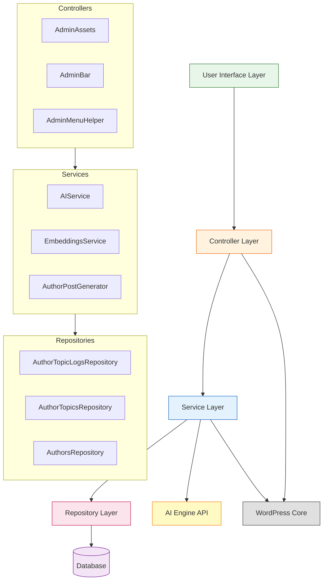
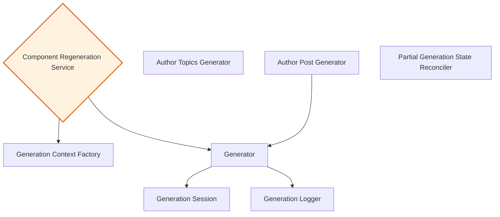
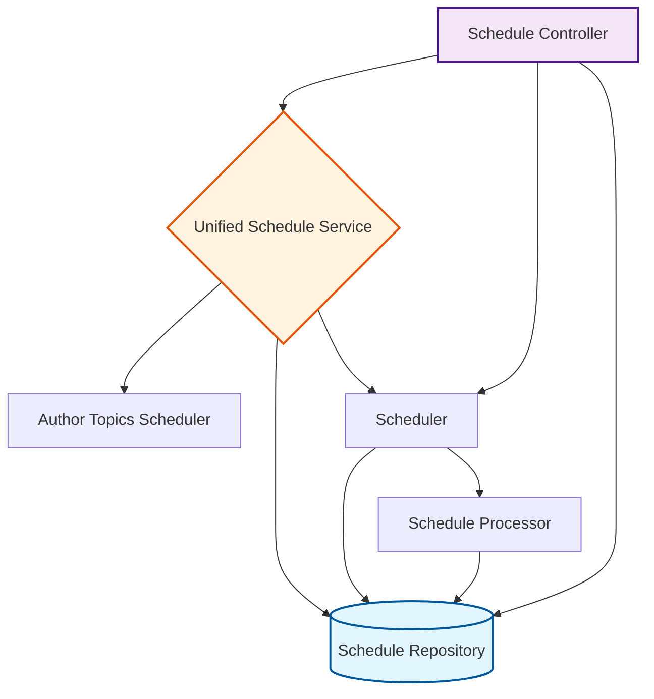
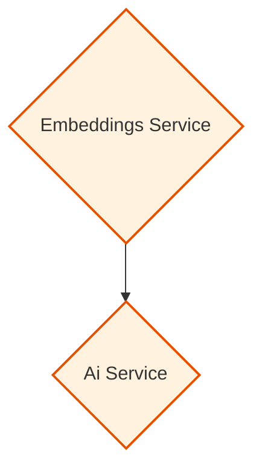
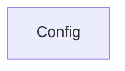
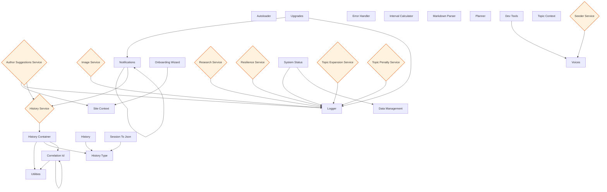

# AI Post Scheduler - Feature Documentation

*Generated by the feature scanner script.*

---

## Table of Contents

1. [Overview](#overview)
2. [Architecture Diagram](#architecture-diagram)
3. [Feature Categories](#feature-categories)
   - [Core Generation](#core-generation)
   - [Scheduling & Automation](#scheduling-and-automation)
   - [Content Management](#content-management)
   - [Data Management](#data-management)
   - [User Interface](#user-interface)
   - [AI Integration](#ai-integration)
   - [Database](#database)
   - [Configuration](#configuration)
   - [Utilities](#utilities)
4. [Feature Profiles](#feature-profiles)
5. [Summary Statistics](#summary-statistics)

## Overview

This document provides comprehensive documentation for the AI Post Scheduler WordPress plugin. The plugin consists of **104 core classes** organized into **9 functional categories**.

- **Total Lines of Code**: 34,306
- **Total Features**: 104
- **Categories**: Core Generation, Scheduling & Automation, Content Management, Data Management, User Interface, AI Integration, Database, Configuration, Utilities

## Architecture Diagram

### Overall Plugin Architecture

```mermaid
flowchart TB
    %% Overall Plugin Architecture

    UI[User Interface Layer]
    CTRL[Controller Layer]
    SVC[Service Layer]
    REPO[Repository Layer]
    DB[(Database)]
    AI[AI Engine API]
    WP[WordPress Core]

    UI --> CTRL
    CTRL --> SVC
    SVC --> REPO
    SVC --> AI
    REPO --> DB
    CTRL --> WP
    SVC --> WP

    subgraph Controllers
        AdminAssets
        AdminBar
        AdminMenuHelper
    end

    subgraph Services
        AIService
        EmbeddingsService
        AuthorPostGenerator
    end

    subgraph Repositories
        AuthorTopicLogsRepository
        AuthorTopicsRepository
        AuthorsRepository
    end

    Controllers --> Services
    Services --> Repositories

    style UI fill:#e8f5e9,stroke:#2e7d32
    style CTRL fill:#fff3e0,stroke:#ef6c00
    style SVC fill:#e3f2fd,stroke:#1565c0
    style REPO fill:#fce4ec,stroke:#c2185b
    style DB fill:#f3e5f5,stroke:#7b1fa2
    style AI fill:#fff9c4,stroke:#f57f17
    style WP fill:#e0e0e0,stroke:#424242
```

## Feature Categories

### Core Generation

This category contains 8 classes:

- **Author Post Generator** (`AIPS_Author_Post_Generator`): Author Post Generator
- **Author Topics Generator** (`AIPS_Author_Topics_Generator`): Author Topics Generator
- **Component Regeneration Service** (`AIPS_Component_Regeneration_Service`): Component Regeneration Service
- **Generation Context Factory** (`AIPS_Generation_Context_Factory`): Generation Context Factory
- **Generation Logger** (`AIPS_Generation_Logger`): AIPS_Generation_Logger
- **Generation Session** (`AIPS_Generation_Session`): Generation Session Tracker
- **Generator** (`AIPS_Generator`): AIPS_Generator
- **Partial Generation State Reconciler** (`AIPS_Partial_Generation_State_Reconciler`): Partial Generation State Reconciler

#### Core Generation Architecture

```mermaid
flowchart TD
    %% Core Generation Architecture

    Author_Post_Generator["Author Post Generator"]
    Author_Topics_Generator["Author Topics Generator"]
    Component_Regeneration_Service{"Component Regeneration Service"}
    Generation_Context_Factory["Generation Context Factory"]
    Generation_Logger["Generation Logger"]
    Generation_Session["Generation Session"]
    Generator["Generator"]
    Partial_Generation_State_Reconciler["Partial Generation State Reconciler"]

    Author_Post_Generator --> Generator
    Component_Regeneration_Service --> Generation_Context_Factory
    Component_Regeneration_Service --> Generator
    Generator --> Generation_Session
    Generator --> Generation_Logger

    classDef repository fill:#e1f5ff,stroke:#01579b,stroke-width:2px
    classDef service fill:#fff3e0,stroke:#e65100,stroke-width:2px
    classDef controller fill:#f3e5f5,stroke:#4a148c,stroke-width:2px
    class Component_Regeneration_Service service
```

### Scheduling & Automation

This category contains 6 classes:

- **Author Topics Scheduler** (`AIPS_Author_Topics_Scheduler`): Author Topics Scheduler
- **Schedule Controller** (`AIPS_Schedule_Controller`): No description available
- **Schedule Processor** (`AIPS_Schedule_Processor`): AIPS_Schedule_Processor
- **Schedule Repository** (`AIPS_Schedule_Repository`): Schedule Repository
- **Scheduler** (`AIPS_Scheduler`): No description available
- **Unified Schedule Service** (`AIPS_Unified_Schedule_Service`): Unified Schedule Service

#### Scheduling & Automation Architecture

```mermaid
flowchart TD
    %% Scheduling & Automation Architecture

    Author_Topics_Scheduler["Author Topics Scheduler"]
    Schedule_Controller["Schedule Controller"]
    Schedule_Processor["Schedule Processor"]
    Schedule_Repository[("Schedule Repository")]
    Scheduler["Scheduler"]
    Unified_Schedule_Service{"Unified Schedule Service"}

    Schedule_Controller --> Unified_Schedule_Service
    Schedule_Controller --> Schedule_Repository
    Schedule_Controller --> Scheduler
    Schedule_Processor --> Schedule_Repository
    Scheduler --> Schedule_Processor
    Scheduler --> Schedule_Repository
    Unified_Schedule_Service --> Schedule_Repository
    Unified_Schedule_Service --> Scheduler
    Unified_Schedule_Service --> Author_Topics_Scheduler

    classDef repository fill:#e1f5ff,stroke:#01579b,stroke-width:2px
    classDef service fill:#fff3e0,stroke:#e65100,stroke-width:2px
    classDef controller fill:#f3e5f5,stroke:#4a148c,stroke-width:2px
    class Schedule_Repository repository
    class Unified_Schedule_Service service
    class Schedule_Controller controller
```

### Content Management

This category contains 22 classes:

- **Article Structure Manager** (`AIPS_Article_Structure_Manager`): Article Structure Manager
- **Article Structure Repository** (`AIPS_Article_Structure_Repository`): Article Structure Repository
- **Content Auditor** (`AIPS_Content_Auditor`): Content Auditor Service
- **Generated Posts Controller** (`AIPS_Generated_Posts_Controller`): Generated Posts Controller
- **Notification Template** (`AIPS_Notification_Template`): Notification Template Value Object
- **Notification Templates** (`AIPS_Notification_Templates`): Notification Templates Registry
- **Post Creator** (`AIPS_Post_Creator`): Legacy Post Creator alias.
- **Post Manager** (`AIPS_Post_Manager`): Post Manager Service
- **Post Review Repository** (`AIPS_Post_Review_Repository`): Post Review Repository
- **Post Review** (`AIPS_Post_Review`): Post Review Handler
- **Prompt Builder Article Structure Section** (`AIPS_Prompt_Builder_Article_Structure_Section`): Article Structure Section Prompt Builder
- **Prompt Builder Post Content** (`AIPS_Prompt_Builder_Post_Content`): Post Content Prompt Builder
- **Prompt Builder Post Excerpt** (`AIPS_Prompt_Builder_Post_Excerpt`): Post Excerpt Prompt Builder
- **Prompt Builder Post Featured Image** (`AIPS_Prompt_Builder_Post_Featured_Image`): Post Featured Image Prompt Builder
- **Prompt Builder Post Title** (`AIPS_Prompt_Builder_Post_Title`): Post Title Prompt Builder
- **Template Context** (`AIPS_Template_Context`): Class AIPS_Template_Context
- **Template Helper** (`AIPS_Template_Helper`): No description available
- **Template Processor** (`AIPS_Template_Processor`): Template Variable Processor
- **Template Repository** (`AIPS_Template_Repository`): Template Repository
- **Template Type Selector** (`AIPS_Template_Type_Selector`): Template Type Selector
- **Templates Controller** (`AIPS_Templates_Controller`): No description available
- **Templates** (`AIPS_Templates`): No description available

#### Content Management Architecture

```mermaid
flowchart TD
    %% Content Management Architecture

    Article_Structure_Manager["Article Structure Manager"]
    Article_Structure_Repository[("Article Structure Repository")]
    Content_Auditor["Content Auditor"]
    Generated_Posts_Controller["Generated Posts Controller"]
    Notification_Template["Notification Template"]
    Notification_Templates["Notification Templates"]
    Post_Creator["Post Creator"]
    Post_Manager["Post Manager"]
    Post_Review_Repository[("Post Review Repository")]
    Post_Review["Post Review"]
    Prompt_Builder_Article_Structure_Section["Prompt Builder Article Structure Section"]
    Prompt_Builder_Post_Content["Prompt Builder Post Content"]
    Prompt_Builder_Post_Excerpt["Prompt Builder Post Excerpt"]
    Prompt_Builder_Post_Featured_Image["Prompt Builder Post Featured Image"]
    Prompt_Builder_Post_Title["Prompt Builder Post Title"]
    Template_Context["Template Context"]
    Template_Helper["Template Helper"]
    Template_Processor["Template Processor"]
    Template_Repository[("Template Repository")]
    Template_Type_Selector["Template Type Selector"]
    Templates_Controller["Templates Controller"]
    Templates["Templates"]

    Article_Structure_Manager --> Article_Structure_Repository
    Generated_Posts_Controller --> Template_Repository
    Generated_Posts_Controller --> Post_Review_Repository
    Notification_Template --> Notification_Template
    Notification_Templates --> Notification_Template
    Notification_Templates --> Notification_Templates
    Post_Review --> Post_Review_Repository
    Post_Review --> Template_Repository
    Prompt_Builder_Article_Structure_Section --> Article_Structure_Manager
    Prompt_Builder_Article_Structure_Section --> Template_Processor
    Prompt_Builder_Post_Content --> Prompt_Builder_Article_Structure_Section
    Prompt_Builder_Post_Content --> Template_Processor
    Prompt_Builder_Post_Excerpt --> Template_Processor
    Prompt_Builder_Post_Featured_Image --> Template_Processor
    Prompt_Builder_Post_Title --> Template_Processor
    Template_Type_Selector --> Article_Structure_Repository
    Templates_Controller --> Template_Context
    Templates_Controller --> Templates
    Templates --> Template_Repository

    classDef repository fill:#e1f5ff,stroke:#01579b,stroke-width:2px
    classDef service fill:#fff3e0,stroke:#e65100,stroke-width:2px
    classDef controller fill:#f3e5f5,stroke:#4a148c,stroke-width:2px
    class Article_Structure_Repository,Post_Review_Repository,Template_Repository repository
    class Generated_Posts_Controller,Templates_Controller controller
```

### Data Management

This category contains 6 classes:

- **Data Management Export Json** (`AIPS_Data_Management_Export_JSON`): JSON export implementation (placeholder for future)
- **Data Management Export Mysql** (`AIPS_Data_Management_Export_MySQL`): MySQL dump export implementation
- **Data Management Export** (`AIPS_Data_Management_Export`): No description available
- **Data Management Import Json** (`AIPS_Data_Management_Import_JSON`): JSON import implementation (placeholder for future)
- **Data Management Import Mysql** (`AIPS_Data_Management_Import_MySQL`): MySQL dump import implementation
- **Data Management Import** (`AIPS_Data_Management_Import`): No description available

#### Data Management Architecture

```mermaid
flowchart TD
    %% Data Management Architecture

    Data_Management_Export_JSON["Data Management Export Json"]
    Data_Management_Export_MySQL["Data Management Export Mysql"]
    Data_Management_Export["Data Management Export"]
    Data_Management_Import_JSON["Data Management Import Json"]
    Data_Management_Import_MySQL["Data Management Import Mysql"]
    Data_Management_Import["Data Management Import"]


    classDef repository fill:#e1f5ff,stroke:#01579b,stroke-width:2px
    classDef service fill:#fff3e0,stroke:#e65100,stroke-width:2px
    classDef controller fill:#f3e5f5,stroke:#4a148c,stroke-width:2px
```

### User Interface

This category contains 18 classes:

- **Admin Assets** (`AIPS_Admin_Assets`): Class AIPS_Admin_Assets
- **Admin Bar** (`AIPS_Admin_Bar`): Class AIPS_Admin_Bar
- **Admin Menu Helper** (`AIPS_Admin_Menu_Helper`): Admin Menu Helper
- **Admin Menu** (`AIPS_Admin_Menu`): Class AIPS_Admin_Menu
- **Ai Edit Controller** (`AIPS_AI_Edit_Controller`): AI Edit Controller
- **Author Topics Controller** (`AIPS_Author_Topics_Controller`): Author Topics Controller
- **Authors Controller** (`AIPS_Authors_Controller`): Authors Controller
- **Calendar Controller** (`AIPS_Calendar_Controller`): Class AIPS_Calendar_Controller
- **Dashboard Controller** (`AIPS_Dashboard_Controller`): AIPS_Dashboard_Controller
- **Prompt Builder Authors** (`AIPS_Prompt_Builder_Authors`): Author Suggestions Prompt Builder
- **Prompt Builder Topic** (`AIPS_Prompt_Builder_Topic`): Topic Prompt Builder
- **Prompt Builder** (`AIPS_Prompt_Builder`): No description available
- **Prompt Sections Controller** (`AIPS_Prompt_Sections_Controller`): Controller for managing prompt sections via AJAX in the WordPress admin.
- **Research Controller** (`AIPS_Research_Controller`): Research Controller
- **Seeder Admin** (`AIPS_Seeder_Admin`): No description available
- **Settings** (`AIPS_Settings`): Class AIPS_Settings
- **Sources Controller** (`AIPS_Sources_Controller`): Sources Controller
- **Structures Controller** (`AIPS_Structures_Controller`): No description available

#### User Interface Architecture

```mermaid
flowchart TD
    %% User Interface Architecture

    Admin_Assets["Admin Assets"]
    Admin_Bar["Admin Bar"]
    Admin_Menu_Helper["Admin Menu Helper"]
    Admin_Menu["Admin Menu"]
    AI_Edit_Controller["Ai Edit Controller"]
    Author_Topics_Controller["Author Topics Controller"]
    Authors_Controller["Authors Controller"]
    Calendar_Controller["Calendar Controller"]
    Dashboard_Controller["Dashboard Controller"]
    Prompt_Builder_Authors["Prompt Builder Authors"]
    Prompt_Builder_Topic["Prompt Builder Topic"]
    Prompt_Builder["Prompt Builder"]
    Prompt_Sections_Controller["Prompt Sections Controller"]
    Research_Controller["Research Controller"]
    Seeder_Admin["Seeder Admin"]
    Settings["Settings"]
    Sources_Controller["Sources Controller"]
    Structures_Controller["Structures Controller"]

    Admin_Assets --> Admin_Menu_Helper
    Admin_Bar --> Admin_Menu_Helper
    Admin_Menu --> Dashboard_Controller
    Prompt_Builder_Authors --> Prompt_Builder
    Prompt_Builder_Topic --> Prompt_Builder
    Settings --> Prompt_Builder

    classDef repository fill:#e1f5ff,stroke:#01579b,stroke-width:2px
    classDef service fill:#fff3e0,stroke:#e65100,stroke-width:2px
    classDef controller fill:#f3e5f5,stroke:#4a148c,stroke-width:2px
    class AI_Edit_Controller,Author_Topics_Controller,Authors_Controller,Calendar_Controller,Dashboard_Controller,Prompt_Sections_Controller,Research_Controller,Sources_Controller,Structures_Controller controller
```

### AI Integration

This category contains 2 classes:

- **Ai Service** (`AIPS_AI_Service`): AI Service Layer
- **Embeddings Service** (`AIPS_Embeddings_Service`): Embeddings Service

#### AI Integration Architecture

```mermaid
flowchart TD
    %% AI Integration Architecture

    AI_Service{"Ai Service"}
    Embeddings_Service{"Embeddings Service"}

    Embeddings_Service --> AI_Service

    classDef repository fill:#e1f5ff,stroke:#01579b,stroke-width:2px
    classDef service fill:#fff3e0,stroke:#e65100,stroke-width:2px
    classDef controller fill:#f3e5f5,stroke:#4a148c,stroke-width:2px
    class AI_Service,Embeddings_Service service
```

### Database

This category contains 12 classes:

- **Author Topic Logs Repository** (`AIPS_Author_Topic_Logs_Repository`): Author Topic Logs Repository
- **Author Topics Repository** (`AIPS_Author_Topics_Repository`): Author Topics Repository
- **Authors Repository** (`AIPS_Authors_Repository`): Authors Repository
- **Db Manager** (`AIPS_DB_Manager`): No description available
- **Feedback Repository** (`AIPS_Feedback_Repository`): Feedback Repository
- **History Repository** (`AIPS_History_Repository`): History Repository
- **Metrics Repository** (`AIPS_Metrics_Repository`): Metrics Repository
- **Notifications Repository** (`AIPS_Notifications_Repository`): Class AIPS_Notifications_Repository
- **Prompt Section Repository** (`AIPS_Prompt_Section_Repository`): Prompt Section Repository
- **Sources Repository** (`AIPS_Sources_Repository`): Sources Repository
- **Trending Topics Repository** (`AIPS_Trending_Topics_Repository`): Trending Topics Repository
- **Voices Repository** (`AIPS_Voices_Repository`): Voices Repository

#### Database Architecture

```mermaid
flowchart TD
    %% Database Architecture

    Author_Topic_Logs_Repository[("Author Topic Logs Repository")]
    Author_Topics_Repository[("Author Topics Repository")]
    Authors_Repository[("Authors Repository")]
    DB_Manager["Db Manager"]
    Feedback_Repository[("Feedback Repository")]
    History_Repository[("History Repository")]
    Metrics_Repository[("Metrics Repository")]
    Notifications_Repository[("Notifications Repository")]
    Prompt_Section_Repository[("Prompt Section Repository")]
    Sources_Repository[("Sources Repository")]
    Trending_Topics_Repository[("Trending Topics Repository")]
    Voices_Repository[("Voices Repository")]


    classDef repository fill:#e1f5ff,stroke:#01579b,stroke-width:2px
    classDef service fill:#fff3e0,stroke:#e65100,stroke-width:2px
    classDef controller fill:#f3e5f5,stroke:#4a148c,stroke-width:2px
    class Author_Topic_Logs_Repository,Author_Topics_Repository,Authors_Repository,Feedback_Repository,History_Repository,Metrics_Repository,Notifications_Repository,Prompt_Section_Repository,Sources_Repository,Trending_Topics_Repository,Voices_Repository repository
```

### Configuration

This category contains 1 classes:

- **Config** (`AIPS_Config`): Configuration Manager

#### Configuration Architecture

```mermaid
flowchart TD
    %% Configuration Architecture

    Config["Config"]


    classDef repository fill:#e1f5ff,stroke:#01579b,stroke-width:2px
    classDef service fill:#fff3e0,stroke:#e65100,stroke-width:2px
    classDef controller fill:#f3e5f5,stroke:#4a148c,stroke-width:2px
```

### Utilities

This category contains 29 classes:

- **Author Suggestions Service** (`AIPS_Author_Suggestions_Service`): Author Suggestions Service
- **Autoloader** (`AIPS_Autoloader`): No description available
- **Correlation Id** (`AIPS_Correlation_ID`): Correlation ID Manager
- **Data Management** (`AIPS_Data_Management`): Data Management Controller
- **Dev Tools** (`AIPS_Dev_Tools`): Class AIPS_Dev_Tools
- **Error Handler** (`AIPS_Error_Handler`): AIPS_Error_Handler
- **History Container** (`AIPS_History_Container`): History Container
- **History Service** (`AIPS_History_Service`): History Service
- **History Type** (`AIPS_History_Type`): History Type Constants
- **History** (`AIPS_History`): Handles history management for AI post generation runs.
- **Image Service** (`AIPS_Image_Service`): Image Service
- **Interval Calculator** (`AIPS_Interval_Calculator`): Interval Calculator Service
- **Logger** (`AIPS_Logger`): No description available
- **Markdown Parser** (`AIPS_Markdown_Parser`): Markdown Parser Utility.
- **Notifications** (`AIPS_Notifications`): Central Notifications Service
- **Onboarding Wizard** (`AIPS_Onboarding_Wizard`): No description available
- **Planner** (`AIPS_Planner`): No description available
- **Research Service** (`AIPS_Research_Service`): Research Service
- **Resilience Service** (`AIPS_Resilience_Service`): Resilience Service Layer
- **Seeder Service** (`AIPS_Seeder_Service`): No description available
- **Session To Json** (`AIPS_Session_To_JSON`): Session To JSON Converter
- **Site Context** (`AIPS_Site_Context`): Site Context Service
- **System Status** (`AIPS_System_Status`): No description available
- **Topic Context** (`AIPS_Topic_Context`): Class AIPS_Topic_Context
- **Topic Expansion Service** (`AIPS_Topic_Expansion_Service`): Topic Expansion Service
- **Topic Penalty Service** (`AIPS_Topic_Penalty_Service`): Topic Penalty Service
- **Upgrades** (`AIPS_Upgrades`): No description available
- **Utilities** (`AIPS_Utilities`): General Utilities
- **Voices** (`AIPS_Voices`): No description available

#### Utilities Architecture

```mermaid
flowchart TD
    %% Utilities Architecture

    Author_Suggestions_Service{"Author Suggestions Service"}
    Autoloader["Autoloader"]
    Correlation_ID["Correlation Id"]
    Data_Management["Data Management"]
    Dev_Tools["Dev Tools"]
    Error_Handler["Error Handler"]
    History_Container["History Container"]
    History_Service{"History Service"}
    History_Type["History Type"]
    History["History"]
    Image_Service{"Image Service"}
    Interval_Calculator["Interval Calculator"]
    Logger["Logger"]
    Markdown_Parser["Markdown Parser"]
    Notifications["Notifications"]
    Onboarding_Wizard["Onboarding Wizard"]
    Planner["Planner"]
    Research_Service{"Research Service"}
    Resilience_Service{"Resilience Service"}
    Seeder_Service{"Seeder Service"}
    Session_To_JSON["Session To Json"]
    Site_Context["Site Context"]
    System_Status["System Status"]
    Topic_Context["Topic Context"]
    Topic_Expansion_Service{"Topic Expansion Service"}
    Topic_Penalty_Service{"Topic Penalty Service"}
    Upgrades["Upgrades"]
    Utilities["Utilities"]
    Voices["Voices"]

    Author_Suggestions_Service --> Site_Context
    Author_Suggestions_Service --> Logger
    Author_Suggestions_Service --> History_Service
    Correlation_ID --> Utilities
    Correlation_ID --> Correlation_ID
    Dev_Tools --> Voices
    History_Container --> Utilities
    History_Container --> History_Type
    History_Container --> Correlation_ID
    History_Service --> History_Container
    History --> History_Type
    Image_Service --> Logger
    Notifications --> Notifications
    Notifications --> History_Service
    Onboarding_Wizard --> Site_Context
    Research_Service --> Logger
    Resilience_Service --> Logger
    Seeder_Service --> Voices
    Session_To_JSON --> History_Type
    System_Status --> Logger
    System_Status --> Data_Management
    Topic_Expansion_Service --> Logger
    Topic_Penalty_Service --> Logger
    Upgrades --> Notifications
    Upgrades --> Logger

    classDef repository fill:#e1f5ff,stroke:#01579b,stroke-width:2px
    classDef service fill:#fff3e0,stroke:#e65100,stroke-width:2px
    classDef controller fill:#f3e5f5,stroke:#4a148c,stroke-width:2px
    class Author_Suggestions_Service,History_Service,Image_Service,Research_Service,Resilience_Service,Seeder_Service,Topic_Expansion_Service,Topic_Penalty_Service service
```

## Feature Profiles

Detailed analysis of each feature including files, functionality, and recommendations.

### Ai Edit Controller

**Summary**: AI Edit Controller

**File**: `ai-post-scheduler/includes/class-aips-ai-edit-controller.php`

**Class**: `AIPS_AI_Edit_Controller`

**Lines of Code**: 511

**Technical Details**:

- **Public Methods** (6): `__construct()`, `ajax_get_post_components()`, `ajax_regenerate_component()`, `ajax_save_post_components()`, `ajax_get_component_revisions()`, `ajax_restore_component_revision()`
- **Dependencies** (2): `AIPS_Component_Regeneration_Service`, `AIPS_History_Repository`
- **Action Hooks** (6): `aips_post_components_updated`, `wp_ajax_aips_get_component_revisions`, `wp_ajax_aips_get_post_components`, `wp_ajax_aips_regenerate_component`, `wp_ajax_aips_save_post_components`, ... and 1 more
- **AJAX Handlers**: `wp_ajax_aips_get_post_components`, `wp_ajax_aips_regenerate_component`, `wp_ajax_aips_save_post_components`, `wp_ajax_aips_get_component_revisions`, `wp_ajax_aips_restore_component_revision`
- **Database Operations**: Has Repository

**Missing Functionality**:

- No input validation methods visible

**Recommended Improvements**:

1. Consider refactoring - class has 511 lines (may violate SRP)
2. Document all custom hooks in HOOKS.md for third-party developers
3. Ensure unit tests cover all public methods and edge cases

---

### Ai Service

**Summary**: AI Service Layer

**File**: `ai-post-scheduler/includes/class-aips-ai-service.php`

**Class**: `AIPS_AI_Service`

**Lines of Code**: 726

**Technical Details**:

- **Public Methods** (12): `__construct()`, `is_available()`, `generate_text()`, `generate_json()`, `generate_image()`, `get_call_log()`, `clear_call_log()`, `get_call_statistics()`, `reset_circuit_breaker()`, `get_circuit_breaker_status()`, ... and 2 more
- **Dependencies** (3): `AIPS_Config`, `AIPS_Logger`, `AIPS_Resilience_Service`
- **Action Hooks** (2): `aips_integration_error`, `aips_quota_alert`
- **WordPress APIs Used**: Options

**Missing Functionality**:

- No input validation methods visible

**Recommended Improvements**:

1. Consider refactoring - class has 726 lines (may violate SRP)
2. Document all custom hooks in HOOKS.md for third-party developers
3. Add comprehensive error handling with specific exception types
4. Ensure unit tests cover all public methods and edge cases
5. Consider using WordPress transients API for caching expensive operations

---

### Admin Assets

**Summary**: Class AIPS_Admin_Assets

**File**: `ai-post-scheduler/includes/class-aips-admin-assets.php`

**Class**: `AIPS_Admin_Assets`

**Lines of Code**: 675

**Technical Details**:

- **Public Methods** (2): `__construct()`, `enqueue_admin_assets()`
- **Dependencies** (2): `AIPS_Admin_Menu_Helper`, `AIPS_Config`
- **Action Hooks** (1): `admin_enqueue_scripts`
- **WordPress APIs Used**: Options

**Missing Functionality**: None identified

**Recommended Improvements**:

1. Consider refactoring - class has 675 lines (may violate SRP)
2. Document all custom hooks in HOOKS.md for third-party developers
3. Ensure unit tests cover all public methods and edge cases

---

### Admin Bar

**Summary**: Class AIPS_Admin_Bar

**File**: `ai-post-scheduler/includes/class-aips-admin-bar.php`

**Class**: `AIPS_Admin_Bar`

**Lines of Code**: 269

**Technical Details**:

- **Public Methods** (5): `__construct()`, `enqueue_assets()`, `add_toolbar_node()`, `ajax_mark_read()`, `ajax_mark_all_read()`
- **Dependencies** (2): `AIPS_Admin_Menu_Helper`, `AIPS_Notifications_Repository`
- **Action Hooks** (5): `admin_bar_menu`, `admin_enqueue_scripts`, `wp_ajax_aips_mark_all_notifications_read`, `wp_ajax_aips_mark_notification_read`, `wp_enqueue_scripts`
- **AJAX Handlers**: `wp_ajax_aips_mark_notification_read`, `wp_ajax_aips_mark_all_notifications_read`
- **Database Operations**: Has Repository

**Missing Functionality**: None identified

**Recommended Improvements**:

1. Document all custom hooks in HOOKS.md for third-party developers
2. Ensure unit tests cover all public methods and edge cases

---

### Admin Menu

**Summary**: Class AIPS_Admin_Menu

**File**: `ai-post-scheduler/includes/class-aips-admin-menu.php`

**Class**: `AIPS_Admin_Menu`

**Lines of Code**: 477

**Technical Details**:

- **Public Methods** (22): `__construct()`, `add_menu_pages()`, `fix_author_topics_parent_file()`, `fix_author_topics_submenu_file()`, `render_dashboard_page()`, `render_voices_page()`, `render_templates_page()`, `render_schedule_page()`, `render_schedule_calendar_page()`, `render_research_page()`, ... and 12 more
- **Dependencies** (10): `AIPS_Article_Structure_Repository`, `AIPS_Dashboard_Controller`, `AIPS_Dev_Tools`, `AIPS_Generated_Posts_Controller`, `AIPS_History`, `AIPS_Prompt_Section_Repository`, `AIPS_Sources_Repository`, `AIPS_System_Status`, `AIPS_Templates`, `AIPS_Voices`
- **Action Hooks** (1): `admin_menu`
- **Filter Hooks** (2): `parent_file`, `submenu_file`
- **Database Operations**: Has Repository
- **WordPress APIs Used**: Options

**Missing Functionality**: None identified

**Recommended Improvements**:

1. High method count (22+ methods) - consider splitting responsibilities
2. High coupling - depends on 10 classes
3. Document all custom hooks in HOOKS.md for third-party developers
4. Ensure unit tests cover all public methods and edge cases

---

### Admin Menu Helper

**Summary**: Admin Menu Helper

**File**: `ai-post-scheduler/includes/class-aips-admin-menu-helper.php`

**Class**: `AIPS_Admin_Menu_Helper`

**Lines of Code**: 74

**Technical Details**:

- **Public Methods** (2): `get_page_url()`, `get_slug()`

**Missing Functionality**: None identified

**Recommended Improvements**:

1. Ensure unit tests cover all public methods and edge cases

---

### Article Structure Manager

**Summary**: Article Structure Manager

**File**: `ai-post-scheduler/includes/class-aips-article-structure-manager.php`

**Class**: `AIPS_Article_Structure_Manager`

**Lines of Code**: 260

**Technical Details**:

- **Public Methods** (8): `__construct()`, `get_active_structures()`, `get_structure()`, `get_default_structure()`, `create_structure()`, `update_structure()`, `delete_structure()`, `get_available_sections()`
- **Dependencies** (2): `AIPS_Article_Structure_Repository`, `AIPS_Prompt_Section_Repository`
- **Action Hooks** (3): `aips_structure_created`, `aips_structure_deleted`, `aips_structure_updated`
- **Database Operations**: Has Repository

**Missing Functionality**: None identified

**Recommended Improvements**:

1. Document all custom hooks in HOOKS.md for third-party developers
2. Ensure unit tests cover all public methods and edge cases

---

### Article Structure Repository

**Summary**: Article Structure Repository

**File**: `ai-post-scheduler/includes/class-aips-article-structure-repository.php`

**Class**: `AIPS_Article_Structure_Repository`

**Lines of Code**: 261

**Technical Details**:

- **Public Methods** (12): `__construct()`, `get_all()`, `get_by_id()`, `get_default()`, `get_by_name()`, `create()`, `update()`, `delete()`, `set_active()`, `set_default()`, ... and 2 more
- **Database Operations**: Uses Wpdb, Has Repository

**Missing Functionality**: None identified

**Recommended Improvements**:

1. Ensure unit tests cover all public methods and edge cases

---

### Author Post Generator

**Summary**: Author Post Generator

**File**: `ai-post-scheduler/includes/class-aips-author-post-generator.php`

**Class**: `AIPS_Author_Post_Generator`

**Lines of Code**: 408

**Technical Details**:

- **Public Methods** (6): `__construct()`, `process_post_generation()`, `generate_post_for_author()`, `generate_post_from_topic()`, `generate_now()`, `regenerate_post()`
- **Dependencies** (11): `AIPS_Admin_Menu_Helper`, `AIPS_Author_Topic_Logs_Repository`, `AIPS_Author_Topics_Repository`, `AIPS_Authors_Repository`, `AIPS_Correlation_ID`, `AIPS_Generator`, `AIPS_History_Service`, `AIPS_Interval_Calculator`, `AIPS_Logger`, `AIPS_Topic_Context`, `AIPS_Topic_Expansion_Service`
- **Action Hooks** (3): `aips_generate_author_posts`, `aips_generation_failed`, `aips_scheduler_error`
- **Database Operations**: Has Repository
- **WordPress APIs Used**: Post Meta

**Missing Functionality**:

- No filter hooks for customizing generation output
- No dedicated error handling methods visible
- No logging methods for debugging and monitoring

**Recommended Improvements**:

1. High coupling - depends on 11 classes
2. Document all custom hooks in HOOKS.md for third-party developers
3. Add comprehensive error handling with specific exception types
4. Ensure unit tests cover all public methods and edge cases

---

### Author Suggestions Service

**Summary**: Author Suggestions Service

**File**: `ai-post-scheduler/includes/class-aips-author-suggestions-service.php`

**Class**: `AIPS_Author_Suggestions_Service`

**Lines of Code**: 304

**Technical Details**:

- **Public Methods** (2): `__construct()`, `suggest_authors()`
- **Dependencies** (5): `AIPS_AI_Service`, `AIPS_History_Service`, `AIPS_Logger`, `AIPS_Prompt_Builder_Authors`, `AIPS_Site_Context`

**Missing Functionality**:

- No logging methods for debugging and monitoring
- No input validation methods visible

**Recommended Improvements**:

1. Add comprehensive error handling with specific exception types
2. Ensure unit tests cover all public methods and edge cases
3. Consider using WordPress transients API for caching expensive operations

---

### Author Topic Logs Repository

**Summary**: Author Topic Logs Repository

**File**: `ai-post-scheduler/includes/class-aips-author-topic-logs-repository.php`

**Class**: `AIPS_Author_Topic_Logs_Repository`

**Lines of Code**: 215

**Technical Details**:

- **Public Methods** (11): `__construct()`, `get_by_topic()`, `get_by_id()`, `create()`, `log_approval()`, `log_rejection()`, `log_post_generation()`, `log_edit()`, `get_by_post()`, `delete_by_topic_ids()`, ... and 1 more
- **Database Operations**: Uses Wpdb, Has Repository

**Missing Functionality**:

- Missing save/update methods for data persistence

**Recommended Improvements**:

1. Ensure unit tests cover all public methods and edge cases

---

### Author Topics Controller

**Summary**: Author Topics Controller

**File**: `ai-post-scheduler/includes/class-aips-author-topics-controller.php`

**Class**: `AIPS_Author_Topics_Controller`

**Lines of Code**: 935

**Technical Details**:

- **Public Methods** (21): `__construct()`, `ajax_approve_topic()`, `ajax_reject_topic()`, `ajax_edit_topic()`, `ajax_delete_topic()`, `ajax_generate_post_from_topic()`, `ajax_get_topic_logs()`, `ajax_bulk_approve_topics()`, `ajax_bulk_reject_topics()`, `ajax_bulk_delete_topics()`, ... and 11 more
- **Dependencies** (8): `AIPS_Author_Post_Generator`, `AIPS_Author_Topic_Logs_Repository`, `AIPS_Author_Topics_Repository`, `AIPS_Feedback_Repository`, `AIPS_History_Repository`, `AIPS_History_Service`, `AIPS_Topic_Expansion_Service`, `AIPS_Topic_Penalty_Service`
- **Action Hooks** (20): `wp_ajax_aips_approve_topic`, `wp_ajax_aips_delete_topic`, `wp_ajax_aips_edit_topic`, `wp_ajax_aips_generate_post_from_topic`, `wp_ajax_aips_reject_topic`, ... and 15 more
- **AJAX Handlers**: `wp_ajax_aips_approve_topic`, `wp_ajax_aips_reject_topic`, `wp_ajax_aips_edit_topic`, `wp_ajax_aips_delete_topic`, `wp_ajax_aips_generate_post_from_topic`, `wp_ajax_aips_get_topic_logs`, `wp_ajax_aips_get_topic_feedback`, `wp_ajax_aips_bulk_approve_topics`, `wp_ajax_aips_bulk_reject_topics`, `wp_ajax_aips_bulk_delete_topics`, `wp_ajax_aips_bulk_generate_topics`, `wp_ajax_aips_bulk_delete_feedback`, `wp_ajax_aips_regenerate_post`, `wp_ajax_aips_delete_generated_post`, `wp_ajax_aips_get_similar_topics`, `wp_ajax_aips_suggest_related_topics`, `wp_ajax_aips_compute_topic_embeddings`, `wp_ajax_aips_get_generation_queue`, `wp_ajax_aips_bulk_generate_from_queue`, `wp_ajax_aips_get_bulk_generate_estimate`
- **Database Operations**: Has Repository

**Missing Functionality**:

- No input validation methods visible

**Recommended Improvements**:

1. Consider refactoring - class has 935 lines (may violate SRP)
2. High method count (21+ methods) - consider splitting responsibilities
3. High coupling - depends on 8 classes
4. Document all custom hooks in HOOKS.md for third-party developers
5. Ensure unit tests cover all public methods and edge cases

---

### Author Topics Generator

**Summary**: Author Topics Generator

**File**: `ai-post-scheduler/includes/class-aips-author-topics-generator.php`

**Class**: `AIPS_Author_Topics_Generator`

**Lines of Code**: 468

**Technical Details**:

- **Public Methods** (3): `__construct()`, `generate_topics()`, `get_feedback_context()`
- **Dependencies** (7): `AIPS_AI_Service`, `AIPS_Author_Topic_Logs_Repository`, `AIPS_Author_Topics_Repository`, `AIPS_Embeddings_Service`, `AIPS_Feedback_Repository`, `AIPS_Logger`, `AIPS_Prompt_Builder_Topic`
- **Database Operations**: Has Repository
- **WordPress APIs Used**: Options

**Missing Functionality**:

- No filter hooks for customizing generation output
- No dedicated error handling methods visible
- No logging methods for debugging and monitoring

**Recommended Improvements**:

1. High coupling - depends on 7 classes
2. Add comprehensive error handling with specific exception types
3. Ensure unit tests cover all public methods and edge cases

---

### Author Topics Repository

**Summary**: Author Topics Repository

**File**: `ai-post-scheduler/includes/class-aips-author-topics-repository.php`

**Class**: `AIPS_Author_Topics_Repository`

**Lines of Code**: 411

**Technical Details**:

- **Public Methods** (16): `__construct()`, `get_by_author()`, `get_by_id()`, `create()`, `create_bulk()`, `get_latest_by_author()`, `update()`, `update_status()`, `delete()`, `delete_by_author()`, ... and 6 more
- **Database Operations**: Uses Wpdb, Has Repository

**Missing Functionality**: None identified

**Recommended Improvements**:

1. Ensure unit tests cover all public methods and edge cases

---

### Author Topics Scheduler

**Summary**: Author Topics Scheduler

**File**: `ai-post-scheduler/includes/class-aips-author-topics-scheduler.php`

**Class**: `AIPS_Author_Topics_Scheduler`

**Lines of Code**: 220

**Technical Details**:

- **Public Methods** (4): `__construct()`, `process_topic_generation()`, `generate_topics_for_author()`, `generate_now()`
- **Dependencies** (7): `AIPS_Author_Topics_Generator`, `AIPS_Authors_Repository`, `AIPS_Correlation_ID`, `AIPS_History_Service`, `AIPS_Interval_Calculator`, `AIPS_Logger`, `AIPS_Notifications`
- **Action Hooks** (1): `aips_generate_author_topics`
- **Database Operations**: Has Repository

**Missing Functionality**:

- No logging methods for debugging and monitoring

**Recommended Improvements**:

1. High coupling - depends on 7 classes
2. Document all custom hooks in HOOKS.md for third-party developers
3. Ensure unit tests cover all public methods and edge cases

---

### Authors Controller

**Summary**: Authors Controller

**File**: `ai-post-scheduler/includes/class-aips-authors-controller.php`

**Class**: `AIPS_Authors_Controller`

**Lines of Code**: 517

**Technical Details**:

- **Public Methods** (10): `__construct()`, `ajax_save_author()`, `ajax_delete_author()`, `ajax_get_author()`, `ajax_get_author_topics()`, `ajax_get_author_posts()`, `ajax_generate_topics_now()`, `ajax_get_author_feedback()`, `ajax_get_topic_posts()`, `ajax_suggest_authors()`
- **Dependencies** (7): `AIPS_Author_Suggestions_Service`, `AIPS_Author_Topic_Logs_Repository`, `AIPS_Author_Topics_Repository`, `AIPS_Author_Topics_Scheduler`, `AIPS_Authors_Repository`, `AIPS_Feedback_Repository`, `AIPS_Notifications`
- **Action Hooks** (10): `aips_author_suggestions_generated`, `wp_ajax_aips_delete_author`, `wp_ajax_aips_get_author`, `wp_ajax_aips_get_author_topics`, `wp_ajax_aips_save_author`, ... and 5 more
- **AJAX Handlers**: `wp_ajax_aips_save_author`, `wp_ajax_aips_delete_author`, `wp_ajax_aips_get_author`, `wp_ajax_aips_get_author_topics`, `wp_ajax_aips_get_author_posts`, `wp_ajax_aips_get_author_feedback`, `wp_ajax_aips_generate_topics_now`, `wp_ajax_aips_get_topic_posts`, `wp_ajax_aips_suggest_authors`
- **Database Operations**: Has Repository

**Missing Functionality**:

- No input validation methods visible

**Recommended Improvements**:

1. Consider refactoring - class has 517 lines (may violate SRP)
2. High coupling - depends on 7 classes
3. Document all custom hooks in HOOKS.md for third-party developers
4. Ensure unit tests cover all public methods and edge cases

---

### Authors Repository

**Summary**: Authors Repository

**File**: `ai-post-scheduler/includes/class-aips-authors-repository.php`

**Class**: `AIPS_Authors_Repository`

**Lines of Code**: 227

**Technical Details**:

- **Public Methods** (12): `__construct()`, `get_all()`, `get_by_id()`, `create()`, `update()`, `delete()`, `get_due_for_topic_generation()`, `get_due_for_post_generation()`, `update_topic_generation_active()`, `update_post_generation_active()`, ... and 2 more
- **Database Operations**: Uses Wpdb, Has Repository

**Missing Functionality**: None identified

**Recommended Improvements**:

1. Ensure unit tests cover all public methods and edge cases

---

### Autoloader

**Summary**: No description available

**File**: `ai-post-scheduler/includes/class-aips-autoloader.php`

**Class**: `AIPS_Autoloader`

**Lines of Code**: 57

**Technical Details**:

- **Public Methods** (4): `register()`, `convert_class_name_to_base()`, `convert_class_name_to_filename()`, `load()`

**Missing Functionality**: None identified

**Recommended Improvements**:

1. Ensure unit tests cover all public methods and edge cases
2. Add comprehensive class-level PHPDoc documentation

---

### Calendar Controller

**Summary**: Class AIPS_Calendar_Controller

**File**: `ai-post-scheduler/includes/class-aips-calendar-controller.php`

**Class**: `AIPS_Calendar_Controller`

**Lines of Code**: 234

**Technical Details**:

- **Public Methods** (4): `__construct()`, `render_page()`, `get_month_events()`, `ajax_get_calendar_events()`
- **Dependencies** (3): `AIPS_Interval_Calculator`, `AIPS_Schedule_Repository`, `AIPS_Template_Repository`
- **Action Hooks** (1): `wp_ajax_aips_get_calendar_events`
- **AJAX Handlers**: `wp_ajax_aips_get_calendar_events`
- **Database Operations**: Has Repository

**Missing Functionality**:

- No input validation methods visible

**Recommended Improvements**:

1. Document all custom hooks in HOOKS.md for third-party developers
2. Ensure unit tests cover all public methods and edge cases

---

### Component Regeneration Service

**Summary**: Component Regeneration Service

**File**: `ai-post-scheduler/includes/class-aips-component-regeneration-service.php`

**Class**: `AIPS_Component_Regeneration_Service`

**Lines of Code**: 364

**Technical Details**:

- **Public Methods** (7): `__construct()`, `get_generation_context()`, `regenerate_title()`, `regenerate_excerpt()`, `regenerate_content()`, `regenerate_featured_image()`, `capture_component_revision()`
- **Dependencies** (12): `AIPS_AI_Service`, `AIPS_Article_Structure_Manager`, `AIPS_Generation_Context_Factory`, `AIPS_Generator`, `AIPS_History_Container`, `AIPS_History_Repository`, `AIPS_Image_Service`, `AIPS_Prompt_Builder`, `AIPS_Prompt_Builder_Article_Structure_Section`, `AIPS_Prompt_Builder_Post_Content`, `AIPS_Prompt_Builder_Post_Featured_Image`, `AIPS_Template_Processor`
- **Database Operations**: Has Repository

**Missing Functionality**:

- No logging methods for debugging and monitoring
- No input validation methods visible

**Recommended Improvements**:

1. High coupling - depends on 12 classes
2. Add comprehensive error handling with specific exception types
3. Ensure unit tests cover all public methods and edge cases
4. Consider using WordPress transients API for caching expensive operations

---

### Config

**Summary**: Configuration Manager

**File**: `ai-post-scheduler/includes/class-aips-config.php`

**Class**: `AIPS_Config`

**Lines of Code**: 387

**Technical Details**:

- **Public Methods** (21): `get_instance()`, `get_default_options()`, `get_option()`, `set_option()`, `get_version()`, `get_plugin_dir()`, `get_plugin_url()`, `is_debug_mode()`, `get_ai_config()`, `get_retry_config()`, ... and 11 more
- **Dependencies** (1): `AIPS_Settings`
- **WordPress APIs Used**: Options

**Missing Functionality**: None identified

**Recommended Improvements**:

1. High method count (21+ methods) - consider splitting responsibilities
2. Ensure unit tests cover all public methods and edge cases

---

### Content Auditor

**Summary**: Content Auditor Service

**File**: `ai-post-scheduler/includes/class-aips-content-auditor.php`

**Class**: `AIPS_Content_Auditor`

**Lines of Code**: 257

**Technical Details**:

- **Public Methods** (4): `__construct()`, `get_site_content_summary()`, `perform_gap_analysis()`, `perform_gap_analysis_fallback()`
- **Dependencies** (2): `AIPS_AI_Service`, `AIPS_Logger`
- **WordPress APIs Used**: Options

**Missing Functionality**: None identified

**Recommended Improvements**:

1. Ensure unit tests cover all public methods and edge cases

---

### Correlation Id

**Summary**: Correlation ID Manager

**File**: `ai-post-scheduler/includes/class-aips-correlation-id.php`

**Class**: `AIPS_Correlation_ID`

**Lines of Code**: 90

**Technical Details**:

- **Public Methods** (4): `generate()`, `get()`, `set()`, `reset()`
- **Dependencies** (2): `AIPS_Correlation_ID`, `AIPS_Utilities`

**Missing Functionality**: None identified

**Recommended Improvements**:

1. Ensure unit tests cover all public methods and edge cases

---

### Db Manager

**Summary**: No description available

**File**: `ai-post-scheduler/includes/class-aips-db-manager.php`

**Class**: `AIPS_DB_Manager`

**Lines of Code**: 683

**Technical Details**:

- **Public Methods** (14): `__construct()`, `get_table_names()`, `get_full_table_names()`, `get_schema()`, `install_tables()`, `drop_tables()`, `truncate_tables()`, `backup_data()`, `restore_data()`, `ajax_repair_db()`, ... and 4 more
- **Action Hooks** (3): `wp_ajax_aips_reinstall_db`, `wp_ajax_aips_repair_db`, `wp_ajax_aips_wipe_db`
- **AJAX Handlers**: `wp_ajax_aips_repair_db`, `wp_ajax_aips_reinstall_db`, `wp_ajax_aips_wipe_db`
- **Database Operations**: Uses Wpdb, Creates Tables
- **WordPress APIs Used**: Options

**Missing Functionality**: None identified

**Recommended Improvements**:

1. Consider refactoring - class has 683 lines (may violate SRP)
2. Consider using Repository pattern for database access instead of direct $wpdb
3. Document all custom hooks in HOOKS.md for third-party developers
4. Ensure unit tests cover all public methods and edge cases
5. Add comprehensive class-level PHPDoc documentation

---

### Dashboard Controller

**Summary**: AIPS_Dashboard_Controller

**File**: `ai-post-scheduler/includes/class-aips-dashboard-controller.php`

**Class**: `AIPS_Dashboard_Controller`

**Lines of Code**: 57

**Technical Details**:

- **Public Methods** (1): `render_page()`
- **Dependencies** (5): `AIPS_Author_Topics_Repository`, `AIPS_History_Repository`, `AIPS_Post_Review_Repository`, `AIPS_Schedule_Repository`, `AIPS_Template_Repository`
- **Database Operations**: Has Repository

**Missing Functionality**:

- No AJAX handlers defined for user interactions
- No WordPress action hooks registered
- No input validation methods visible

**Recommended Improvements**:

1. Ensure unit tests cover all public methods and edge cases

---

### Data Management

**Summary**: Data Management Controller

**File**: `ai-post-scheduler/includes/class-aips-data-management.php`

**Class**: `AIPS_Data_Management`

**Lines of Code**: 147

**Technical Details**:

- **Public Methods** (5): `__construct()`, `get_export_formats()`, `get_import_formats()`, `ajax_export_data()`, `ajax_import_data()`
- **Dependencies** (4): `AIPS_Data_Management_Export_JSON`, `AIPS_Data_Management_Export_MySQL`, `AIPS_Data_Management_Import_JSON`, `AIPS_Data_Management_Import_MySQL`
- **Action Hooks** (2): `wp_ajax_aips_export_data`, `wp_ajax_aips_import_data`
- **AJAX Handlers**: `wp_ajax_aips_export_data`, `wp_ajax_aips_import_data`

**Missing Functionality**: None identified

**Recommended Improvements**:

1. Document all custom hooks in HOOKS.md for third-party developers
2. Ensure unit tests cover all public methods and edge cases

---

### Data Management Export

**Summary**: No description available

**File**: `ai-post-scheduler/includes/class-aips-data-management-export.php`

**Class**: `AIPS_Data_Management_Export`

**Lines of Code**: 78

**Technical Details**:

- **Public Methods** (4): `get_format_name()`, `get_file_extension()`, `get_mime_type()`, `export()`
- **Dependencies** (1): `AIPS_DB_Manager`

**Missing Functionality**: None identified

**Recommended Improvements**:

1. Ensure unit tests cover all public methods and edge cases
2. Add comprehensive class-level PHPDoc documentation

---

### Data Management Export Json

**Summary**: JSON export implementation (placeholder for future)

**File**: `ai-post-scheduler/includes/class-aips-data-management-export-json.php`

**Class**: `AIPS_Data_Management_Export_JSON`

**Lines of Code**: 79

**Technical Details**:

- **Public Methods** (5): `get_format_name()`, `get_file_extension()`, `get_mime_type()`, `export()`, `do_export()`
- **Database Operations**: Uses Wpdb

**Missing Functionality**: None identified

**Recommended Improvements**:

1. Consider using Repository pattern for database access instead of direct $wpdb
2. Ensure unit tests cover all public methods and edge cases

---

### Data Management Export Mysql

**Summary**: MySQL dump export implementation

**File**: `ai-post-scheduler/includes/class-aips-data-management-export-mysql.php`

**Class**: `AIPS_Data_Management_Export_MySQL`

**Lines of Code**: 138

**Technical Details**:

- **Public Methods** (5): `get_format_name()`, `get_file_extension()`, `get_mime_type()`, `export()`, `do_export()`
- **Database Operations**: Uses Wpdb, Creates Tables

**Missing Functionality**: None identified

**Recommended Improvements**:

1. Consider using Repository pattern for database access instead of direct $wpdb
2. Ensure unit tests cover all public methods and edge cases

---

### Data Management Import

**Summary**: No description available

**File**: `ai-post-scheduler/includes/class-aips-data-management-import.php`

**Class**: `AIPS_Data_Management_Import`

**Lines of Code**: 61

**Technical Details**:

- **Public Methods** (4): `get_format_name()`, `get_file_extension()`, `validate_file()`, `import()`
- **Dependencies** (1): `AIPS_DB_Manager`

**Missing Functionality**: None identified

**Recommended Improvements**:

1. Ensure unit tests cover all public methods and edge cases
2. Add comprehensive class-level PHPDoc documentation

---

### Data Management Import Json

**Summary**: JSON import implementation (placeholder for future)

**File**: `ai-post-scheduler/includes/class-aips-data-management-import-json.php`

**Class**: `AIPS_Data_Management_Import_JSON`

**Lines of Code**: 132

**Technical Details**:

- **Public Methods** (4): `get_format_name()`, `get_file_extension()`, `validate_file()`, `import()`
- **Database Operations**: Uses Wpdb

**Missing Functionality**: None identified

**Recommended Improvements**:

1. Consider using Repository pattern for database access instead of direct $wpdb
2. Ensure unit tests cover all public methods and edge cases

---

### Data Management Import Mysql

**Summary**: MySQL dump import implementation

**File**: `ai-post-scheduler/includes/class-aips-data-management-import-mysql.php`

**Class**: `AIPS_Data_Management_Import_MySQL`

**Lines of Code**: 289

**Technical Details**:

- **Public Methods** (4): `get_format_name()`, `get_file_extension()`, `validate_file()`, `import()`
- **Dependencies** (1): `AIPS_DB_Manager`
- **Database Operations**: Uses Wpdb, Creates Tables

**Missing Functionality**: None identified

**Recommended Improvements**:

1. Consider using Repository pattern for database access instead of direct $wpdb
2. Ensure unit tests cover all public methods and edge cases

---

### Dev Tools

**Summary**: Class AIPS_Dev_Tools

**File**: `ai-post-scheduler/includes/class-aips-dev-tools.php`

**Class**: `AIPS_Dev_Tools`

**Lines of Code**: 206

**Technical Details**:

- **Public Methods** (3): `__construct()`, `render_page()`, `ajax_generate_scaffold()`
- **Dependencies** (5): `AIPS_AI_Service`, `AIPS_Article_Structure_Repository`, `AIPS_Prompt_Section_Repository`, `AIPS_Template_Repository`, `AIPS_Voices`
- **Action Hooks** (1): `wp_ajax_aips_generate_scaffold`
- **AJAX Handlers**: `wp_ajax_aips_generate_scaffold`
- **Database Operations**: Has Repository

**Missing Functionality**: None identified

**Recommended Improvements**:

1. Document all custom hooks in HOOKS.md for third-party developers
2. Ensure unit tests cover all public methods and edge cases

---

### Embeddings Service

**Summary**: Embeddings Service

**File**: `ai-post-scheduler/includes/class-aips-embeddings-service.php`

**Class**: `AIPS_Embeddings_Service`

**Lines of Code**: 225

**Technical Details**:

- **Public Methods** (7): `__construct()`, `generate_embedding()`, `calculate_similarity()`, `find_nearest_neighbors()`, `batch_generate_embeddings()`, `clear_cache()`, `is_embeddings_supported()`
- **Dependencies** (2): `AIPS_AI_Service`, `AIPS_Logger`

**Missing Functionality**:

- No logging methods for debugging and monitoring
- No input validation methods visible

**Recommended Improvements**:

1. Add comprehensive error handling with specific exception types
2. Ensure unit tests cover all public methods and edge cases
3. Consider using WordPress transients API for caching expensive operations

---

### Error Handler

**Summary**: AIPS_Error_Handler

**File**: `ai-post-scheduler/includes/class-aips-error-handler.php`

**Class**: `AIPS_Error_Handler`

**Lines of Code**: 39

**Technical Details**:

- **Public Methods** (1): `make_text_error()`
- **Dependencies** (1): `AIPS_AI_Service`

**Missing Functionality**: None identified

**Recommended Improvements**:

1. Ensure unit tests cover all public methods and edge cases

---

### Feedback Repository

**Summary**: Feedback Repository

**File**: `ai-post-scheduler/includes/class-aips-feedback-repository.php`

**Class**: `AIPS_Feedback_Repository`

**Lines of Code**: 372

**Technical Details**:

- **Public Methods** (14): `__construct()`, `get_by_topic()`, `get_by_author()`, `get_by_id()`, `create()`, `record_approval()`, `record_rejection()`, `delete()`, `delete_by_topic()`, `get_statistics()`, ... and 4 more
- **Database Operations**: Uses Wpdb, Has Repository

**Missing Functionality**:

- Missing save/update methods for data persistence

**Recommended Improvements**:

1. Ensure unit tests cover all public methods and edge cases

---

### Generated Posts Controller

**Summary**: Generated Posts Controller

**File**: `ai-post-scheduler/includes/class-aips-generated-posts-controller.php`

**Class**: `AIPS_Generated_Posts_Controller`

**Lines of Code**: 530

**Technical Details**:

- **Public Methods** (8): `__construct()`, `render_page()`, `get_missing_components()`, `format_post_status()`, `ajax_get_post_session()`, `ajax_download_session_json()`, `ajax_get_session_json()`, `format_source()`
- **Dependencies** (9): `AIPS_Author_Topics_Repository`, `AIPS_Authors_Repository`, `AIPS_Config`, `AIPS_History_Repository`, `AIPS_History_Type`, `AIPS_Post_Review_Repository`, `AIPS_Schedule_Repository`, `AIPS_Session_To_JSON`, `AIPS_Template_Repository`
- **Action Hooks** (3): `wp_ajax_aips_download_session_json`, `wp_ajax_aips_get_post_session`, `wp_ajax_aips_get_session_json`
- **AJAX Handlers**: `wp_ajax_aips_get_post_session`, `wp_ajax_aips_get_session_json`, `wp_ajax_aips_download_session_json`
- **Database Operations**: Has Repository
- **WordPress APIs Used**: Options

**Missing Functionality**:

- No input validation methods visible

**Recommended Improvements**:

1. Consider refactoring - class has 530 lines (may violate SRP)
2. High coupling - depends on 9 classes
3. Document all custom hooks in HOOKS.md for third-party developers
4. Ensure unit tests cover all public methods and edge cases

---

### Generation Context Factory

**Summary**: Generation Context Factory

**File**: `ai-post-scheduler/includes/class-aips-generation-context-factory.php`

**Class**: `AIPS_Generation_Context_Factory`

**Lines of Code**: 137

**Technical Details**:

- **Public Methods** (2): `__construct()`, `create_from_history_id()`
- **Dependencies** (7): `AIPS_Author_Topics_Repository`, `AIPS_Authors_Repository`, `AIPS_History_Repository`, `AIPS_Template_Context`, `AIPS_Template_Repository`, `AIPS_Topic_Context`, `AIPS_Voices_Repository`
- **Database Operations**: Has Repository

**Missing Functionality**: None identified

**Recommended Improvements**:

1. High coupling - depends on 7 classes
2. Ensure unit tests cover all public methods and edge cases

---

### Generation Logger

**Summary**: AIPS_Generation_Logger

**File**: `ai-post-scheduler/includes/class-aips-generation-logger.php`

**Class**: `AIPS_Generation_Logger`

**Lines of Code**: 120

**Technical Details**:

- **Public Methods** (6): `__construct()`, `set_history_id()`, `log_ai_call()`, `log()`, `log_error()`, `warning()`
- **Database Operations**: Has Repository

**Missing Functionality**: None identified

**Recommended Improvements**:

1. Ensure unit tests cover all public methods and edge cases

---

### Generation Session

**Summary**: Generation Session Tracker

**File**: `ai-post-scheduler/includes/class-aips-generation-session.php`

**Class**: `AIPS_Generation_Session`

**Lines of Code**: 312

**Technical Details**:

- **Public Methods** (14): `__construct()`, `start()`, `log_ai_call()`, `add_error()`, `complete()`, `get_duration()`, `get_ai_call_count()`, `get_error_count()`, `get_template()`, `get_voice()`, ... and 4 more
- **Database Operations**: Has Repository

**Missing Functionality**: None identified

**Recommended Improvements**:

1. Ensure unit tests cover all public methods and edge cases

---

### Generator

**Summary**: AIPS_Generator

**File**: `ai-post-scheduler/includes/class-aips-generator.php`

**Class**: `AIPS_Generator`

**Lines of Code**: 1012

**Technical Details**:

- **Public Methods** (9): `__construct()`, `is_available()`, `generate_content()`, `resolve_ai_variables()`, `generate_title()`, `generate_excerpt()`, `generate_preview()`, `generate_post()`, `set_history_container()`
- **Dependencies** (14): `AIPS_AI_Service`, `AIPS_Admin_Menu_Helper`, `AIPS_Article_Structure_Manager`, `AIPS_Generation_Logger`, `AIPS_Generation_Session`, `AIPS_History_Repository`, `AIPS_History_Service`, `AIPS_Image_Service`, `AIPS_Logger`, `AIPS_Markdown_Parser`, `AIPS_Post_Manager`, `AIPS_Prompt_Builder`, `AIPS_Template_Context`, `AIPS_Template_Processor`
- **Action Hooks** (6): `aips_post_generated`, `aips_post_generation_before_post_create`, `aips_post_generation_incomplete`, `aips_post_generation_started`, ... and 1 more
- **Database Operations**: Has Repository

**Missing Functionality**:

- No filter hooks for customizing generation output
- No dedicated error handling methods visible
- No logging methods for debugging and monitoring

**Recommended Improvements**:

1. Consider refactoring - class has 1012 lines (may violate SRP)
2. High coupling - depends on 14 classes
3. Document all custom hooks in HOOKS.md for third-party developers
4. Add comprehensive error handling with specific exception types
5. Ensure unit tests cover all public methods and edge cases

---

### History

**Summary**: Handles history management for AI post generation runs.

**File**: `ai-post-scheduler/includes/class-aips-history.php`

**Class**: `AIPS_History`

**Lines of Code**: 492

**Technical Details**:

- **Public Methods** (16): `__construct()`, `ajax_bulk_delete_history()`, `ajax_clear_history()`, `ajax_export_history()`, `ajax_get_history_details()`, `ajax_get_history_logs()`, `ajax_reload_history()`, `ajax_retry_generation()`, `get_history()`, `generate_pagination_html()`, ... and 6 more
- **Dependencies** (5): `AIPS_Config`, `AIPS_Generator`, `AIPS_History_Repository`, `AIPS_History_Type`, `AIPS_Templates`
- **Action Hooks** (7): `wp_ajax_aips_bulk_delete_history`, `wp_ajax_aips_clear_history`, `wp_ajax_aips_export_history`, `wp_ajax_aips_get_history_details`, `wp_ajax_aips_get_history_logs`, ... and 2 more
- **AJAX Handlers**: `wp_ajax_aips_bulk_delete_history`, `wp_ajax_aips_clear_history`, `wp_ajax_aips_export_history`, `wp_ajax_aips_get_history_details`, `wp_ajax_aips_get_history_logs`, `wp_ajax_aips_reload_history`, `wp_ajax_aips_retry_generation`
- **Database Operations**: Has Repository
- **WordPress APIs Used**: Options

**Missing Functionality**: None identified

**Recommended Improvements**:

1. Document all custom hooks in HOOKS.md for third-party developers
2. Ensure unit tests cover all public methods and edge cases

---

### History Container

**Summary**: History Container

**File**: `ai-post-scheduler/includes/class-aips-history-container.php`

**Class**: `AIPS_History_Container`

**Lines of Code**: 471

**Technical Details**:

- **Public Methods** (13): `__construct()`, `load_existing()`, `resolve_existing()`, `get_uuid()`, `get_correlation_id()`, `get_id()`, `record()`, `record_error()`, `record_user_action()`, `complete_success()`, ... and 3 more
- **Dependencies** (4): `AIPS_Correlation_ID`, `AIPS_Generation_Session`, `AIPS_History_Type`, `AIPS_Utilities`
- **Database Operations**: Has Repository

**Missing Functionality**: None identified

**Recommended Improvements**:

1. Ensure unit tests cover all public methods and edge cases

---

### History Repository

**Summary**: History Repository

**File**: `ai-post-scheduler/includes/class-aips-history-repository.php`

**Class**: `AIPS_History_Repository`

**Lines of Code**: 1064

**Technical Details**:

- **Public Methods** (23): `__construct()`, `get_history()`, `get_partial_generations()`, `get_by_id()`, `post_has_history_and_completed()`, `get_by_post_id()`, `get_by_correlation_id()`, `add_log_entry()`, `get_estimated_generation_time()`, `get_stats()`, ... and 13 more
- **Dependencies** (1): `AIPS_History_Type`
- **Database Operations**: Uses Wpdb, Has Repository
- **WordPress APIs Used**: Transients

**Missing Functionality**: None identified

**Recommended Improvements**:

1. Consider refactoring - class has 1064 lines (may violate SRP)
2. High method count (23+ methods) - consider splitting responsibilities
3. Ensure unit tests cover all public methods and edge cases

---

### History Service

**Summary**: History Service

**File**: `ai-post-scheduler/includes/class-aips-history-service.php`

**Class**: `AIPS_History_Service`

**Lines of Code**: 94

**Technical Details**:

- **Public Methods** (6): `__construct()`, `create()`, `get_activity_feed()`, `post_has_history_and_completed()`, `get_by_id()`, `update_history_record()`
- **Dependencies** (2): `AIPS_History_Container`, `AIPS_History_Repository`
- **Database Operations**: Has Repository

**Missing Functionality**:

- No logging methods for debugging and monitoring
- No input validation methods visible

**Recommended Improvements**:

1. Add comprehensive error handling with specific exception types
2. Ensure unit tests cover all public methods and edge cases
3. Consider using WordPress transients API for caching expensive operations

---

### History Type

**Summary**: History Type Constants

**File**: `ai-post-scheduler/includes/class-aips-history-type.php`

**Class**: `AIPS_History_Type`

**Lines of Code**: 127

**Technical Details**:

- **Public Methods** (3): `get_label()`, `get_all_types()`, `is_activity_type()`

**Missing Functionality**: None identified

**Recommended Improvements**:

1. Ensure unit tests cover all public methods and edge cases

---

### Image Service

**Summary**: Image Service

**File**: `ai-post-scheduler/includes/class-aips-image-service.php`

**Class**: `AIPS_Image_Service`

**Lines of Code**: 396

**Technical Details**:

- **Public Methods** (7): `__construct()`, `generate_and_upload_featured_image()`, `fetch_and_upload_unsplash_image()`, `select_media_library_image()`, `upload_image_from_url()`, `upload_multiple_images()`, `validate_image_url()`
- **Dependencies** (2): `AIPS_AI_Service`, `AIPS_Logger`
- **WordPress APIs Used**: Options

**Missing Functionality**:

- No logging methods for debugging and monitoring

**Recommended Improvements**:

1. Add comprehensive error handling with specific exception types
2. Ensure unit tests cover all public methods and edge cases
3. Consider using WordPress transients API for caching expensive operations

---

### Interval Calculator

**Summary**: Interval Calculator Service

**File**: `ai-post-scheduler/includes/class-aips-interval-calculator.php`

**Class**: `AIPS_Interval_Calculator`

**Lines of Code**: 347

**Technical Details**:

- **Public Methods** (8): `get_intervals()`, `calculate_next_run()`, `calculate_next_occurrence_after()`, `get_interval_duration()`, `get_interval_display()`, `get_all_interval_displays()`, `is_valid_frequency()`, `merge_with_wp_schedules()`
- **WordPress APIs Used**: Cron

**Missing Functionality**: None identified

**Recommended Improvements**:

1. Ensure unit tests cover all public methods and edge cases

---

### Logger

**Summary**: No description available

**File**: `ai-post-scheduler/includes/class-aips-logger.php`

**Class**: `AIPS_Logger`

**Lines of Code**: 191

**Technical Details**:

- **Public Methods** (7): `__construct()`, `log()`, `warning()`, `error()`, `get_logs()`, `clear_logs()`, `get_log_files()`
- **WordPress APIs Used**: Options

**Missing Functionality**: None identified

**Recommended Improvements**:

1. Ensure unit tests cover all public methods and edge cases
2. Add comprehensive class-level PHPDoc documentation

---

### Markdown Parser

**Summary**: Markdown Parser Utility.

**File**: `ai-post-scheduler/includes/class-aips-markdown-parser.php`

**Class**: `AIPS_Markdown_Parser`

**Lines of Code**: 216

**Technical Details**:

- **Public Methods** (3): `is_markdown()`, `contains_html()`, `parse()`

**Missing Functionality**: None identified

**Recommended Improvements**:

1. Ensure unit tests cover all public methods and edge cases

---

### Metrics Repository

**Summary**: Metrics Repository

**File**: `ai-post-scheduler/includes/class-aips-metrics-repository.php`

**Class**: `AIPS_Metrics_Repository`

**Lines of Code**: 549

**Technical Details**:

- **Public Methods** (5): `__construct()`, `get_baseline_metrics()`, `get_generation_metrics()`, `get_queue_depth_metrics()`, `invalidate_cache()`
- **Database Operations**: Uses Wpdb, Has Repository
- **WordPress APIs Used**: Transients

**Missing Functionality**:

- Missing save/update methods for data persistence

**Recommended Improvements**:

1. Consider refactoring - class has 549 lines (may violate SRP)
2. Ensure unit tests cover all public methods and edge cases

---

### Notification Template

**Summary**: Notification Template Value Object

**File**: `ai-post-scheduler/includes/class-aips-notification-template.php`

**Class**: `AIPS_Notification_Template`

**Lines of Code**: 169

**Technical Details**:

- **Public Methods** (6): `__construct()`, `get_type()`, `get_header_title()`, `get_header_color()`, `render_subject()`, `render_body()`
- **Dependencies** (1): `AIPS_Notification_Template`

**Missing Functionality**: None identified

**Recommended Improvements**:

1. Ensure unit tests cover all public methods and edge cases

---

### Notification Templates

**Summary**: Notification Templates Registry

**File**: `ai-post-scheduler/includes/class-aips-notification-templates.php`

**Class**: `AIPS_Notification_Templates`

**Lines of Code**: 221

**Technical Details**:

- **Public Methods** (4): `__construct()`, `register()`, `get()`, `all()`
- **Dependencies** (2): `AIPS_Notification_Template`, `AIPS_Notification_Templates`
- **Action Hooks** (1): `aips_notification_templates`

**Missing Functionality**: None identified

**Recommended Improvements**:

1. Document all custom hooks in HOOKS.md for third-party developers
2. Ensure unit tests cover all public methods and edge cases

---

### Notifications

**Summary**: Central Notifications Service

**File**: `ai-post-scheduler/includes/class-aips-notifications.php`

**Class**: `AIPS_Notifications`

**Lines of Code**: 1707

**Technical Details**:

- **Public Methods** (38): `__construct()`, `get_channel_mode_options()`, `get_notification_type_registry()`, `get_high_priority_notification_types()`, `get_hook_bindings()`, `send()`, `author_topics_generated()`, `generation_failed()`, `quota_alert()`, `integration_error()`, ... and 28 more
- **Dependencies** (7): `AIPS_Admin_Menu_Helper`, `AIPS_History_Service`, `AIPS_Notification_Templates`, `AIPS_Notifications`, `AIPS_Notifications_Repository`, `AIPS_Schedule_Repository`, `AIPS_Template_Repository`
- **Filter Hooks** (2): `aips_notification_hook_bindings`
- **Database Operations**: Has Repository
- **WordPress APIs Used**: Transients, Options

**Missing Functionality**: None identified

**Recommended Improvements**:

1. Consider refactoring - class has 1707 lines (may violate SRP)
2. High method count (38+ methods) - consider splitting responsibilities
3. High coupling - depends on 7 classes
4. Document all custom hooks in HOOKS.md for third-party developers
5. Ensure unit tests cover all public methods and edge cases

---

### Notifications Repository

**Summary**: Class AIPS_Notifications_Repository

**File**: `ai-post-scheduler/includes/class-aips-notifications-repository.php`

**Class**: `AIPS_Notifications_Repository`

**Lines of Code**: 262

**Technical Details**:

- **Public Methods** (10): `__construct()`, `create()`, `create_notification()`, `was_recently_sent()`, `get_unread()`, `count_unread()`, `mark_as_read()`, `mark_all_as_read()`, `cleanup_old()`, `get_type_counts_for_window()`
- **Database Operations**: Uses Wpdb, Has Repository

**Missing Functionality**:

- Missing save/update methods for data persistence

**Recommended Improvements**:

1. Ensure unit tests cover all public methods and edge cases

---

### Onboarding Wizard

**Summary**: No description available

**File**: `ai-post-scheduler/includes/class-aips-onboarding-wizard.php`

**Class**: `AIPS_Onboarding_Wizard`

**Lines of Code**: 484

**Technical Details**:

- **Public Methods** (14): `__construct()`, `register_page()`, `maybe_redirect_after_activation()`, `fix_parent_file()`, `fix_submenu_file()`, `render_page()`, `ajax_save_strategy()`, `ajax_create_author()`, `ajax_create_template()`, `ajax_generate_topics()`, ... and 4 more
- **Dependencies** (7): `AIPS_Admin_Menu_Helper`, `AIPS_Author_Topics_Generator`, `AIPS_Authors_Repository`, `AIPS_Generator`, `AIPS_Settings`, `AIPS_Site_Context`, `AIPS_Template_Repository`
- **Action Hooks** (18): `aips_onboarding_author_created`, `aips_onboarding_post_generated`, `aips_onboarding_strategy_saved`, `aips_onboarding_template_created`, `aips_onboarding_topics_generated`, ... and 13 more
- **Filter Hooks** (2): `parent_file`, `submenu_file`
- **AJAX Handlers**: `wp_ajax_aips_onboarding_save_strategy`, `wp_ajax_aips_onboarding_create_author`, `wp_ajax_aips_onboarding_create_template`, `wp_ajax_aips_onboarding_generate_topics`, `wp_ajax_aips_onboarding_generate_post`, `wp_ajax_aips_onboarding_reset`, `wp_ajax_aips_onboarding_complete`, `wp_ajax_aips_onboarding_skip`
- **Database Operations**: Has Repository
- **WordPress APIs Used**: Transients, Options

**Missing Functionality**: None identified

**Recommended Improvements**:

1. High coupling - depends on 7 classes
2. Document all custom hooks in HOOKS.md for third-party developers
3. Ensure unit tests cover all public methods and edge cases
4. Add comprehensive class-level PHPDoc documentation

---

### Partial Generation State Reconciler

**Summary**: Partial Generation State Reconciler

**File**: `ai-post-scheduler/includes/class-aips-partial-generation-state-reconciler.php`

**Class**: `AIPS_Partial_Generation_State_Reconciler`

**Lines of Code**: 107

**Technical Details**:

- **Public Methods** (3): `__construct()`, `on_save_post()`, `on_post_components_updated()`
- **Dependencies** (1): `AIPS_Post_Manager`
- **Action Hooks** (4): `aips_partial_generation_state_reconciled`, `aips_post_components_updated`, `save_post`
- **WordPress APIs Used**: Post Meta

**Missing Functionality**: None identified

**Recommended Improvements**:

1. Document all custom hooks in HOOKS.md for third-party developers
2. Ensure unit tests cover all public methods and edge cases

---

### Planner

**Summary**: No description available

**File**: `ai-post-scheduler/includes/class-aips-planner.php`

**Class**: `AIPS_Planner`

**Lines of Code**: 281

**Technical Details**:

- **Public Methods** (5): `__construct()`, `ajax_generate_topics()`, `ajax_bulk_schedule()`, `ajax_bulk_generate_now()`, `render_page()`
- **Dependencies** (3): `AIPS_Generator`, `AIPS_Scheduler`, `AIPS_Templates`
- **Action Hooks** (5): `aips_planner_bulk_scheduled`, `aips_planner_topics_generated`, `wp_ajax_aips_bulk_generate_now`, `wp_ajax_aips_bulk_schedule`, `wp_ajax_aips_generate_topics`
- **Filter Hooks** (1): `aips_bulk_run_now_limit`
- **AJAX Handlers**: `wp_ajax_aips_generate_topics`, `wp_ajax_aips_bulk_schedule`, `wp_ajax_aips_bulk_generate_now`
- **Database Operations**: Uses Wpdb

**Missing Functionality**: None identified

**Recommended Improvements**:

1. Consider using Repository pattern for database access instead of direct $wpdb
2. Document all custom hooks in HOOKS.md for third-party developers
3. Ensure unit tests cover all public methods and edge cases
4. Add comprehensive class-level PHPDoc documentation

---

### Post Creator

**Summary**: Legacy Post Creator alias.

**File**: `ai-post-scheduler/includes/class-aips-post-creator.php`

**Class**: `AIPS_Post_Creator`

**Lines of Code**: 32

**Technical Details**:

- **Public Methods** (1): `__construct()`

**Missing Functionality**: None identified

**Recommended Improvements**:

1. Ensure unit tests cover all public methods and edge cases

---

### Post Manager

**Summary**: Post Manager Service

**File**: `ai-post-scheduler/includes/class-aips-post-manager.php`

**Class**: `AIPS_Post_Manager`

**Lines of Code**: 356

**Technical Details**:

- **Public Methods** (4): `create_post()`, `set_featured_image()`, `update_generation_status_meta()`, `reconcile_generation_status_meta_from_post()`
- **Filter Hooks** (1): `aips_post_seo_metadata`
- **WordPress APIs Used**: Options, Post Meta

**Missing Functionality**: None identified

**Recommended Improvements**:

1. Document all custom hooks in HOOKS.md for third-party developers
2. Ensure unit tests cover all public methods and edge cases

---

### Post Review

**Summary**: Post Review Handler

**File**: `ai-post-scheduler/includes/class-aips-post-review.php`

**Class**: `AIPS_Post_Review`

**Lines of Code**: 699

**Technical Details**:

- **Public Methods** (10): `__construct()`, `get_draft_posts()`, `get_draft_count()`, `ajax_get_draft_post_preview()`, `ajax_get_draft_posts()`, `ajax_publish_post()`, `ajax_bulk_publish_posts()`, `ajax_regenerate_post()`, `ajax_delete_draft_post()`, `ajax_bulk_delete_draft_posts()`
- **Dependencies** (4): `AIPS_Generator`, `AIPS_History_Service`, `AIPS_Post_Review_Repository`, `AIPS_Template_Repository`
- **Action Hooks** (12): `aips_post_review_deleted`, `aips_post_review_published`, `aips_post_review_regenerated`, ... and 7 more
- **Filter Hooks** (1): `the_content`
- **AJAX Handlers**: `wp_ajax_aips_get_draft_posts`, `wp_ajax_aips_publish_post`, `wp_ajax_aips_bulk_publish_posts`, `wp_ajax_aips_regenerate_post`, `wp_ajax_aips_delete_draft_post`, `wp_ajax_aips_bulk_delete_draft_posts`, `wp_ajax_aips_get_draft_post_preview`
- **Database Operations**: Has Repository

**Missing Functionality**: None identified

**Recommended Improvements**:

1. Consider refactoring - class has 699 lines (may violate SRP)
2. Document all custom hooks in HOOKS.md for third-party developers
3. Ensure unit tests cover all public methods and edge cases

---

### Post Review Repository

**Summary**: Post Review Repository

**File**: `ai-post-scheduler/includes/class-aips-post-review-repository.php`

**Class**: `AIPS_Post_Review_Repository`

**Lines of Code**: 179

**Technical Details**:

- **Public Methods** (3): `__construct()`, `get_draft_posts()`, `get_draft_count()`
- **Database Operations**: Uses Wpdb, Has Repository

**Missing Functionality**:

- Missing save/update methods for data persistence

**Recommended Improvements**:

1. Ensure unit tests cover all public methods and edge cases

---

### Prompt Builder

**Summary**: No description available

**File**: `ai-post-scheduler/includes/class-aips-prompt-builder.php`

**Class**: `AIPS_Prompt_Builder`

**Lines of Code**: 474

**Technical Details**:

- **Public Methods** (16): `__construct()`, `build_content_prompt()`, `build_content_context()`, `build_title_prompt()`, `build_excerpt_prompt()`, `build_excerpt_instructions()`, `build_featured_image_prompt()`, `build_site_context_block()`, `build_sources_block()`, `build_prompts()`, ... and 6 more
- **Dependencies** (10): `AIPS_Article_Structure_Manager`, `AIPS_Prompt_Builder_Article_Structure_Section`, `AIPS_Prompt_Builder_Post_Content`, `AIPS_Prompt_Builder_Post_Excerpt`, `AIPS_Prompt_Builder_Post_Featured_Image`, `AIPS_Prompt_Builder_Post_Title`, `AIPS_Site_Context`, `AIPS_Sources_Repository`, `AIPS_Template_Processor`, `AIPS_Voices`
- **Filter Hooks** (3): `aips_content_context_parts`, `aips_content_prompt`
- **Database Operations**: Has Repository

**Missing Functionality**: None identified

**Recommended Improvements**:

1. High coupling - depends on 10 classes
2. Document all custom hooks in HOOKS.md for third-party developers
3. Ensure unit tests cover all public methods and edge cases
4. Add comprehensive class-level PHPDoc documentation

---

### Prompt Builder Article Structure Section

**Summary**: Article Structure Section Prompt Builder

**File**: `ai-post-scheduler/includes/class-aips-prompt-builder-article-structure-section.php`

**Class**: `AIPS_Prompt_Builder_Article_Structure_Section`

**Lines of Code**: 106

**Technical Details**:

- **Public Methods** (2): `__construct()`, `build()`
- **Dependencies** (3): `AIPS_Article_Structure_Manager`, `AIPS_Prompt_Section_Repository`, `AIPS_Template_Processor`
- **Database Operations**: Has Repository

**Missing Functionality**: None identified

**Recommended Improvements**:

1. Ensure unit tests cover all public methods and edge cases

---

### Prompt Builder Authors

**Summary**: Author Suggestions Prompt Builder

**File**: `ai-post-scheduler/includes/class-aips-prompt-builder-authors.php`

**Class**: `AIPS_Prompt_Builder_Authors`

**Lines of Code**: 130

**Technical Details**:

- **Public Methods** (2): `__construct()`, `build()`
- **Dependencies** (1): `AIPS_Prompt_Builder`

**Missing Functionality**: None identified

**Recommended Improvements**:

1. Ensure unit tests cover all public methods and edge cases

---

### Prompt Builder Post Content

**Summary**: Post Content Prompt Builder

**File**: `ai-post-scheduler/includes/class-aips-prompt-builder-post-content.php`

**Class**: `AIPS_Prompt_Builder_Post_Content`

**Lines of Code**: 118

**Technical Details**:

- **Public Methods** (2): `__construct()`, `build()`
- **Dependencies** (2): `AIPS_Prompt_Builder_Article_Structure_Section`, `AIPS_Template_Processor`
- **Action Hooks** (2): `aips_before_build_content_prompt`
- **Filter Hooks** (2): `aips_content_prompt`

**Missing Functionality**: None identified

**Recommended Improvements**:

1. Document all custom hooks in HOOKS.md for third-party developers
2. Ensure unit tests cover all public methods and edge cases

---

### Prompt Builder Post Excerpt

**Summary**: Post Excerpt Prompt Builder

**File**: `ai-post-scheduler/includes/class-aips-prompt-builder-post-excerpt.php`

**Class**: `AIPS_Prompt_Builder_Post_Excerpt`

**Lines of Code**: 76

**Technical Details**:

- **Public Methods** (3): `__construct()`, `build()`, `build_instructions()`
- **Dependencies** (1): `AIPS_Template_Processor`
- **Filter Hooks** (1): `aips_excerpt_prompt`

**Missing Functionality**: None identified

**Recommended Improvements**:

1. Document all custom hooks in HOOKS.md for third-party developers
2. Ensure unit tests cover all public methods and edge cases

---

### Prompt Builder Post Featured Image

**Summary**: Post Featured Image Prompt Builder

**File**: `ai-post-scheduler/includes/class-aips-prompt-builder-post-featured-image.php`

**Class**: `AIPS_Prompt_Builder_Post_Featured_Image`

**Lines of Code**: 99

**Technical Details**:

- **Public Methods** (2): `__construct()`, `build()`
- **Dependencies** (1): `AIPS_Template_Processor`

**Missing Functionality**: None identified

**Recommended Improvements**:

1. Ensure unit tests cover all public methods and edge cases

---

### Prompt Builder Post Title

**Summary**: Post Title Prompt Builder

**File**: `ai-post-scheduler/includes/class-aips-prompt-builder-post-title.php`

**Class**: `AIPS_Prompt_Builder_Post_Title`

**Lines of Code**: 110

**Technical Details**:

- **Public Methods** (2): `__construct()`, `build()`
- **Dependencies** (1): `AIPS_Template_Processor`
- **Filter Hooks** (2): `aips_title_prompt`

**Missing Functionality**: None identified

**Recommended Improvements**:

1. Document all custom hooks in HOOKS.md for third-party developers
2. Ensure unit tests cover all public methods and edge cases

---

### Prompt Builder Topic

**Summary**: Topic Prompt Builder

**File**: `ai-post-scheduler/includes/class-aips-prompt-builder-topic.php`

**Class**: `AIPS_Prompt_Builder_Topic`

**Lines of Code**: 189

**Technical Details**:

- **Public Methods** (2): `__construct()`, `build()`
- **Dependencies** (2): `AIPS_Prompt_Builder`, `AIPS_Site_Context`

**Missing Functionality**: None identified

**Recommended Improvements**:

1. Ensure unit tests cover all public methods and edge cases

---

### Prompt Section Repository

**Summary**: Prompt Section Repository

**File**: `ai-post-scheduler/includes/class-aips-prompt-section-repository.php`

**Class**: `AIPS_Prompt_Section_Repository`

**Lines of Code**: 252

**Technical Details**:

- **Public Methods** (11): `__construct()`, `get_all()`, `get_by_id()`, `get_by_key()`, `get_by_keys()`, `create()`, `update()`, `delete()`, `set_active()`, `count_by_status()`, ... and 1 more
- **Database Operations**: Uses Wpdb, Has Repository

**Missing Functionality**: None identified

**Recommended Improvements**:

1. Ensure unit tests cover all public methods and edge cases

---

### Prompt Sections Controller

**Summary**: Controller for managing prompt sections via AJAX in the WordPress admin.

**File**: `ai-post-scheduler/includes/class-aips-prompt-sections-controller.php`

**Class**: `AIPS_Prompt_Sections_Controller`

**Lines of Code**: 163

**Technical Details**:

- **Public Methods** (6): `__construct()`, `ajax_get_sections()`, `ajax_get_section()`, `ajax_save_section()`, `ajax_delete_section()`, `ajax_toggle_section_active()`
- **Dependencies** (1): `AIPS_Prompt_Section_Repository`
- **Action Hooks** (5): `wp_ajax_aips_delete_prompt_section`, `wp_ajax_aips_get_prompt_section`, `wp_ajax_aips_get_prompt_sections`, `wp_ajax_aips_save_prompt_section`, `wp_ajax_aips_toggle_prompt_section_active`
- **AJAX Handlers**: `wp_ajax_aips_get_prompt_sections`, `wp_ajax_aips_get_prompt_section`, `wp_ajax_aips_save_prompt_section`, `wp_ajax_aips_delete_prompt_section`, `wp_ajax_aips_toggle_prompt_section_active`
- **Database Operations**: Has Repository

**Missing Functionality**:

- No input validation methods visible

**Recommended Improvements**:

1. Document all custom hooks in HOOKS.md for third-party developers
2. Ensure unit tests cover all public methods and edge cases

---

### Research Controller

**Summary**: Research Controller

**File**: `ai-post-scheduler/includes/class-aips-research-controller.php`

**Class**: `AIPS_Research_Controller`

**Lines of Code**: 470

**Technical Details**:

- **Public Methods** (11): `__construct()`, `ajax_research_topics()`, `ajax_get_trending_topics()`, `ajax_delete_trending_topic()`, `ajax_delete_trending_topic_bulk()`, `ajax_schedule_trending_topics()`, `run_scheduled_research()`, `get_research_stats()`, `get_dashboard_topics()`, `ajax_perform_gap_analysis()`, ... and 1 more
- **Dependencies** (6): `AIPS_Content_Auditor`, `AIPS_Interval_Calculator`, `AIPS_Logger`, `AIPS_Research_Service`, `AIPS_Scheduler`, `AIPS_Trending_Topics_Repository`
- **Action Hooks** (10): `aips_scheduled_research_completed`, `aips_trending_topic_scheduled`, `wp_ajax_aips_delete_trending_topic`, `wp_ajax_aips_get_trending_topics`, `wp_ajax_aips_research_topics`, ... and 5 more
- **AJAX Handlers**: `wp_ajax_aips_research_topics`, `wp_ajax_aips_get_trending_topics`, `wp_ajax_aips_delete_trending_topic`, `wp_ajax_aips_delete_trending_topic_bulk`, `wp_ajax_aips_schedule_trending_topics`, `wp_ajax_aips_perform_gap_analysis`, `wp_ajax_aips_generate_topics_from_gap`
- **Database Operations**: Has Repository
- **WordPress APIs Used**: Options

**Missing Functionality**:

- No input validation methods visible

**Recommended Improvements**:

1. High coupling - depends on 6 classes
2. Document all custom hooks in HOOKS.md for third-party developers
3. Ensure unit tests cover all public methods and edge cases

---

### Research Service

**Summary**: Research Service

**File**: `ai-post-scheduler/includes/class-aips-research-service.php`

**Class**: `AIPS_Research_Service`

**Lines of Code**: 473

**Technical Details**:

- **Public Methods** (5): `__construct()`, `research_trending_topics()`, `get_top_topics()`, `analyze_topic_freshness()`, `compare_topics()`
- **Dependencies** (2): `AIPS_AI_Service`, `AIPS_Logger`

**Missing Functionality**:

- No logging methods for debugging and monitoring
- No input validation methods visible

**Recommended Improvements**:

1. Add comprehensive error handling with specific exception types
2. Ensure unit tests cover all public methods and edge cases
3. Consider using WordPress transients API for caching expensive operations

---

### Resilience Service

**Summary**: Resilience Service Layer

**File**: `ai-post-scheduler/includes/class-aips-resilience-service.php`

**Class**: `AIPS_Resilience_Service`

**Lines of Code**: 394

**Technical Details**:

- **Public Methods** (11): `__construct()`, `execute_with_retry()`, `execute_safely()`, `check_circuit_breaker()`, `record_success()`, `record_failure()`, `reset_circuit_breaker()`, `get_circuit_breaker_status()`, `check_rate_limit()`, `get_rate_limiter_status()`, ... and 1 more
- **Dependencies** (2): `AIPS_Config`, `AIPS_Logger`
- **WordPress APIs Used**: Transients

**Missing Functionality**:

- No logging methods for debugging and monitoring
- No input validation methods visible

**Recommended Improvements**:

1. Add comprehensive error handling with specific exception types
2. Ensure unit tests cover all public methods and edge cases

---

### Schedule Controller

**Summary**: No description available

**File**: `ai-post-scheduler/includes/class-aips-schedule-controller.php`

**Class**: `AIPS_Schedule_Controller`

**Lines of Code**: 705

**Technical Details**:

- **Public Methods** (15): `__construct()`, `ajax_save_schedule()`, `ajax_delete_schedule()`, `ajax_toggle_schedule()`, `ajax_run_now()`, `ajax_bulk_delete_schedules()`, `ajax_bulk_toggle_schedules()`, `ajax_bulk_run_now_schedules()`, `ajax_get_schedules_post_count()`, `ajax_get_schedule_history()`, ... and 5 more
- **Dependencies** (9): `AIPS_Generator`, `AIPS_History_Repository`, `AIPS_History_Type`, `AIPS_Interval_Calculator`, `AIPS_Schedule_Repository`, `AIPS_Scheduler`, `AIPS_Templates`, `AIPS_Unified_Schedule_Service`, `AIPS_Voices`
- **Action Hooks** (14): `wp_ajax_aips_bulk_delete_schedules`, `wp_ajax_aips_delete_schedule`, `wp_ajax_aips_run_now`, `wp_ajax_aips_save_schedule`, `wp_ajax_aips_toggle_schedule`, ... and 9 more
- **Filter Hooks** (2): `aips_bulk_run_now_limit`, `aips_unified_bulk_run_now_limit`
- **AJAX Handlers**: `wp_ajax_aips_save_schedule`, `wp_ajax_aips_delete_schedule`, `wp_ajax_aips_toggle_schedule`, `wp_ajax_aips_run_now`, `wp_ajax_aips_bulk_delete_schedules`, `wp_ajax_aips_bulk_toggle_schedules`, `wp_ajax_aips_bulk_run_now_schedules`, `wp_ajax_aips_get_schedules_post_count`, `wp_ajax_aips_get_schedule_history`, `wp_ajax_aips_unified_run_now`, `wp_ajax_aips_unified_toggle`, `wp_ajax_aips_unified_bulk_toggle`, `wp_ajax_aips_unified_bulk_run_now`, `wp_ajax_aips_get_unified_schedule_history`
- **Database Operations**: Has Repository

**Missing Functionality**:

- No input validation methods visible

**Recommended Improvements**:

1. Consider refactoring - class has 705 lines (may violate SRP)
2. High coupling - depends on 9 classes
3. Document all custom hooks in HOOKS.md for third-party developers
4. Ensure unit tests cover all public methods and edge cases
5. Add comprehensive class-level PHPDoc documentation

---

### Schedule Processor

**Summary**: AIPS_Schedule_Processor

**File**: `ai-post-scheduler/includes/class-aips-schedule-processor.php`

**Class**: `AIPS_Schedule_Processor`

**Lines of Code**: 590

**Technical Details**:

- **Public Methods** (6): `__construct()`, `set_generator()`, `set_repository()`, `set_template_repository()`, `process_due_schedules()`, `process_single_schedule()`
- **Dependencies** (12): `AIPS_Admin_Menu_Helper`, `AIPS_Correlation_ID`, `AIPS_Generator`, `AIPS_History_Container`, `AIPS_History_Repository`, `AIPS_History_Service`, `AIPS_Interval_Calculator`, `AIPS_Logger`, `AIPS_Schedule_Repository`, `AIPS_Template_Context`, `AIPS_Template_Repository`, `AIPS_Template_Type_Selector`
- **Action Hooks** (6): `aips_schedule_execution_failed`, `aips_schedule_execution_started`, `aips_scheduler_error`, `aips_system_error`, ... and 1 more
- **Database Operations**: Has Repository

**Missing Functionality**: None identified

**Recommended Improvements**:

1. Consider refactoring - class has 590 lines (may violate SRP)
2. High coupling - depends on 12 classes
3. Document all custom hooks in HOOKS.md for third-party developers
4. Ensure unit tests cover all public methods and edge cases

---

### Schedule Repository

**Summary**: Schedule Repository

**File**: `ai-post-scheduler/includes/class-aips-schedule-repository.php`

**Class**: `AIPS_Schedule_Repository`

**Lines of Code**: 530

**Technical Details**:

- **Public Methods** (20): `__construct()`, `get_all()`, `get_by_id()`, `get_due_schedules()`, `get_upcoming()`, `get_by_template()`, `create()`, `update()`, `delete()`, `delete_by_template()`, ... and 10 more
- **Database Operations**: Uses Wpdb, Has Repository

**Missing Functionality**: None identified

**Recommended Improvements**:

1. Consider refactoring - class has 530 lines (may violate SRP)
2. Ensure unit tests cover all public methods and edge cases

---

### Scheduler

**Summary**: No description available

**File**: `ai-post-scheduler/includes/class-aips-scheduler.php`

**Class**: `AIPS_Scheduler`

**Lines of Code**: 395

**Technical Details**:

- **Public Methods** (16): `__construct()`, `set_generator()`, `set_repository()`, `set_template_repository()`, `set_processor()`, `get_intervals()`, `add_cron_intervals()`, `get_all_schedules()`, `get_schedule()`, `save_schedule()`, ... and 6 more
- **Dependencies** (8): `AIPS_History_Container`, `AIPS_History_Repository`, `AIPS_History_Service`, `AIPS_Interval_Calculator`, `AIPS_Schedule_Processor`, `AIPS_Schedule_Repository`, `AIPS_Template_Repository`, `AIPS_Template_Type_Selector`
- **Action Hooks** (1): `aips_generate_scheduled_posts`
- **Filter Hooks** (1): `cron_schedules`
- **Database Operations**: Uses Wpdb, Has Repository
- **WordPress APIs Used**: Cron

**Missing Functionality**:

- No logging methods for debugging and monitoring

**Recommended Improvements**:

1. High coupling - depends on 8 classes
2. Document all custom hooks in HOOKS.md for third-party developers
3. Ensure unit tests cover all public methods and edge cases
4. Add comprehensive class-level PHPDoc documentation

---

### Seeder Admin

**Summary**: No description available

**File**: `ai-post-scheduler/includes/class-aips-seeder-admin.php`

**Class**: `AIPS_Seeder_Admin`

**Lines of Code**: 67

**Technical Details**:

- **Public Methods** (3): `__construct()`, `enqueue_assets()`, `ajax_process_seeder()`
- **Dependencies** (1): `AIPS_Seeder_Service`
- **Action Hooks** (3): `admin_enqueue_scripts`, `aips_seeder_completed`, `wp_ajax_aips_process_seeder`
- **AJAX Handlers**: `wp_ajax_aips_process_seeder`

**Missing Functionality**: None identified

**Recommended Improvements**:

1. Document all custom hooks in HOOKS.md for third-party developers
2. Ensure unit tests cover all public methods and edge cases
3. Add comprehensive class-level PHPDoc documentation

---

### Seeder Service

**Summary**: No description available

**File**: `ai-post-scheduler/includes/class-aips-seeder-service.php`

**Class**: `AIPS_Seeder_Service`

**Lines of Code**: 241

**Technical Details**:

- **Public Methods** (2): `__construct()`, `seed()`
- **Dependencies** (4): `AIPS_Generator`, `AIPS_Scheduler`, `AIPS_Templates`, `AIPS_Voices`

**Missing Functionality**:

- No logging methods for debugging and monitoring
- No input validation methods visible

**Recommended Improvements**:

1. Add comprehensive error handling with specific exception types
2. Ensure unit tests cover all public methods and edge cases
3. Add comprehensive class-level PHPDoc documentation
4. Consider using WordPress transients API for caching expensive operations

---

### Session To Json

**Summary**: Session To JSON Converter

**File**: `ai-post-scheduler/includes/class-aips-session-to-json.php`

**Class**: `AIPS_Session_To_JSON`

**Lines of Code**: 456

**Technical Details**:

- **Public Methods** (5): `__construct()`, `generate_session_json()`, `generate_json_to_tempfile()`, `cleanup_old_exports()`, `generate_json_string()`
- **Dependencies** (2): `AIPS_History_Repository`, `AIPS_History_Type`
- **Database Operations**: Has Repository
- **WordPress APIs Used**: Post Meta

**Missing Functionality**: None identified

**Recommended Improvements**:

1. Ensure unit tests cover all public methods and edge cases

---

### Settings

**Summary**: Class AIPS_Settings

**File**: `ai-post-scheduler/includes/class-aips-settings.php`

**Class**: `AIPS_Settings`

**Lines of Code**: 1106

**Technical Details**:

- **Public Methods** (42): `__construct()`, `register_settings()`, `get_content_strategy_options()`, `general_section_callback()`, `ai_section_callback()`, `feedback_section_callback()`, `api_keys_section_callback()`, `developers_section_callback()`, `post_status_field_callback()`, `category_field_callback()`, ... and 32 more
- **Dependencies** (5): `AIPS_AI_Service`, `AIPS_Config`, `AIPS_Notifications`, `AIPS_Prompt_Builder`, `AIPS_Site_Context`
- **Action Hooks** (3): `admin_init`, `wp_ajax_aips_notifications_data_hygiene`, `wp_ajax_aips_test_connection`
- **AJAX Handlers**: `wp_ajax_aips_test_connection`, `wp_ajax_aips_notifications_data_hygiene`
- **WordPress APIs Used**: Cron, Options

**Missing Functionality**: None identified

**Recommended Improvements**:

1. Consider refactoring - class has 1106 lines (may violate SRP)
2. High method count (42+ methods) - consider splitting responsibilities
3. Document all custom hooks in HOOKS.md for third-party developers
4. Ensure unit tests cover all public methods and edge cases

---

### Site Context

**Summary**: Site Context Service

**File**: `ai-post-scheduler/includes/class-aips-site-context.php`

**Class**: `AIPS_Site_Context`

**Lines of Code**: 78

**Technical Details**:

- **Public Methods** (3): `get()`, `get_setting()`, `is_configured()`
- **Dependencies** (1): `AIPS_Settings`
- **WordPress APIs Used**: Options

**Missing Functionality**: None identified

**Recommended Improvements**:

1. Ensure unit tests cover all public methods and edge cases

---

### Sources Controller

**Summary**: Sources Controller

**File**: `ai-post-scheduler/includes/class-aips-sources-controller.php`

**Class**: `AIPS_Sources_Controller`

**Lines of Code**: 336

**Technical Details**:

- **Public Methods** (8): `__construct()`, `ajax_get_sources()`, `ajax_save_source()`, `ajax_delete_source()`, `ajax_toggle_source_active()`, `ajax_get_source_groups()`, `ajax_save_source_group()`, `ajax_delete_source_group()`
- **Dependencies** (1): `AIPS_Sources_Repository`
- **Action Hooks** (7): `wp_ajax_aips_delete_source`, `wp_ajax_aips_get_source_groups`, `wp_ajax_aips_get_sources`, `wp_ajax_aips_save_source`, `wp_ajax_aips_toggle_source_active`, ... and 2 more
- **AJAX Handlers**: `wp_ajax_aips_get_sources`, `wp_ajax_aips_save_source`, `wp_ajax_aips_delete_source`, `wp_ajax_aips_toggle_source_active`, `wp_ajax_aips_get_source_groups`, `wp_ajax_aips_save_source_group`, `wp_ajax_aips_delete_source_group`
- **Database Operations**: Has Repository

**Missing Functionality**:

- No input validation methods visible

**Recommended Improvements**:

1. Document all custom hooks in HOOKS.md for third-party developers
2. Ensure unit tests cover all public methods and edge cases

---

### Sources Repository

**Summary**: Sources Repository

**File**: `ai-post-scheduler/includes/class-aips-sources-repository.php`

**Class**: `AIPS_Sources_Repository`

**Lines of Code**: 356

**Technical Details**:

- **Public Methods** (14): `__construct()`, `get_all()`, `get_by_id()`, `get_active_urls()`, `create()`, `update()`, `delete()`, `set_active()`, `url_exists()`, `get_source_term_ids()`, ... and 4 more
- **Database Operations**: Uses Wpdb, Has Repository

**Missing Functionality**: None identified

**Recommended Improvements**:

1. Ensure unit tests cover all public methods and edge cases

---

### Structures Controller

**Summary**: No description available

**File**: `ai-post-scheduler/includes/class-aips-structures-controller.php`

**Class**: `AIPS_Structures_Controller`

**Lines of Code**: 151

**Technical Details**:

- **Public Methods** (7): `__construct()`, `ajax_get_structures()`, `ajax_get_structure()`, `ajax_save_structure()`, `ajax_delete_structure()`, `ajax_set_structure_default()`, `ajax_toggle_structure_active()`
- **Dependencies** (2): `AIPS_Article_Structure_Manager`, `AIPS_Article_Structure_Repository`
- **Action Hooks** (6): `wp_ajax_aips_delete_structure`, `wp_ajax_aips_get_structure`, `wp_ajax_aips_get_structures`, `wp_ajax_aips_save_structure`, `wp_ajax_aips_set_structure_default`, ... and 1 more
- **AJAX Handlers**: `wp_ajax_aips_get_structures`, `wp_ajax_aips_get_structure`, `wp_ajax_aips_save_structure`, `wp_ajax_aips_delete_structure`, `wp_ajax_aips_set_structure_default`, `wp_ajax_aips_toggle_structure_active`
- **Database Operations**: Has Repository

**Missing Functionality**:

- No input validation methods visible

**Recommended Improvements**:

1. Document all custom hooks in HOOKS.md for third-party developers
2. Ensure unit tests cover all public methods and edge cases
3. Add comprehensive class-level PHPDoc documentation

---

### System Status

**Summary**: No description available

**File**: `ai-post-scheduler/includes/class-aips-system-status.php`

**Class**: `AIPS_System_Status`

**Lines of Code**: 607

**Technical Details**:

- **Public Methods** (2): `render_page()`, `get_system_info()`
- **Dependencies** (5): `AIPS_DB_Manager`, `AIPS_Data_Management`, `AIPS_Logger`, `AIPS_Metrics_Repository`, `AIPS_Notifications_Repository`
- **Database Operations**: Uses Wpdb, Has Repository
- **WordPress APIs Used**: Options

**Missing Functionality**: None identified

**Recommended Improvements**:

1. Consider refactoring - class has 607 lines (may violate SRP)
2. Ensure unit tests cover all public methods and edge cases
3. Add comprehensive class-level PHPDoc documentation

---

### Template Context

**Summary**: Class AIPS_Template_Context

**File**: `ai-post-scheduler/includes/class-aips-template-context.php`

**Class**: `AIPS_Template_Context`

**Lines of Code**: 292

**Technical Details**:

- **Public Methods** (24): `__construct()`, `get_type()`, `get_id()`, `get_name()`, `get_content_prompt()`, `get_title_prompt()`, `get_image_prompt()`, `should_generate_featured_image()`, `get_featured_image_source()`, `get_unsplash_keywords()`, ... and 14 more

**Missing Functionality**: None identified

**Recommended Improvements**:

1. High method count (24+ methods) - consider splitting responsibilities
2. Ensure unit tests cover all public methods and edge cases

---

### Template Helper

**Summary**: No description available

**File**: `ai-post-scheduler/includes/class-aips-template-helper.php`

**Class**: `AIPS_Template_Helper`

**Lines of Code**: 31

**Technical Details**:

- **Public Methods** (1): `render_frequency_dropdown()`
- **Dependencies** (1): `AIPS_Interval_Calculator`

**Missing Functionality**: None identified

**Recommended Improvements**:

1. Ensure unit tests cover all public methods and edge cases
2. Add comprehensive class-level PHPDoc documentation

---

### Template Processor

**Summary**: Template Variable Processor

**File**: `ai-post-scheduler/includes/class-aips-template-processor.php`

**Class**: `AIPS_Template_Processor`

**Lines of Code**: 303

**Technical Details**:

- **Public Methods** (9): `process()`, `process_with_ai_variables()`, `extract_ai_variables()`, `has_ai_variables()`, `build_ai_variables_prompt()`, `parse_ai_variables_response()`, `get_variables()`, `get_variable_names()`, `validate_template()`
- **Filter Hooks** (1): `aips_template_variables`

**Missing Functionality**: None identified

**Recommended Improvements**:

1. Document all custom hooks in HOOKS.md for third-party developers
2. Ensure unit tests cover all public methods and edge cases

---

### Template Repository

**Summary**: Template Repository

**File**: `ai-post-scheduler/includes/class-aips-template-repository.php`

**Class**: `AIPS_Template_Repository`

**Lines of Code**: 326

**Technical Details**:

- **Public Methods** (11): `__construct()`, `get_all()`, `get_by_id()`, `get_by_voice()`, `search()`, `create()`, `update()`, `delete()`, `set_active()`, `count_by_status()`, ... and 1 more
- **Database Operations**: Uses Wpdb, Has Repository

**Missing Functionality**: None identified

**Recommended Improvements**:

1. Ensure unit tests cover all public methods and edge cases

---

### Template Type Selector

**Summary**: Template Type Selector

**File**: `ai-post-scheduler/includes/class-aips-template-type-selector.php`

**Class**: `AIPS_Template_Type_Selector`

**Lines of Code**: 324

**Technical Details**:

- **Public Methods** (5): `__construct()`, `select_structure()`, `invalidate_count_cache()`, `preview_next_structure()`, `get_rotation_patterns()`
- **Dependencies** (2): `AIPS_Article_Structure_Repository`, `AIPS_Schedule_Repository`
- **Database Operations**: Uses Wpdb, Has Repository
- **WordPress APIs Used**: Transients

**Missing Functionality**: None identified

**Recommended Improvements**:

1. Ensure unit tests cover all public methods and edge cases

---

### Templates

**Summary**: No description available

**File**: `ai-post-scheduler/includes/class-aips-templates.php`

**Class**: `AIPS_Templates`

**Lines of Code**: 224

**Technical Details**:

- **Public Methods** (8): `__construct()`, `get_all()`, `get()`, `save()`, `delete()`, `get_pending_stats()`, `get_all_pending_stats()`, `render_page()`
- **Dependencies** (3): `AIPS_Interval_Calculator`, `AIPS_Schedule_Repository`, `AIPS_Template_Repository`
- **Database Operations**: Uses Wpdb, Has Repository
- **WordPress APIs Used**: Transients

**Missing Functionality**: None identified

**Recommended Improvements**:

1. Ensure unit tests cover all public methods and edge cases
2. Add comprehensive class-level PHPDoc documentation

---

### Templates Controller

**Summary**: No description available

**File**: `ai-post-scheduler/includes/class-aips-templates-controller.php`

**Class**: `AIPS_Templates_Controller`

**Lines of Code**: 323

**Technical Details**:

- **Public Methods** (7): `__construct()`, `ajax_save_template()`, `ajax_delete_template()`, `ajax_get_template()`, `ajax_clone_template()`, `ajax_test_template()`, `ajax_preview_template_prompts()`
- **Dependencies** (4): `AIPS_Generator`, `AIPS_Prompt_Builder`, `AIPS_Template_Context`, `AIPS_Templates`
- **Action Hooks** (9): `aips_template_changed`, `wp_ajax_aips_delete_template`, `wp_ajax_aips_save_template`, ... and 4 more
- **AJAX Handlers**: `wp_ajax_aips_save_template`, `wp_ajax_aips_delete_template`, `wp_ajax_aips_get_template`, `wp_ajax_aips_test_template`, `wp_ajax_aips_clone_template`, `wp_ajax_aips_preview_template_prompts`

**Missing Functionality**:

- No input validation methods visible

**Recommended Improvements**:

1. Document all custom hooks in HOOKS.md for third-party developers
2. Ensure unit tests cover all public methods and edge cases
3. Add comprehensive class-level PHPDoc documentation

---

### Topic Context

**Summary**: Class AIPS_Topic_Context

**File**: `ai-post-scheduler/includes/class-aips-topic-context.php`

**Class**: `AIPS_Topic_Context`

**Lines of Code**: 308

**Technical Details**:

- **Public Methods** (25): `__construct()`, `get_type()`, `get_id()`, `get_name()`, `get_content_prompt()`, `get_title_prompt()`, `get_image_prompt()`, `should_generate_featured_image()`, `get_featured_image_source()`, `get_unsplash_keywords()`, ... and 15 more
- **Dependencies** (1): `AIPS_Prompt_Builder_Topic`

**Missing Functionality**: None identified

**Recommended Improvements**:

1. High method count (25+ methods) - consider splitting responsibilities
2. Ensure unit tests cover all public methods and edge cases

---

### Topic Expansion Service

**Summary**: Topic Expansion Service

**File**: `ai-post-scheduler/includes/class-aips-topic-expansion-service.php`

**Class**: `AIPS_Topic_Expansion_Service`

**Lines of Code**: 361

**Technical Details**:

- **Public Methods** (8): `__construct()`, `compute_topic_embedding()`, `get_topic_embedding()`, `find_similar_topics()`, `suggest_related_topics()`, `get_expanded_context()`, `batch_compute_approved_embeddings()`, `batch_compute_all_approved_embeddings()`
- **Dependencies** (4): `AIPS_Author_Topics_Repository`, `AIPS_Authors_Repository`, `AIPS_Embeddings_Service`, `AIPS_Logger`
- **Database Operations**: Has Repository
- **WordPress APIs Used**: Options

**Missing Functionality**:

- No logging methods for debugging and monitoring
- No input validation methods visible

**Recommended Improvements**:

1. Add comprehensive error handling with specific exception types
2. Ensure unit tests cover all public methods and edge cases
3. Consider using WordPress transients API for caching expensive operations

---

### Topic Penalty Service

**Summary**: Topic Penalty Service

**File**: `ai-post-scheduler/includes/class-aips-topic-penalty-service.php`

**Class**: `AIPS_Topic_Penalty_Service`

**Lines of Code**: 274

**Technical Details**:

- **Public Methods** (7): `__construct()`, `apply_penalty()`, `apply_reward()`, `get_penalty_weight()`, `set_penalty_weights()`, `get_author_policy_flags()`, `clear_author_policy_flags()`
- **Dependencies** (3): `AIPS_Author_Topics_Repository`, `AIPS_Authors_Repository`, `AIPS_Logger`
- **Database Operations**: Has Repository

**Missing Functionality**:

- No logging methods for debugging and monitoring
- No input validation methods visible

**Recommended Improvements**:

1. Add comprehensive error handling with specific exception types
2. Ensure unit tests cover all public methods and edge cases
3. Consider using WordPress transients API for caching expensive operations

---

### Trending Topics Repository

**Summary**: Trending Topics Repository

**File**: `ai-post-scheduler/includes/class-aips-trending-topics-repository.php`

**Class**: `AIPS_Trending_Topics_Repository`

**Lines of Code**: 617

**Technical Details**:

- **Public Methods** (18): `__construct()`, `get_all()`, `get_by_id()`, `get_by_niche()`, `get_top_topics()`, `search()`, `save_research_batch()`, `create_bulk()`, `create()`, `update()`, ... and 8 more
- **Database Operations**: Uses Wpdb, Has Repository

**Missing Functionality**: None identified

**Recommended Improvements**:

1. Consider refactoring - class has 617 lines (may violate SRP)
2. Ensure unit tests cover all public methods and edge cases

---

### Unified Schedule Service

**Summary**: Unified Schedule Service

**File**: `ai-post-scheduler/includes/class-aips-unified-schedule-service.php`

**Class**: `AIPS_Unified_Schedule_Service`

**Lines of Code**: 423

**Technical Details**:

- **Public Methods** (5): `__construct()`, `get_all()`, `toggle()`, `run_now()`, `get_history()`
- **Dependencies** (7): `AIPS_Author_Post_Generator`, `AIPS_Author_Topics_Scheduler`, `AIPS_Authors_Repository`, `AIPS_History_Repository`, `AIPS_History_Type`, `AIPS_Schedule_Repository`, `AIPS_Scheduler`
- **Database Operations**: Uses Wpdb, Has Repository, Has Migrations

**Missing Functionality**:

- No logging methods for debugging and monitoring
- No input validation methods visible

**Recommended Improvements**:

1. High coupling - depends on 7 classes
2. Add comprehensive error handling with specific exception types
3. Ensure unit tests cover all public methods and edge cases
4. Consider using WordPress transients API for caching expensive operations

---

### Upgrades

**Summary**: No description available

**File**: `ai-post-scheduler/includes/class-aips-upgrades.php`

**Class**: `AIPS_Upgrades`

**Lines of Code**: 53

**Technical Details**:

- **Public Methods** (2): `__construct()`, `check_and_run()`
- **Dependencies** (3): `AIPS_DB_Manager`, `AIPS_Logger`, `AIPS_Notifications`
- **Database Operations**: Creates Tables
- **WordPress APIs Used**: Options

**Missing Functionality**: None identified

**Recommended Improvements**:

1. Ensure unit tests cover all public methods and edge cases
2. Add comprehensive class-level PHPDoc documentation

---

### Utilities

**Summary**: General Utilities

**File**: `ai-post-scheduler/includes/class-aips-utilities.php`

**Class**: `AIPS_Utilities`

**Lines of Code**: 49

**Technical Details**:

- **Public Methods** (1): `generate_uuid()`

**Missing Functionality**: None identified

**Recommended Improvements**:

1. Ensure unit tests cover all public methods and edge cases

---

### Voices

**Summary**: No description available

**File**: `ai-post-scheduler/includes/class-aips-voices.php`

**Class**: `AIPS_Voices`

**Lines of Code**: 144

**Technical Details**:

- **Public Methods** (10): `__construct()`, `get_all()`, `get()`, `save()`, `delete()`, `ajax_save_voice()`, `ajax_delete_voice()`, `ajax_get_voice()`, `ajax_search_voices()`, `render_page()`
- **Dependencies** (1): `AIPS_Voices_Repository`
- **Action Hooks** (4): `wp_ajax_aips_delete_voice`, `wp_ajax_aips_get_voice`, `wp_ajax_aips_save_voice`, `wp_ajax_aips_search_voices`
- **AJAX Handlers**: `wp_ajax_aips_save_voice`, `wp_ajax_aips_delete_voice`, `wp_ajax_aips_get_voice`, `wp_ajax_aips_search_voices`
- **Database Operations**: Has Repository

**Missing Functionality**: None identified

**Recommended Improvements**:

1. Document all custom hooks in HOOKS.md for third-party developers
2. Ensure unit tests cover all public methods and edge cases
3. Add comprehensive class-level PHPDoc documentation

---

### Voices Repository

**Summary**: Voices Repository

**File**: `ai-post-scheduler/includes/class-aips-voices-repository.php`

**Class**: `AIPS_Voices_Repository`

**Lines of Code**: 174

**Technical Details**:

- **Public Methods** (7): `__construct()`, `get_all()`, `get_by_id()`, `create()`, `update()`, `delete()`, `search()`
- **Database Operations**: Uses Wpdb, Has Repository

**Missing Functionality**: None identified

**Recommended Improvements**:

1. Ensure unit tests cover all public methods and edge cases

---

## Summary Statistics

### Classes by Category

| Category | Count | Classes |
|----------|-------|----------|
| Core Generation | 8 | Author_Post_Generator, Author_Topics_Generator, Component_Regeneration_Service, ... (5 more) |
| Scheduling & Automation | 6 | Author_Topics_Scheduler, Schedule_Controller, Schedule_Processor, ... (3 more) |
| Content Management | 22 | Article_Structure_Manager, Article_Structure_Repository, Content_Auditor, ... (19 more) |
| Data Management | 6 | Data_Management_Export_JSON, Data_Management_Export_MySQL, Data_Management_Export, ... (3 more) |
| User Interface | 18 | Admin_Assets, Admin_Bar, Admin_Menu_Helper, ... (15 more) |
| AI Integration | 2 | AI_Service, Embeddings_Service |
| Database | 12 | Author_Topic_Logs_Repository, Author_Topics_Repository, Authors_Repository, ... (9 more) |
| Configuration | 1 | Config |
| Utilities | 29 | Author_Suggestions_Service, Autoloader, Correlation_ID, ... (26 more) |

### Largest Classes (by Lines of Code)

| Class | Lines | File |
|-------|-------|------|
| Notifications | 1707 | `class-aips-notifications.php` |
| Settings | 1106 | `class-aips-settings.php` |
| History Repository | 1064 | `class-aips-history-repository.php` |
| Generator | 1012 | `class-aips-generator.php` |
| Author Topics Controller | 935 | `class-aips-author-topics-controller.php` |
| Ai Service | 726 | `class-aips-ai-service.php` |
| Schedule Controller | 705 | `class-aips-schedule-controller.php` |
| Post Review | 699 | `class-aips-post-review.php` |
| Db Manager | 683 | `class-aips-db-manager.php` |
| Admin Assets | 675 | `class-aips-admin-assets.php` |

### Most Connected Classes (by Dependencies)

| Class | Dependencies | Depends On |
|-------|--------------|------------|
| Generator | 14 | AI_Service, Admin_Menu_Helper, Article_Structure_Manager, ... (11 more) |
| Component Regeneration Service | 12 | AI_Service, Article_Structure_Manager, Generation_Context_Factory, ... (9 more) |
| Schedule Processor | 12 | Admin_Menu_Helper, Correlation_ID, Generator, ... (9 more) |
| Author Post Generator | 11 | Admin_Menu_Helper, Author_Topic_Logs_Repository, Author_Topics_Repository, ... (8 more) |
| Admin Menu | 10 | Article_Structure_Repository, Dashboard_Controller, Dev_Tools, ... (7 more) |
| Prompt Builder | 10 | Article_Structure_Manager, Prompt_Builder_Article_Structure_Section, Prompt_Builder_Post_Content, ... (7 more) |
| Generated Posts Controller | 9 | Author_Topics_Repository, Authors_Repository, Config, ... (6 more) |
| Schedule Controller | 9 | Generator, History_Repository, History_Type, ... (6 more) |
| Author Topics Controller | 8 | Author_Post_Generator, Author_Topic_Logs_Repository, Author_Topics_Repository, ... (5 more) |
| Scheduler | 8 | History_Container, History_Repository, History_Service, ... (5 more) |

---

*This report was automatically generated by the Feature Scanner tool.*
